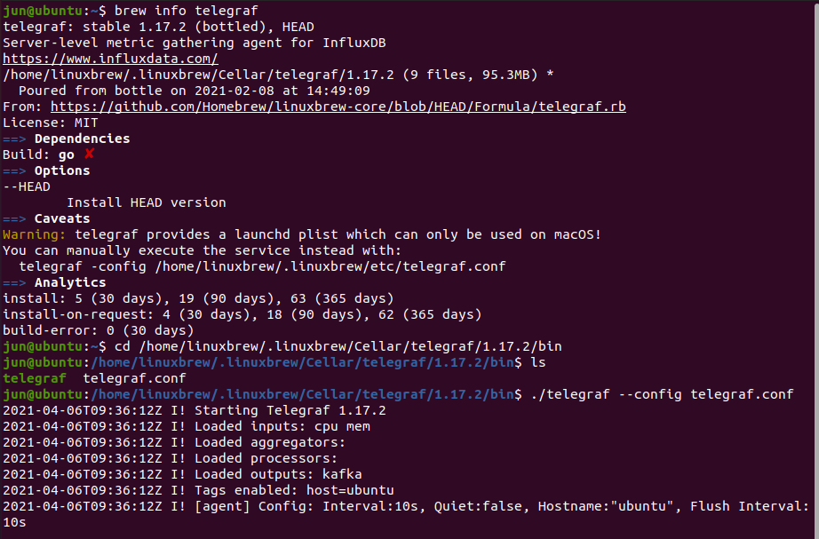
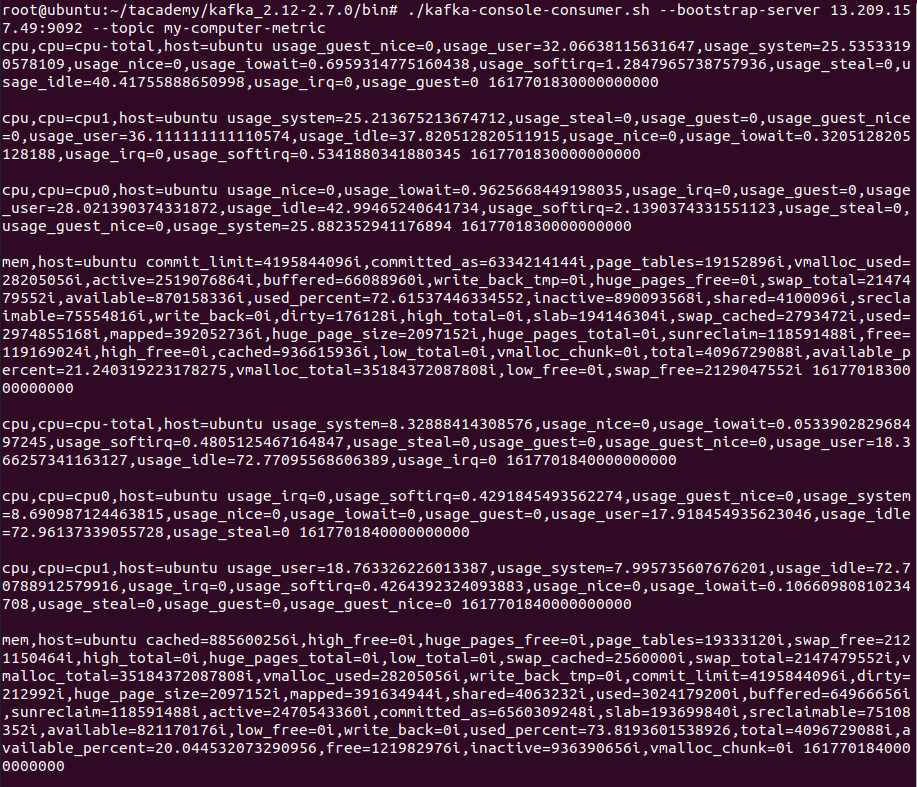

# Kafka_Simple
1. **Kafka**-related **Basic Knowledge** (Summary of contents of **Kafka The Definitive Guide**)
2. **Simple Projects** (Source code based on [AndersonChoi' lecture](https://github.com/AndersonChoi/tacademy-kafka))

## Contents
1. [Using](#using)
2. [A quick look at Kafka](#a-quick-look-at-kafka)
3. [Kafka installation and configuration](#kafka-installation-and-configuration)
4. [Kafka Producer](#kafka-producer)
5. [Kafka Consumer](#kafka-consumer)
6. [Kafka internal mechanism](#kafka-internal-mechanism)
7. [Reliable data delivery](#reliable-data-delivery)
8. [Build the data pipeline](#build-the-data-pipeline)
9. [Cross-cluster data mirroring](#cross-cluster-data-mirroring)
10. [Kafka management](#kafka-management)
11. [Kafka monitoring](#kafka-monitoring)
12. [Stream processing](#stream-processing)
13. [Simple Projects](#simple-projects)

---------------------------------------------------

## Using
1. BackEnd - Java(JDK 1.8), **Kafka(v2.5.0)**, **Zookeeper**
2. OS - Ubuntu 20.04.1 LTS (VMware), Amazon Linux 2(AWS EC2)
3. IDE - IntelliJ(Community / 11.0.9.1 / 2020.3.2)
4. Server - **AWS(EC2, Route 53)**
5. etc - Homebrew, **telegraf(v1.17.2)**

----------------------------------------------------


## A quick look at Kafka


----------------------------------------------------


## Kafka installation and configuration
1. **AWS EC2에 카프카 설치**
    1. **AWS EC2 구축** (EC2 + Route 53 + Elastic beanstalk + RDS), pem파일 저장 [영상](https://www.youtube.com/playlist?list=PLSU3uVI3_Xyvpw2fIiUrKs8skZMwyr3LI) [](https://www.youtube.com/playlist?list=PLSU3uVI3_Xyvpw2fIiUrKs8skZMwyr3LI)
    2. pem 파일 위치에서 **AWS Server** 접속
        ```{.bash}
        chmod 400 mykafka.pem
        ssh -i mykafka.pem ec20user@{aws ec2 public ip}
        ```
    3. Java, Kafka 설치 및 압축 풀기 / **Kafka 실행 최소 Heap Size 설정 제거**
        ```{.bash}
        sudo yum install -y java-1.8.0-openjdk-devel.x86_64
        wget http://mirror.navercorp.com/apache/kafka/2.5.0/kafka_2.12-2.5.0.tgz
        tar -xvf kafka_2.12-2.5.0.tgz
        export KAFKA_HEAP_OPTS="-Xmx400m -Xms400m"
        ```
    4. **카프카 설정 파일 수정**
        ```{.bash}
        vi config/server.properties
        listeners=PLAINTEXT://:9092
        advertised.listeners=PLAINTEXT://{aws ec2 public ip}:9092
        ```
    5. **주키퍼** 실행
        ```{.bash}
        bin/zookeeper-server-start.sh -daemon config/zookeeper.properties
        ```
    6. **카프카** 실행
        ```{.bash}
        bin/kafka-server-start.sh -daemon config/server.properties
        ```
    7. 로그 확인
        ```{.bash}
        tail -f logs/*
        ```
2. **Local**에 카프카 설치 및 테스트
    1. 카프카 설치 및 압축 풀기
        ```{.bash}
        curl http://mirror.navercorp.com/apache/kafka/2.5.0/kafka_2.13-2.5.0.tgz
        tar -xvf kafka_2.13-2.5.0.tgz
        ```
    2. 테스트
        ```{.bash}
        cd kafka_2.13-2.5.0/bin
        - 토픽 생성
        ./kafka-topics.sh --create --bootstrap-server {aws ec2 public ip}:9092 --replication-factor 1 --partitions 3 --topic test
        - Producer 실행
        ./kafka-console-producer.sh --bootstrap-server {aws ec2 public ip}:9092 --topic test
        - Consumer 실행
        ./kafka-console-consumer.sh --bootstrap-server {aws ec2 public ip}:9092 --topic test --from-beginning
        ./kafka-console-consumer.sh --bootstrap-server {aws ec2 public ip}:9092 --topic test -group testgroup --from-beginning
        - Consumer Group List 확인
        ./kafka-consumer-groups.sh --bootstrap-server {aws ec2 public ip}:9092 --list
        - Consumer Group 상태 확인
        ./kafka-consumer-groups.sh --bootstrap-server {aws ec2 public ip}:9092 --group testgroup --describe
        - 가장 낮은 Offset으로 Reset
        ./kafka-consumer-groups.sh --bootstrap-server {aws ec2 public ip}:9092 --group testgroup --topic test --reset-offsets --to-earliest --execute
        - 특정 파티션을 특정 Offset으로 Reset
        ./kafka-consumer-groups.sh --bootstrap-server {aws ec2 public ip}:9092 --group testgroup --topic test:1 --reset-offsets --to-offset 10 --execute
        ```
----------------------------------------------------


## Kafka Producer


----------------------------------------------------


## Kafka Consumer


----------------------------------------------------


## Kafka internal mechanism


----------------------------------------------------


## Reliable data delivery


----------------------------------------------------


## Build the data pipeline


----------------------------------------------------


## Cross-cluster data mirroring


----------------------------------------------------


## Kafka management


----------------------------------------------------


## Kafka monitoring


----------------------------------------------------


## Stream processing


----------------------------------------------------

## Simple Projects
- **Detailed Source Code** : can be found in each directory.  

1. **simple-kafka-producer** : key = null, topic만 사용하여 value 전송
2. **Kafka-producer-key-value** : topic, key, value를 사용하여 전송
3. **Kafka-producer-exact-partition** : topic, partition, key, value를 사용하여 전송
4. **simple-kafka-consumer** : topic과 consumer group을 사용하여 데이터 읽기
5. **Kafka-consumer-auto-commit** : 일정 시간, polling 할 때 자동으로 commit
6. **Kafka-consumer-sync-commit** : commitSync(), commitAsync()를 사용하여 commit
7. **Kafka-consumer-multi-thread** : multi thread를 이용하여 파티션이 끊어지거나 새로 할당되는 등의 상황에 안전하게 종료하기
8. **Kafka-consumer-save-metric** : telegraf를 통해 데이터를 수집하고 카프카 적재 후 읽어와서 .csv 형식으로 저장
    1. **Homebrew** [설치](https://www.whatwant.com/entry/LinuxBrew-install-Ubuntu-1804)
    2. **Telegraf** 설치
        ```{.bash}
        brew install telegraf
        ```
    3. **Telegraf 설정 파일 생성 및 설정**
        1. telegraf 설치 경로 확인
        ```{.bash}
        brew info telegraf
        ```
        2. **telegraf.conf 파일 생성**
        ```{.bash}
        cd {telegraf 설치경로}/bin
        vi telegraf.conf
        ```
        3. **telegraf.conf 파일 설정**
        ```{.html}
        [agent]
          interval = "10s"
        [[outputs.kafka]]
          brokers = ["{AWS EC2 Public IP}:9092"]
          ## Kafka topic for producer messages
          topic = "my-computer-metric"
        [[inputs.cpu]]
          percpu = true
          totalcpu = true
          fielddrop = ["time_*"]
        [[inputs.mem]]
        ```
    4. **카프카 토픽 생성**
        ```{.bash}
        (KAFKA_HOME)/bin/kafka-topics.sh --create --bootstrap-server {AWS EC2 Public IP}:9092 --replication-factor 1 --partitions 5 --topic my-computer-metric
        ```
    5. **Telegraf 실행** (telegraf 설치경로/bin)
        ```{.bash}
        ./telegraf --config telegraf.conf
        ```
    5. 데이터 확인
        ```{.bash}
        (KAFKA_HOME)/bin/kafka-console-consumer.sh --bootstrap-server {AWS EC2 Public IP}:9092 --topic my-computer-metric --from-beginning
        ```
    6. **자바 프로젝트 실행(Kafka-consumer-save-metric)** 후 파일 확인
        ```{.bash}
        (자바 프로젝트 위치) tail -f *.csv
        ```
    7. 화면 캡쳐
        <p align="center">
            
        </p>
        <p align="center">
            
        </p>