# Kafka The Definitive Guide
1. **Kafka**-related **Basic Knowledge** (Summary of contents of **Kafka The Definitive Guide**)
2. **Simple Projects** (Source code based on [AndersonChoi' lecture](https://github.com/AndersonChoi/tacademy-kafka))

## Contents
1. [Using](#using)
2. [A quick look at Kafka](#a-quick-look-at-kafka)
3. [Kafka installation and configuration](#kafka-installation-and-configuration)
4. [Kafka Producer](#kafka-producer)
5. [Kafka Consumer](#kafka-consumer)
6. [Kafka internal mechanism](#kafka-internal-mechanism)
7. [Reliable data delivery](#reliable-data-delivery)
8. [Build the data pipeline](#build-the-data-pipeline)
9. [Cross-cluster data mirroring](#cross-cluster-data-mirroring)
10. [Kafka management](#kafka-management)
11. [Kafka monitoring](#kafka-monitoring)
12. [Stream processing](#stream-processing)
13. [Simple Projects](#simple-projects)
14. [Kafka Manager](#kafka-manager)

---------------------------------------------------

## Using
1. BackEnd - Java(JDK 1.8), **Kafka(AWS : v1.1.1, Local : v2.5.0)**, **Zookeeper(v3.4.12)**
2. OS - Ubuntu 20.04.1 LTS (VMware), Amazon Linux 2(AWS EC2)
3. IDE - IntelliJ(Community / 11.0.9.1 / 2020.3.2)
4. Server - **AWS(EC2, Route 53)**
5. etc - Homebrew, **telegraf(v1.17.2)**, **Elasticsearch**(v7.12.1), **Kafka Manager**(v1.3.3.23)

----------------------------------------------------

## A quick look at Kafka
1. **카프카 (Kafka)**
    - **메시지 발행/구독 시스템**
    - **분산 커밋 로그(distributed commit log)** 또는 분산 스트리밍 플랫폼(distributed streaming platform)
    - 카프카의 데이터도 지속해서 저장하고 읽을 수 있다.
    - 시스템 장애에 대비하고 확장에 따른 성능 저하를 방지하기 위해 데이터가 분산 처리될 수 있다.
2. **메시지 (message)**
    - **데이터의 기본 단위** (이것은 데이터베이스의 행(row)이나 레코드(record)에 비유될 수 있다.)
    - 카프카는 **메시지를 바이트 배열의 데이터로 간주**하므로 특정 형식이나 의미를 갖지 않는다.
    - 메시지에는 **키**(key)라는 메타데이터가 포함될 수 있으며, 이것 역시 바이트 배열이고 특별한 의미를 갖지 않는다.
    - 카프카의 메시지 데이터는 **토픽**(topic)으로 분류된 **파티션(partition)에 수록**되는데, **이때 데이터를 수록할 파티션을 결정하기 위해 일관된 해시 값으로 키를 생성**한다.
    - **따라서 같은 키 값을 갖는 메시지는 항상 같은 파티션에 수록된다.**
3. **배치 (batch)**
    - 카프카는 효율성을 위해서 여러 개의 메시지를 모아 배치 형태로 파티션에 수록하므로 네티워크로부터 매번 각 메시지를 받아서 처리하는 데 따른 부담을 줄일 수 있다.
    - 물론 이 경우 대기 시간(latency)과 처리량(throughput) 간의 트레이트오프가 생길 수 있다.(배치의 크기가 클수록 단위 시간당 처리될 수 있는 메시지는 많아지지만, 각 메시지의 전송 시간은 더 길어진다.)
    - **배치에는 데이터 압축이 적용되므로 더 효율적인 데이터 전송과 저장 능력을 제공한다.**
4. **스키마 (schema)**
    - 카프카는 메시지를 단순히 바이트 배열로 처리하지만, **내용을 이해하기 쉽도록 메시지의 구조를 나타내는 스키마를 사용할 수 있다.**
    - **각 애플리케이션의 필요에 따라 메시지 스키마로 여러 가지 표준 형식을 사용할 수 있다.**
    - 가장 간단한 방법으로는 **JSON**(Javascript Object Notation)이나 **XML**(Extensible Markup Language)이 있으며, 알기 쉽고 사용하기 쉽다. 그러나 **강력한 데이터 타입에 대한 지원이 부족하고 스키마 버전 간의 호환성이 떨어진다.**
    - 따라서 많은 카프카 개발자들이 **아파치 Avro를 선호**한다. 이것은 원래 **하둡**(Hadoop)을 위해 개발된 **직렬화(serializaion) 프레임워크**이다.
    - **Avro는 데이터를 직렬화하는 형식을 제공하며, 메시지와는 별도로 스키마를 유지 관리하므로 스키마가 변경되더라도 애플리케이션의 코드를 추가하거나 변경할 필요가 없다.** 또한, 강력한 데이터 타입을 지원하며 **스키마 신구버전 간의 호환성도 제공**한다.
    - **카프카에서는 일관된 데이터 형식이 중요하다.** 메시지 쓰기와 읽기 작업을 분리해서 할 수 있기 때문이다.
    - 만일 두 작업이 하나로 합쳐져 있다면 구버전과 신버전의 데이터 형식을 병행 처리하기 위해 메시지 구독 애플리케이션이 먼저 업데이트되어야 하며, 그 다음에 메시지 발행 애플리케이션도 업데이트되어야 한다.
    - 그러나 **카프카에서는 잘 정의된 스키마를 공유 리포지토리(repository)에 저장하여 사용할 수 있으므로 애플리케이션 변경 없이 메시지를 처리할 수 있다.**
5. **토픽 (topic)과 파티션 (partition)**
    - 카프카의 **메시지는 토픽으로 분류된다.** (데이터베이스 테이블이나 파일 시스템의 폴더와 유사하다.)
    - **하나의 토픽은 여러 개의 파티션으로 구성**될 수 있다.
    - 커밋 로그 데이터의 관점으로 보면 파티션은 하나의 로그에 해당한다.
    - 메시지는 파티션에 추가되는 형태로만 수록되며, 맨 앞부터 제일 끝까지의 순서로 읽힌다.
    - **대개 하나의 토픽은 여러 개의 파티션을 갖지만, 메시지 처리 순서는 토픽이 아닌 파티션별로 유지 관리된다.**
    - 추가되는 메시지는 각 파티션의 끝에 수록된다.
    - 각 파티션은 서로 다른 서버에 분산될 수 있다. **하나의 토픽이 여러 서버에 걸쳐 수평적으로 확장될 수 있음을 의미하므로 단일 서버로 처리할 때보다 훨씬 성능이 우수하다.**
    - 카프카와 같은 시스템의 데이터를 얘기할 때 **스트림**(stream)이라는 용어가 자주 사용된다.
    - **대부분 스트림은 파티션의 개수와 상관없이 하나의 토픽 데이터로 간주되며, 데이터를 쓰는 프로듀서로부터 데이터를 읽는 컨슈머로 이동되는 연속적인 데이터**를 나타낸다.
    - **카프카 스트림즈(Kafka Streams)**, **아파치 Samza**, **Storm**과 같은 프레임워크에서 실시간으로 메시지를 처리할 때 주로 사용되는 방법이 스트림이다.
    - 이것은 실시간이 아닌 오프라인으로 대량의 데이터를 처리하도록 설계된 프레임워크인 하둡의 방법과 대비된다.
6. **프로듀서 (Producer)와 컨슈머 (Consumer)**
    - **카프카 클라이언트는 시스템의 사용자이며 기본적으로 프로듀서와 컨슈머라는 두 가지 형태가 있다.**
    - 또한, **데이터 통합을 위한 카프카 커넥트(Kafka Connect) API**와 **스트림 처리를 위한 카프카 스트림즈의 클라이언트 API**도 있으며, **이 클라이언트들은 나름의 프로듀서와 컨슈머를 가지고 사용한다.**
    - **프로듀서는 새로운 메시지를 생성한다(쓰기).**
    - **메시지는 특정 토픽으로 생성되며, 기본적으로 프로듀서는 메시지가 어떤 파티션에 수록되는지 관여하지 않는다.**
    - 그러나 **때로는 프로듀서가 특정 파티션에 메시지를 직접 쓰는 경우가 있다.** 이때는 **메시지 키와 파티셔너** (partitioner)를 사용한다.
    - **파티셔너는 키의 해시 값을 생성하고 그것을 특정 파티션에 대응시킴으로써 지정된 키를 갖는 메시지가 항상 같은 파티션에 수록되게 해준다.**
    - **프로듀서는 또한 나름의 커스텀 파티셔너를 갖고 다른 규칙에 따라 메시지가 파티션에 대응되게 할 수도 있다.**
    - **컨슈머는 메시지를 읽는다.**
    - **컨슈머는 하나 이상의 토픽을 구독하여 메시지가 생성된 순서로 읽으며, 메시지의 오프셋(offset)을 유지하여 읽는 메시지의 위치를 알 수 있다.**
    - 또 다른 종류의 메타데이터인 **오프셋**은 지속적으로 증가하는 정숫값이며, 메시지가 생성될 때 **카프카가 추가**해준다.
    - 파티션에 수록된 각 메시지는 고유한 오프셋을 갖는다.
    - 그리고 **주키퍼(Zookeeper)나 카프카에서는 각 파티션에서 마지막에 읽은 메시지의 오프셋을 저장하고 있으므로 컨슈머가 메시지 읽기를 중단했다가 다시 시작하더라도 언제든 그 다음 메시지부터 읽을 수 있다.**
    - **컨슈머는 컨슈머 그룹의 멤버로 동작**한다.
    - **컨슈머 그룹은 하나 이상의 컨슈머로 구성**되며, **한 토픽을 소비하기 위해 같은 그룹의 여러 컨슈머가 함께 동작**한다.
    - 그리고 **한 토픽의 각 파티션은 하나의 컨슈머만 소비할 수 있다.**
    - 각 컨슈머가 특정 파티션에 대응되는 것을 **파티션 소유권**(ownership)이라고 한다.
    - **다량의 메시지를 갖는 토픽을 소비하기 위해 컨슈머를 수평적으로 확장할 수 있다.**
    - **한 컨슈머가 자신의 파티션 메시지를 읽는 데 실패하더라도 같은 그룹의 다른 컨슈머가 파티션 소유권을 재조정받은 후 실패한 컨슈머의 파티션 메시지를 대신 읽을 수 있다.**
7. **브로커(broker)와 클러스터(cluster)**
    - **하나의 카프카 서버를 브로커**라고 한다.
    - **브로커는 프로듀서로부터 메시지를 수신하고 오프셋을 지정한 후 해당 메시지를 디스크에 저장**한다.
    - 또한 컨슈머의 파티션 읽기 요청에 응답하고 디스크에 수록된 메시지를 전송한다.
    - 하나의 브로커는 초당 수천 개의 토픽과 수백만 개의 메시지를 처리할 수 있다.
    - **카프카 브로커는 클러스터의 일부로 동작하도록 설계**되었다.
    - 즉 **여러 개의 브로커가 하나의 클러스터에 포함될 수 있으며, 그 중 하나는 자동으로 선정되는 클러스터 컨트롤러(controller)의 기능을 수행**한다.
    - **컨트롤러는 같은 클러스터의 각 브로커에게 담당 파티션을 할당하고 브로커들이 정상적으로 동작하는지 모니터링하는 관리 기능을 맡는다.**
    - 각 파티션은 클러스터의 한 브로커가 소유하며, 그 브로커를 **파티션 리더**(leader)라고 한다.
    - **같은 파티션이 여러 브로커에 지정될 수도 있는데, 이때는 해당 파티션이 복제(replication)된다.** 이 경우 해당 파티션의 메시지는 중복으로 저장되지만, **관련 브로커에 장애가 생기면 다른 브로커가 소유권을 인계받아 그 파티션을 처리**할 수 있다.
    - **각 파티션을 사용하는 모든 컨슈머와 프로듀서는 파티션 리더에 연결해야 한다.**
8. **보존 (retention)**
    - 아파치 **카프카의 핵심 기능으로 보존**이 있다. 이것은 **일정 기간 메시지를 보존하는 것**이다.
    - 카프카 브로커는 기본적으로 **토픽의 보존 설정을 하도록 구성**되는데 예를 들어, 7일과 같이 **일정 기간** 메시지를 보존하거나 1GB와 같이 **지정된 토픽 크기**가 될 때까지 메시지를 보존할 수 있다.
    - 그리고 이런 **한도 값에 도달하면 최소한의 데이터가 유지되도록 만료 메시지들이 삭제**된다.
    - **메시지가 유용할 때만 보존되도록 토픽마다 보존 설정을 다르게 지정할 수도 있다.**
    - 예를 들어, 지속적인 메시지 유지가 필요한 토픽은 7일 동안 보존하고, 애플리케이션의 성능 관련 메트릭을 저장한 토픽은 수시간 동안만 보존되게 할 수 있다.
    - 또한, **토픽은 압축 로그(log compacted) 설정으로 구성될 수도 있다.**
    - 이 경우 **같은 키를 갖는 메시지들은 가장 최신 것만 보존**된다.
    - 따라서 마지막으로 변경된 것이 중요한 로그 데이터에 유용하다.
9. **다중 클러스터**
    - 카프카가 많이 설치되어 사용될 때 **다중 클러스터(multiple cluster)를 고려하면 다음과 같은 장점**이 있다.
        - **데이터 타입에 따라 구분해서 처리할 수 있음**
        - **보안 요구사항을 분리해서 처리할 수 있음**
        - **재해 복구를 대비한 다중 데이터센터를 유지할 수 있음**
    - 특히 카프카가 다중 데이터센터로 설치되어 동작할 때는 메시지가 데이터센터 간에 복제되어야 하며, 그렇게 하면 온라인 애플리케이션에서는 사용자의 처리 결과를 양쪽 사이트 모두에서 사용할 수 있다.
    - 예를 들어, 한 데이터센터에 접속된 사용자가 자신의 프로파일에 있는 공개 정보를 변경한다면 다른 데이터센터에서도 변경 내용을 볼 수 있게 될 것이다.
    - 또는 여러 사이트에서 수집된 모니터링 데이터를 분석/보안 시스템이 운영되는 센터로 집중시켜 처리할 수 있다.
    - **카프카 클러스터의 복제 메커니즘은 다중 클러스터가 아닌 단일 클러스터에서만 동작하도록 설계되었다.**
    - 따라서 **다중 클러스터를 지원하기 위해** 아파치 카프카 프로젝트에는 **미러메이커**(MirrorMaker)라는 도구가 포함되어 있다.
    - 근본적으로 미러메이커도 카프카의 컨슈머와 프로듀서이며, 각 미러메이커는 큐(queue)로 상호 연결된다.
    - 그리고 하나의 카프카 클러스터에서 소비된 메시지를 다른 클러스터에서도 사용할 수 있도록 생성해준다.
10. **카프카를 사용하는 이유**
    1. **다중 프로듀서**
        - 여러 클라이언트가 많은 토픽을 사용하거나 같은 토픽을 같이 사용해도 카프카는 무리 없이 많은 프로듀서의 메시지를 처리할 수 있다.
        - 따라서 여러 프런트엔드 시스템으로부터 데이터를 수집하고 일관성을 유지하는 데 이상적이다.
        - 예를 들어, 여러 가지 마이크로서비스를 통해 사용자에게 콘텐츠를 서비스하는 사이트에서 모든 마이크로서비스가 같은 형식으로 작성한 페이지 뷰(page view)를 하나의 토픽으로 가질 수 있다.
        - 그 다음에 컨슈머 애플리케이션에서 그 사이트의 모든 애플리케이션 페이지 뷰를 하나의 스트림으로 받을 수 있다.
    2. **다중 컨슈머**
        - 다중 프로듀서와 더불어 카프카는 많은 컨슈머가 상호 간섭 없이 어떤 메시지 스트림도 읽을 수 있게 지원한다.
        - **한 클라이언트가 특정 메시지를 소비하면 다른 클라이언트에서 그 메시지를 사용할 수 없는 큐 시스템과는 다르다.**
        - 카프카 컨슈머는 컨슈머 그룹의 멤버가 되어 메시지 스트림을 공유할 수 있다.
    3. **디스크 기반의 보존**
        - 카프카는 다중 컨슈머를 처리할 수 있을 뿐만 아니라 **지속해서 메시지를 보존**할 수도 있다.
        - **따라서 컨슈머 애플리케이션이 항상 실시간으로 실행되지 않아도 된다.**
        - 메시지는 카프카 구성에 설정된 보존 옵션에 따라 디스크에 저장되어 보존된다. 그리고 보존 옵션을 토픽별로 선택할 수 있으므로, 컨슈머의 요구에 맞게 메시지 스트림마다 서로 다른 보존 옵션을 가질 수 있다.
        - **따라서 처리가 느리거나 접속 폭주로 인해 컨슈머가 메시지를 읽는 데 실패하더라도 데이터 유실될 위험이 없다.**
        - 또한 **보존 기간 동안 컨슈머가 동작하지 않더라도 메시지는 카프카에 보존되므로 프로듀서의 메시지 백업이 필요 없고, 컨슈머의 유지보수도 자유롭게 수행할 수 있다.**
        - 그리고 **컨슈머가 다시 실행되면 중단 시점의 메시지부터 처리할 수 있다.**
    4. **확장성**
        - 카프카는 확장성이 좋아서 어떤 크기의 데이터도 쉽게 처리할 수 있다.
        - 따라서 처음에는 실제로 잘 되는지 검증하는 의미에서 하나의 브로커로 시작한 후 세 개의 브로커로 구성된 소규모의 개발용 클러스터로 확장하면 좋다.
        - 그 다음에 데이터 증가에 따라 10개에서 심지어는 수백 개의 브로커를 갖는 대규모 클러스터로 업무용 환경을 구축하면 된다.
        - **확장 작업은 시스템 전체의 사용에 영향을 주지 않고 클러스터가 온라인 상태일 때도 수행될 수 있다.**
        - 여러 개의 브로커로 구성된 클러스터는 개별적인 브로커의 장애를 처리하면서 클라이언트에게 지속적인 서비스를 할 수 있기 때문이다.
        - 또한, 동시에 여러 브로커에 장애가 생겨도 정상적으로 처리할 수 있는 **복제 팩터**(replication factor)를 더 큰 값으로 구성할 수 있다.
    5. **고성능**
        - 프로듀서, 컨슈머, 브로커 모두 대용량의 메시지 스트림을 쉽게 처리할 수 있도록 확장될 수 있으며, 확장 작업도 1초 미만의 짧은 시간 내에 가능하다.
11. **데이터 생태계**
    - 데이터를 처리하기 위해 구축한 환경에는 많은 애플리케이션이 있다. 그리고 데이터를 생성하는 애플리케이션에 맞춰 입력 형식이 정의되며, 메프틱, 리포트 등으로 출력 형태가 정의된다. 또한, 특정 컴포넌트를 사용해서 시스템의 데이터를 읽은 후 다른 소스에서 받은 데이터를 사용해서 변환시킨다. 그 다음에 어디서든 사용될 수 있도록 최종 데이터를 데이터 기반 구조에 전달한다. 이런 작업은 고유한 콘텐츠와 크기, 용도를 갖는 다양한 유형의 데이터로 처리된다. 이것이 메시지 데이터의 처리 흐름이다.
    - 아파치 카프카는 **데이터 생태계의 순환 시스템을 제공**한다. 즉, **모든 클라이언트에 대해 일관된 인터페이스를 제공하면서 데이터 기반 구조의 다양한 멤버 간에 메시지를 전달**한다. 이때 메시지 구조를 정의한 스키마를 시스템에서 제공하면 프로듀서와 컨슈머가 어떤 형태로든 밀접하게 결합하거나 연결되지 않아도 되므로, 비즈니스 용도가 생기거나 없어질 때 관련 컴포넌트만 추가하거나 제거하면 된다. 또한, 프로듀서는 누가 자신의 데이터를 사용하는지, 그리고 컨슈머 애플리케이션이 몇 개 인지 신경쓰지 않아도 된다.
12. **이용 사례**
    1. **활동 추적**
        - 처음에 카프카는 사용자 활동 추적에 사용하기 위해 링크드인(LinkedIn)에서 설계되었다.
        - 즉, 사용자가 웹 사이트에 접속하여 액션(페이지 이동, 특정 콘텐츠 조회 등)을 수행하면 이것에 관한 메시지 데이터를 생성하는 프런트엔드 애플리케이션이 동작한다. 이런 추적 데이터는 해당 사이트의 페이지 뷰와 클릭 기록이 될 수 있으며, 그 사이트의 사용자가 자신의 프로파일에 추가하는 정보와 같이 더 복잡한 것이 될 수도 있다. 그리고 이와 같은 메시지는 하나 이상의 토픽으로 생성되어 카프카에 저장된 후 백엔드 애플리케이션에서 소비된다. 예를 들어, 리포트를 생성하거나, 머신 러닝 시스템에 제공되거나, 검색 결과를 변경하거나, 풍부한 사용자 경험을 제공하는 데 필요한 다른 작업을 수행하는 데 사용될 수 있다.
    2. **메시지 전송**
        - 카프카 또한 메시지를 전송하는데도 사용될 수 있으므로 사용자에게 알림 메시지를 전송해야 하는 애플리케이션에 유용하다.
        - 이때 각 애플리케이션에서 메시지 형식이나 전송 방법을 신경 쓰지 않게 메시지를 생성할 수 있다.
        - 전송될 모든 메시지를 하나의 애플리케이션이 읽어서 다음 작업을 일관성 있게 처리할 수 있기 때문이다.
            - 같은 룩앤필(look and feel)을 사용해서 메시지의 형식을 만든다.
            - 여러 개의 메시지를 하나의 알림 메시지로 전송하기 위해 합친다.
            - 사용자가 원하는 메시지 수신 방법을 적용한다.
        - 그리고 하나의 애플리케이션에서 처리하면 여러 애플리케이션에 중복된 기능을 가질 필요가 없을 뿐만 아니라 메시지 집중 처리와 같은 기능도 함께 수행할 수 있다.
    3. **메트릭과 로깅**
        - 카프카는 또한 애플리케이션과 시스템의 **메트릭과 로그 데이터**를 모으는 데 이상적이다.
        - 이것은 여러 애플리케이션에서 같은 타입의 메시지를 생성하는 대표적인 이용 사례다.
        - 이 경우 각 애플리케이션에서 장기적으로 메트릭을 생성하여 카프카 토픽으로 저장한 후 모니터링과 보안 시스템에서 그 데이터를 사용할 수 있다. 또한 하둡과 같은 오프라인 시스템에서 데이터 증가 예측과 같은 장기적인 분석을 위해 사용될 수도 있다. 로그 메시지는 모두 같은 방법으로 생성될 수 있으며, 엘라스틱서치(Elasticsearch)나 보안 분석 애플리케이션과 같은 로그 검색 전용 시스템으로 전달될 수 있다.
        - 이외에도 카프카를 사용하면 또 다른 장점이 있다. 즉, 특정 시스템을 변경해야 할 때(로그 저장 시스템을 변경할 시기가 되었을 때와 같이)도 프런트엔드 애플리케이션이나 메시지 수집 방법을 변경할 필요가 없다.
    4. **커밋 로그**
        - 카프카는 커밋 로그 개념을 기반으로 하므로 데이터베이스의 변경 사항이 카프카 메시지 스트림으로 생성될 수 있다.(커밋 로그는 데이터가 변경된 내역을 고르 메시지로 모아둔 것을 말한다).
        - 그리고 애플리케이션에서는 해당 스트림을 모니터링하여 발생 시점의 최신 변경 데이터를 받을 수 있다.
        - 이런 스트림을 변경 로그 스트림(changelog stream)이라고 하며, 이 스트림은 데이터베이스의 변경 데이터를 원격 시스템에 복제하는 데 사용되거나 여러 애플리케이션의 변경 데이터를 하나의 데이터베이스 뷰로 통합하는데 사용될 수 있다.
        - 이때 변경 로그 데이터를 모아두는 버퍼를 제공하기 위해 카프카의 메시지 보존 기능이 유용하게 사용된다.
        - 컨슈머 애플리케이션에 장애가 생긴 이후에도 해당 데이터를 다시 사용할 수 있기 때문이다.
        - 또한 더 오랫동안 데이터를 보존하고자 할 때는 키 하나당 하나의 변경 데이터만 보존하는 압축로그(log-compacted) 토픽을 사용할 수도 있다.
    5. **스트림 프로세싱**
        - 여러 종류의 애플리케이션에서 스트림 프로세싱(stream processing)을 지원한다. 카프카를 사용할 때도 대부분 스트림 프로세싱을 한다.
        - **일반적으로 이 용어는 하둡의 맵/리듀스(map/reduce)처리와 유사한 기능을 제공하는 애플리케이션에 사용된다.**
        - **단, 하둡은 긴 시간(어러 시간이나 여러 날)에 걸쳐 집중된 데이터를 사용하지만, 스트림 프로세싱에서는 메시지가 생성되자마자 실시간으로 데이터를 처리한다는 차이가 있다.**
        - 그리고 스트림 프로세싱을 하는 프레임워크에서는 작은 크기의 애플리케이션을 기능별로 여러 개 작성하여 카프카 메시지를 처리할 수 있다.
        - 예를 들어, 메트릭 데이터의 각종 수치를 계산하는 작업을 수행하는 애플리케이션, 다른 애플리케이션에서 효율적으로 메시지를 처리할 수 있게 파티션에 저장하는 애플리케이션, 여러 소스에서 받은 데이터를 사용해서 메시지를 변환하는 애플리케이션 등이다.

----------------------------------------------------

## Kafka installation and configuration
1. **AWS EC2에 카프카 설치**
    1. **AWS EC2 구축** (EC2 + Route 53 + Elastic beanstalk + RDS), pem파일 저장 [영상](https://www.youtube.com/playlist?list=PLSU3uVI3_Xyvpw2fIiUrKs8skZMwyr3LI) [](https://www.youtube.com/playlist?list=PLSU3uVI3_Xyvpw2fIiUrKs8skZMwyr3LI)
    2. pem 파일 위치에서 **AWS Server** 접속
        ```bash
        chmod 400 mykafka.pem
        
        ssh -i mykafka.pem ec20user@{aws ec2 public ip}
        ```
    3. Java, Kafka 설치 및 압축 풀기 / **Kafka 실행 최소 Heap Size 설정 제거**
        ```bash
        sudo yum install -y java-1.8.0-openjdk-devel.x86_64
        wget http://mirror.navercorp.com/apache/kafka/2.5.0/kafka_2.12-2.5.0.tgz
        tar -xvf kafka_2.12-2.5.0.tgz
        
        export KAFKA_HEAP_OPTS="-Xmx400m -Xms400m"
        ```
    4. **카프카 설정 파일 수정**
        ```bash
        vi config/server.properties
        
        listeners=PLAINTEXT://:9092
        advertised.listeners=PLAINTEXT://{aws ec2 public ip}:9092
        ```
    5. **주키퍼** 실행
        ```bash
        bin/zookeeper-server-start.sh -daemon config/zookeeper.properties
        ```
    6. **카프카** 실행
        ```bash
        bin/kafka-server-start.sh -daemon config/server.properties
        ```
    7. 로그 확인
        ```bash
        tail -f logs/*
        ```
2. **Local**에 카프카 설치 및 테스트
    1. 카프카 설치 및 압축 풀기
        ```bash
        curl http://mirror.navercorp.com/apache/kafka/2.5.0/kafka_2.13-2.5.0.tgz
        tar -xvf kafka_2.13-2.5.0.tgz
        ```
    2. 테스트
        ```bash
        cd kafka_2.13-2.5.0/bin
        
        - 토픽 생성
        ./kafka-topics.sh --create --bootstrap-server {aws ec2 public ip}:9092 --replication-factor 1 --partitions 3 --topic test
        
        - Producer 실행
        ./kafka-console-producer.sh --bootstrap-server {aws ec2 public ip}:9092 --topic test
        
        - Consumer 실행
        ./kafka-console-consumer.sh --bootstrap-server {aws ec2 public ip}:9092 --topic test --from-beginning
        ./kafka-console-consumer.sh --bootstrap-server {aws ec2 public ip}:9092 --topic test --group testgroup --from-beginning
        
        - Consumer Group List 확인
        ./kafka-consumer-groups.sh --bootstrap-server {aws ec2 public ip}:9092 --list
        
        - Consumer Group 상태 확인
        ./kafka-consumer-groups.sh --bootstrap-server {aws ec2 public ip}:9092 --group testgroup --describe
        
        - 가장 낮은 Offset으로 Reset
        ./kafka-consumer-groups.sh --bootstrap-server {aws ec2 public ip}:9092 --group testgroup --topic test --reset-offsets --to-earliest --execute
        
        - 특정 파티션을 특정 Offset으로 Reset
        ./kafka-consumer-groups.sh --bootstrap-server {aws ec2 public ip}:9092 --group testgroup --topic test:1 --reset-offsets --to-offset 10 --execute
        ```
        
3. **구성 옵션 설정 관련**
    1. **주키퍼** 구성 옵션 ((KAFKA_HOME)/config/zookeeper.properties)
        - **tickTime** : initLimit 설정 관여
        - **dataDir** : 각 서버는 dataDir에 지정된 디텍터리에 myid라는 이름의 파일을 갖고 있어야 한다. 그리고 이 파일은 구성 파일에 지정된 것과 일치되는 각 서버의 ID 번호를 포함해야 한다.
        - **clientPort** : 주키퍼에 접속하는 클라이언트는 clientPort에 지정된 포트 번호로 앙상블과 연결 (앙상블의 서버들은 세 가지 포트 모두를 사용해서 상호 통신)
        - **initLimit** : 팔로어(대기 서버)가 리더(데이터 쓰기를 하는 서버)에 접속할 수 있는 시간 (initLimit이 20, tickTime이 2000 일 경우 20*2000 ms = 40초)
        - **syncLimit** : 리더가 될 수 있는 팔로어의 최대 개수
        - **앙상블의 서버** 내역 설정
            - **server.X=hostname:peerPort:leaderPort**
            - X : 각 서버의 ID 번호이며 정수
            - hostname : 각 서버의 호스트 이름이나 IP 주소
            - peerPort : 앙상블의 서버들이 상호 통신하는 데 사용하는 TCP 포트 번호
            - leaderPort : 리더를 선출하는 데 사용하는 TCP 포트 번호
    2. **브로커** 구성 옵션 ((KAFKA_HOME)/config/server.properties)
        - **broker.id** : 모든 카프카 브로커는 broker.id에 설정하는 정수로 된 번호를 가져야 한다. 이것의 기본 값은 0 이지만 어떤 값도 가능하다. **단 하나의 카프카 클러스터 내에서 고유한 값이어야 한다.**
        - **port** : 카프카의 실행에 사용되는 TCP 포트, **기본 구성값은 9092**, 이 값은 어떤 포트 번호로도 설정할 수 있지만 1024보다 작은 값으로 설정한다면 카프카가 root 권한으로 시작되어야 한다.
        - **zookeeper.connect** : **브로커의 메타데이터를 저장하기 위해 사용되는 주키퍼의 위치**, 기본 구성 값은 localhost:2181 (로컬 호스트의 2181 포트에서 실행되는 주키퍼를 사용), "호스트이름:포트/경로" 형식으로 지정
        - **log.dirs** : **카프카는 모든 메시지를 로그 세그먼트 파일에 모아서 디스크에 저장**한다. 그리고 이 파일은 **log.dirs에 지정된 디렉터리에 저장**된다. 여러 경로를 쉼표로 구분하여 지정할 수 있고, 두 개 이상의 경로가 지정되면 해당 브로커가 모든 경로에 파티션을 저장한다. (**주의, 브로커가 새로운 파티션을 저장할 때는 가장 적은 디스크 용량을 사용하는 경로가 아닌 가장 적은 수의 파티션을 저장한 경로를 사용한다.**)
        - **num.recovery.threads.per.data.dir** : 카프카는 구성 가능한 스레드 풀을 사용해서 로그 세그먼트를 처리한다. 기본적으로는 로그 디렉터리당 하나의 스레드만 사용한다. 이 스레드들은 브로커의 시작과 종료 시에만 사용되므로 병행 처리를 하도록 많은 수의 스레드를 설정하는 것이 좋다. 그리고 **이 매개변수에 설정하는 스레드의 수는 log.dirs에 지정된 로그 디렉터리마다 적용된다는 것에 유의**해야 한다. (log.dirs에 지정된 경로가 3개, num.recovery.threads.per.data.dir을 8로 설정하면 전체 스레드의 개수는 24개)
        - **auto.create.topics.enable** : 기본 설정에는 true로 지정되어 있다. 직접 토픽 생성을 관리 할 때에는 auto.create.topics.enable 값을 false로 지정하면 된다.
        - **num.partitions** : 새로운 토픽이 몇 개의 파티션으로 생성되는지를 나타내며, 주로 자동 토픽 생성이 활성화될 때 사용된다. (**주의, 토픽의 파티션 개수는 증가만 하고 감소될 수 없다.**)
        - **log.retention.ms** : **얼마 동안 메시지를 보존할지** 설정. 시간 단위인 **log.retention.hours** 를 주로 사용 (기본 값은 1주일인 168시간), **log.retention.minutes**와 **log.retention.ms** 를 사용할 수 있다. 만약 두 개 이상이 같이 지정되면 더 작은 시간 단위의 매개변수 값이 사용되므로 항상 log.retention.ms의 값이 사용된다.
        - **log.retention.bytes** : **저장된 메시지들의 전체 크기를 기준으로 만기를 처리하는 방법**, 이 값은 모든 파티션에 적용된다. (하나의 토픽이 8개의 파티션으로 되어 있고 log.retention.bytes의 값이 1GB로 설정되면 해당 토픽에 저장되는 메시지들의 전체 크기는 최대 8GB가 된다.) 이러한 **메시지 보존은 토픽이 아닌 각 파티션별로 처리된다.**
        - **log.segment.bytes** : 위의 **메시지 보존 설정은 개별적인 메시지가 아닌 로그 세그먼트 파일을 대상으로 처리**된다. 메시지가 카프카 브로커에 생성될 때는 해당 파티션의 로그 세그먼트 파일 끝에 추가된다. 이때 log.segment.bytes 매개변수에 지정된 크기가 되면 해당 로그 세그먼트 파일이 닫히고 새로운 것이 생성되어 열린다. 만약 토픽의 데이터 저장률이 낮다면 로그 세그먼트의 크기를 조정하는 것이 중요하다.(**하루에 100MB의 메시지만 토픽에 수록되고 log.segment.bytes의 값이 1GB로 설정되어 있다면, 하나의 로그 세그먼트를 채우는 데 10일이 소요될 것이다. 그러나 로그 세그먼트 파일은 닫혀야만 만기가 될 수 있으므로 만일 log.retention.ms가 1주일로 설정되어 있다면 로그 세그먼트에 저장된 메시지들은 17일 동안 보존될 것이다. 왜냐하면 마지막 메시지를 쓰면서 로그 세그먼트 파일이 닫히는 데 10일이 소요되고, 다시 보존 시간이 7일이 지나야 만기가 되기 때문**)
        - **log.segment.ms** : **시간을 지정해서 로그 세그먼트 파일이 닫히는 것을 제어**할 수 있다. (log.retention.bytes와 log.retention.ms 매개변수처럼 log.segment.bytes와 log.segment.ms는 상호 연관된다.)
        - **message.max.bytes** : 카프카 브로커는 **쓰려는 메시지의 최대 크기를 제한**할 수 있다. 이때는 기본값이 1000000 (1MB)인 message.max.bytes 매개변수를 지정하면 된다. 그러면 이 값보다 큰 메시지를 전송하려는 프로듀서에게는 브로커가 에러를 보내고 메시지를 받지 않는다. 브로커에 지정되는 다른 모든 바이트 크기와 마찬가지로 이 값도 압축된 메시지의 크기를 나타낸다.
        
----------------------------------------------------

## Kafka Producer
1. **필수 구성 옵션**
    1. **boostrap.servers**
        - **카프카 클러스터에 연결하기 위한 브로커 목록**
        - 프로듀서가 사용하는 브로커들의 host:port 목록을 설정
        - 연결되면 프로듀서가 더 많은 정보를 얻을 수 있기 때문에 **모든 브로커를 포함할 필요는 없다. 그러나 최소한 두 개 이상을 포함하는 것이 좋다. 한 브로커가 중단되는 경우에도 프로듀서는 여전히 클러스터에 연결될 수 있기 때문이다.**
    2. **key.serializer**
        - **메시지 키 직렬화에 사용되는 클래스**
        - 프로듀서가 생성하는 레코드(ProducerRecord 객체)의 메시지 키를 직렬화하기 위해 사용되는 클래스 이름을 이 속성에 설정
        - 카프카 브로커는 바이트 배열로 메시지를 받는다. 그러나 카프카의 프로듀서 인터페이스에서는 매개변수화 타입을 사용해서 키와 값의 쌍으로 된 어떤 자바 객체도 전송할 수 있으므로 알기 쉬운 코드를 작성할 수 있다. 단, 이때는 그런 객체를 바이트 배열로 변환하는 방법을 프로듀서가 알고 있어야 한다.
        - key.serializer에 설정하는 클래스는 org.apache.kafka.common.serialization.Serializer 인터페이스를 구현해야 한다. 프로듀서는 이 클래스를 사용해서 키 객체를 바이트 배열로 직렬화한다.
        - 카프카 클라이언트 패키지에는 세 가지 타입의 직렬화를 지원하는 ByteArraySerializer, StringSerializer, IntegerSerializer가 포함되어 있다. 이런 타입들을 직렬화할 때는 직렬처리기를 따로 구현하지 않아도 된다.
        - **레코드의 키는 생략하고 값만 전송하고자 할 때도 설정해야 한다.**
    3. **value.serializer**
        - **메시지 값을 직렬화하는데 사용되는 클래스**
        - 레코드의 메시지 값을 직렬화하는 데 사용하는 클래스 이름을 설정
        - 직렬화하는 방법은 key.serializer와 동일하다.
    4. **기본 설정**
        ```java
        // Properties 객체 생성
        private Properties kafkaProps = new Properties();
        
        // 속성과 값 설정
        kafkaProps.put("bootstrap.servers", "broker1:9092, broker2:9092");
        kafkaProps.put("key.serializer", "org.apache.kafka.common.serialization.StringSerializer");
        kafkaProps.put("value.serializer", "org.apache.kafka.common.serialization.StringSerializer");
        
        // 새로운 프로듀서 객체 생성, Properties 객체를 생성자 인자로 전달한다.
        Producer<String, String> producer = new KafkaProducer<String, String>(kafkaProps);
        ```
2. **선택 구성 옵션** (Default 값 존재)
    1. **acks**
        - 레코드 전송 **신뢰도 조절** (Replica)
        - 전송된 레코드를 수신하는 파티션 리클리카의 수를 제어, 메시지가 유실될 가능성에 영향을 준다.
        - **acks=0** : **프로듀서는 브로커의 응답을 기다리지 않는다.** 메시지 유실 가능성이 큰데 반해, 매우 높은 처리량이 필요할 때 사용
        - **acks=1** : **리더 리플리카가 메시지를 받는 순간 프로듀서는 브로커로부터 성공적으로 수신했다는 응답을 받는다.** 그러나 만일 리더에서 메시지를 쓸 수 없다면 프로듀서는 에러 응답을 받을 것이고 데이터 유실을 막기 위해 메시지를 다시 전송할 수 있다. 또한 리더가 중단되고 해당 메시지를 아직 복제하지 않은 리플리카가 새로운 리더로 선출될 경우에도 여전히 메시지가 유실될 수 있다. 이때는 동기식이나 비동기식 중 어떤 방법으로 메시지를 전송했는가에 따라 처리량이 달라질 수 있다.
        - **acks=all** : **동기화된 모든 리플리카가 메시지를 받으면 프로듀서가 브로커의 성공 응답을 받는다.** 하나 이상의 브로커가 해당 메시지를 갖고 있으므로, 파티션이나 리더 리플리카에 문제가 생기더라도 메시지가 유실되지 않기 때문에 가장 안전한 형태이다. 그러나 대기 시간이 길어진다.
    2. **compression.type**
        - **snappy, gzip, lz4 중 하나로 압축**하여 전송
        - 기본적으로 메시지는 압축되지 않은 상태로 전송되지만, 이 매개변수를 설정하면 압축되어 전송된다. 따라서 **네트워크 처리량이 제한적일 때** 사용하면 좋다.
        - 메시지 압축을 사용함으로써 카프카로 메시지를 전송할 때 병목 현상이 생길 수 있는 네트워크와 스토리지 사용을 줄일 수 있다.
    3. **retries**
        - 클러스터 장애에 대응하여 **메시지 전송을 재시도하는 횟수**
        - 프로듀서가 서버로부터 받는 에러가 일시적일 수 있기 때문에 메시지 전송을 포기하고 에러로 처리하기 전에 프로듀서가 메시지를 재전송하는 횟수를 제어할 수 있다.
        - 각 재전송 간에 **retry.backoff.ms**에 설정한 시간동안 대기하고 전송한다.
    4. **buffer.memory**
        - **브로커에 전송될 메시지의 버퍼로 사용될 메모리 양**
        - 브로커들에게 전송될 메시지의 버퍼로 사용할 메모리의 양을 설정
        - 메시지들이 서버에 전달될 수 있는 것보다 더 빠른 속도로 애플리케이션에서 전송된다면 추가로 호출되는 send() 메서드는 block.on.buffer.full(max.block.ms) 매개변수의 설정에 따라 예외를 일시 중단 시키거나 바로 발생시킨다.
    5. **batch.size**
        - **여러 데이터를 함께 보내기 위한 레코드 크기**
        - 같은 파티션에 쓰는 다수의 레코드가 전송될 때는 프로듀서가 그것들을 배치로 모은다. 이 매개변수는 각 배치에 사용될 메모리양(byte)을 제어한다. 그리고 해당 배치가 가득 차면 그것의 모든 메시지가 전송된다.
        - **하지만 배치가 가득 찰 때까지 프로듀서가 기다리는 것은 아니다.** 프로듀서는 절반만 채워진 배치와 심지어는 하나의 메시지만 있는 배치도 전송한다.
        - 크게 설정할 경우 메시지 전송은 지연되지 않지만 메모리를 더 많이 사용하게 된다. 반면에 작게 설정하면 프로듀서가 너무 자주 메시지를 전소앻야 하므로 부담을 초래한다.
    6. **linger.ms**
        - **현재의 배치를 전송하기 전까지 기다리는 시간**
        - **현재의 배치가 가득 찼거나, linger.ms에 설정된 제한 시간이 되면 프로듀서가 메시지 배치를 전송**한다.
        - 대기 시간이 증가하는 단점은 있지만, 동시에 처리량도 증가하는 장점이 있다.
    7. **client.id**
        - **어떤 클라이언트인지 구분하는 식별자**
        - 어떤 문자열도 가능하며, 어떤 클라이언트에서 전송된 메시지인지 식별하기 위해 브로커가 사용한다.
        - **주로 로그 메시지와 메트릭 데이터의 전송에 사용**
    8. **max.in.flight.requests.per.connection**
        - **서버의 응답을 받지 않고 프로듀서가 전송하는 메시지의 개수를 제어**한다.
    9. **timeout.ms, request.timeout.ms, metadata.fetch.timeout.ms**
        - timeout.ms : 동기화된 리플리카들이 메시지를 인지하는 동안 브로커가 대기하는 시간 제어
        - request.timeout.ms : 데이터를 전송할 때 프로듀서가 서버 응답을 기다리는 제한 시간
        - metadata.fetch.timeout.ms : 메타데이터를 요청할 때 프로듀서가 서버 응답을 기다리는 제한 시간
    10. **max.block.ms**
        - send() 메서드를 호출할 때 프로듀서의 전송 버퍼가 가득 차거나 partitionsFor() 메소드로 메타데이터를 요청했지만 사용할 수 없을 때 프로듀서가 max.block.ms의 시간동안 일시 중단된다 (그 사이에 에러가 해결될 수 있도록). 그 다음에 max.block.ms의 시간이 되면 시간 경과 예외가 발생한다.
    11. **max.request.size**
        - **프로듀서가 전송하는 쓰기 요청의 크기를 제어**한다.
        - 전송될 수 있는 가장 큰 메시지의 크기와 프로듀서가 하나의 요청으로 전송할 수 있는 메시지의 최대 개수 모두를 이 매개변수로 제한한다.
        - **브로커 설정의 message.max.bytes와 이 값을 일치되도록 설정하는 것이 좋다. 그래야만 브로커가 거부하는 크기의 메시지를 프로듀서가 전송하지 않을 것이기 때문이다.**
    12. **receive.buffer.bytes, send.buffer.bytes**
        - 데이터를 읽고 쓸 때 소켓이 사용하는 TCP 송수신 버퍼의 크기를 나타낸다. 만일 이 매개변수들이 -1로 설정되면 운영체제의 기본값이 사용된다.
3. **메시지 전송 방법**
    1. **Fire-and-forget (전송 후 망각)**
        - 가장 간단한 방법, send() 메서드로 메시지를 **전송만 하고 성공 또는 실패 여부에 따른 후속 조치를 취하지 않는 방법**, 카프카는 가용성이 높고 전송에 실패할 경우에 프로듀서가 자동으로 재전송을 시도하므로 대부분의 경우에 성공적으로 메시지가 전송된다. 그러나 일부 메시지가 유실될 수도 있다.
        ```java
        // ("topic", "key", "value")
        ProducerRecord<String, String> record = new ProducerRecord<>("CustomerCountry", "Precision Products", "France");
        
        try {
            producer.send(record);
        } catch(Exception e){
            e.printStackTrace();
        }
        ```
    2. **Synchronous send (동기식 전송)**
        - send() 메서드로 메시지를 전송하면 자바의 Future 객체가 반환된다. 그 다음에 **Future 객체의 get() 메서드를 곧바로 호출하면 작업이 완료될 때까지 기다렸다가 브로커로부터 처리 결과가 반환**되므로 send()가 성공적으로 수행되었는지 알 수 있다.
        ```java
        ProducerRecord<String, String> record = new ProducerRecord<>("CustomerCountry", "Precision Products", "France");
        
        try {
            producer.send(record).get();
        } catch(Exception e){
            e.printStackTrace();
        }
        ```
    3. **Asynchronous send (비동기식 전송)**
        - send() 메서드를 호출할 때 **콜백 메서드**를 구현한 객체를 매개변수로 전달한다. 이 객체에 구현된 콜백 메서드는 카프카 브로커로부터 응답을 받을 때 자동으로 호출되므로 send()가 성공적으로 수행되었는지 알 수 있다.
        ```java
        private class DemoProducerCallback implements Callback{
            @Override
            public void onCompletion(RecordMetadata recordMetadata, Exception e){
                if(e != null){
                    e.printStackTrace();
                }
            }
        }
        
        ProducerRecord<String, String> record = new ProducerRecord<>("CustomerCountry", "Precision Products", "France");
        
        producer.send(record, new DemoProducerCallback());
        ```
4. **직렬처리기** (**Detailed** : can be found in each directory.)
    1. **커스텀 직렬 처리기** (Customer.java, CustomerSerializer.java)
        - 예를 들어, 고객을 나타내는 간단한 클래스는 customerID와 customerName 속성을 갖는다.
        - 기존의 int형의 ID를 Long 타입으로 변경해야 하거나 새로운 필드를 추가한다면, **기존 메시지와 새로운 메시지 간의 호환성을 유지하는 데 심각한 문제**가 생길 것이다.
        - 이런 이유로 JSON, 아파치 Avro, Thrift, Protobuf 같은 **범용 직렬처리기와 역직렬처기리의 사용을 권장**한다.
    2. **아파치 Avro를 사용해서 직렬화하기**
        - Avro는 언어 중립적인 데이터 직렬화 시스템이다.
        - Avro는 주로 JSON(JavaScript Object Notation) 형식으로 기술하며, 직렬화 역시 JSON을 지원하지만 주로 이진 파일을 사용한다.
        - **Avro가 파일을 읽고 쓸 때는 스키마가 있다고 간주한다** (Avro 파일에는 스키마가 포함된다).
        - 메시지를 쓰는 애플리케이션이 새로운 스키마(데이터 구조)로 전환하더라도 **해당 메시지를 읽는 애플리케이션은 일체의 변형 없이 계속해서 메시지를 처리할 수 있다는 것이 가장 큰 장점**이다.
        - **조건**
            1. **데이터를 쓰는 데 사용되는 스키마와 읽는 애플리케이션에서 기대하는 스키마가 호환**될 수 있어야 한다.
            2. 직렬화된 데이터를 원래의 형식으로 변환하는 **역직렬처리기는 데이터를 쓸 때 사용되었던 스키마를 사용해야 한다**. 그 스키마가 해당 데이터를 읽는 애플리케이션이 기대하는 것과 다른 경우에도 마찬가지다. 따라서 Avro 파일에는 데이터를 쓸 때 사용되었던 스키마가 포함된다. 그러나 카프카 메시지를 Avro로 직렬화할 때는 Avro 파일을 사용하는 것보다 **스키마 레지스트리**를 사용하는 더 좋은 방법이 있다.
    3. **Avro 레코드 사용하기** (AvroSerializer.java, GenericAvroSerializer.java)
        1. 데이터 파일에 스키마 전체를 저장하는 Avro 파일과는 다르게, 데이터를 갖는 각 레코드에 스키마 전체를 저장한다면 레코드 크기가 2배 이상이 되므로 큰 부담이 될 것이다. 그러나 레코드를 **읽을 때 Avro는 스키마 전체를 필요로 하므로 레코드 크기의 부담이 없게 하려면 스키마를 레코드가 아닌 다른 곳에 두어야 한다.** 이렇게 하기 위해 아파치 카프카에서는 아키텍처 패턴에 나온대로 **스키마 레지스트리를 사용**한다. 스키마 레지스트리는 아파치 카프카에 포함되지 않았지만 **오픈 소스에서 선택**할 수 있는 것들이 있다. 여기서는 [Confluent](https://github.com/confluentinc/schema-registry) 스키마 레지스트리를 사용. 
        2. **카프카에 데이터를 쓰는 데 사용되는 모든 스키마를 레지스트리에 저장하는 것이 스키마 레지스트리의 개념**이다. 그 다음에 **카프카에 쓰는 레코드에는 사용된 스키마의 식별자만 저장하면 된다.** 그러면 컨슈머는 해당 식별자를 사용해서 스키마 레지스트리의 스키마를 가져온 후 이 스키마에 맞춰 데이터를 역직렬화할 수 있다. 이때 모든 작업이 직렬처리기와 역직렬처리기에서 수행된다는 것이 중요하다. 즉, 카프카에 데이터를 쓰는 코드에서는 스키마 레지스트리 관련 코드를 추가하지 않고 종전 직렬처리기를 사용하듯이 Avro를 사용하면 된다.
        3. **필요 jar 및 Gradle Dependency 추가** (Producer_Serializer/lib Directory)
            1. [Apache Avro](https://mvnrepository.com/artifact/org.apache.avro/avro/1.8.2)
            2. [Confluent Avro Serializer](http://packages.confluent.io/maven/io/confluent/kafka-avro-serializer/)
                - Influent는 Gradle Dependency Error가 잘 발생하여 직접 jar 파일을 다운로드해서 사용  
5. **파티션** (**Detailed** : can be found in each directory.)
    1. **Key 사용 목적**
        1. **메시지를 식별**하는 추가 정보
        2. 메시지를 쓰는 **토픽의 여러 파티션 중 하나를 결정**하기 위해서 (같은 키를 갖는 모든 메시지는 같은 파티션에 저장된다.)
    2. **ProducerRecord** 객체 생성
        1. **키와 값이 쌍**으로 된 레코드
            ```java
            ProducerRecord<String, String> record = new ProducerRecord<>("topic","key","value");
            ```
        2. **키가 없는 레코드** (이 경우 key = null)
            ```java
            ProducerRecord<String, String> record = new ProducerRecord<>("topic", "value");
            ```
    3. **키가 null 이면서 카프카의 기본 파티셔너**를 사용
        - 사용 가능한 토픽의 파티션들 중 하나가 **무작위로 선택**되어 해당 레코드 저장
        - 각 파티션에 저장되는 메시지 개수의 균형을 맞추기 위해 **라운드 로빈** 알고리즘 사용
    4. **키가 있으면서 기본 파티셔너** 사용
        - 카프카에서 **키의 해시 값**을 구한 후 그 값에 따라 **특정 파티션**에 메시지를 저장
        - 파티셔너 자신의 해싱 알고리즘을 사용하므로 자바 버전이 업그레이드 되어도 해시 값은 변하지 않는다.
        - 같은 키는 항상 같은 파티션에 대응되는 것이 중요하므로 토픽의 모든 파티션들을 대상으로 대응 되는 파티션을 선택한다.
        - 그러나 **토픽에 새로운 파티션들을 추가하는 순간 일관성이 보장되지 않는다.**
        - 같은 키와 대응되는 파티션이 변경되지 않게 하려면 충분한 수의 파티션을 갖는 토픽을 생성하고 이후로는 파티션을 추가하지 않는 것이 가장 쉬운 방법
    5. **커스텀 파티셔너**
        - 반드시 키의 해시 값을 사용해서 대응되는 파티션을 찾아야 하는 것은 아니다.
        - 해시 값을 사용하는 기본 파티셔너를 사용한다면, **하나의 파티션이 나머지 파티션보다 더 많은 메시지를 갖게 되는 경우**가 생긴다. 따라서 서버의 **스토리지 공간 부족**으로 처리 속도가 저하되는 등의 문제가 발생한다.
        - 이런 경우 커스텀 파티셔너를 사용
        
----------------------------------------------------

## Kafka Consumer
1. **중요 개념**
    - 카프카 컨슈머들은 **컨슈머 그룹**(Consumer Group)에 속한다.
    - 다수의 컨슈머가 같은 토픽을 소비하면서 같은 컨슈머 그룹에 속할 때는 **각 컨슈머가 해당 토픽의 서로 다른 파티션을 분담해서 메시지를 읽을 수 있다.**
    - 하나의 컨슈머 그룹에 더 많은 컨슈머를 추가하면 카프카 토픽의 데이터 소비를 확장할 수 있다.
    - 그러나 **한 토픽의 파티션 개수보다 더 많은 수의 컨슈머를 추가하는 것은 의미가 없다**.
    - **각 컨슈머는 스레드로 구현되며 병행으로 실행된다.**
    - **같은 토픽의 데이터를 다수의 애플리케이션이 읽어야 할 때는 각 애플리케이션이 자신의 컨슈머 그룹을 갖도록 해야 한다.** 각 애플리케이션에서 하나 이상의 토픽에 저장된 모든 메시지들을 읽어야 할 때는 애플리케이션마다 컨슈머 그룹을 생성한다. 그리고 토픽의 메시지 소비를 확장할 때는 기존 컨슈머 그룹에 새로운 컨슈머를 추가한다.
2. 컨슈머 그룹과 **리밸런싱** (Re-Balancing)
    - **컨슈머 그룹의 컨슈머들은 자신들이 읽는 토픽 파티션의 소유권을 공유**한다.
    - **새로운 컨슈머를 그룹에 추가하면 이전에 다른 컨슈머가 읽던 파티션의 메시지들을 읽는다.** 특정 컨슈머가 **문제가 생겨 중단될 때도** 마찬가지다. 즉, **그 컨슈머가 읽던 파티션은 남은 컨슈머 중 하나가 재할당받아 읽는다.**
    - 해당 컨슈머 그룹이 읽는 토픽들에 변경사항이 생길 때(파티션 추가 등)에도 **파티션의 재할당**이 생길 수 있다.
    - **한 컨슈머로부터 다른 컨슈머로 파티션 소유권을 이전하는 것을 리밸런싱이라고 한다.** 리밸런싱은 컨슈머 그룹의 가용성과 확장성을 높여주므로 중요하다.
    - 그러나 정상적인 처리에서는 그다지 바람직하지 않다. **리밸런싱을 하는 동안 컨슈머들은 메시지를 읽을 수 없으므로 해당 컨슈머 그룹 전체가 잠시나마 사용 불가능 상태**가 되기 때문이다.
    - 또한 한 컨슈머로부터 다른 컨슈머로 파티션이 이전될 때는 해당 컨슈머의 이전 파티션에 관한 현재 상태 정보가 없어진다. 따라서 캐시 매모리에 있던 데이터도 지워지므로 컨슈머의 해당 파티션 상태 정보가 다시 설정될 때까지 애플리케이션의 실행이 느려질 수 있다.
    - **그룹 조정자로 지정된 카프카 브로커에게 컨슈머가 하트비트를 전송하면 자신이 속한 컨슈머 그룹의 맴버십과 자신에게 할당된 파티션 소유권을 유지할 수 있다.**
    - **그룹조정자는 GroupCoordinator 클래스의 인스턴스로 생성되어 백그라운드 프로세스로 실행되는 카프카 브로커**다.
    - **하트비트는 컨슈머의 상태를 알리기 위해 전송되는 신호이며, 컨슈머가 일정 시간 간격으로 하트비트를 전송한다면, 그 컨슈머는 살아있고 잘 동작하며 자신의 파티션 메시지를 처리 가능한 것으로 간주한다.**
    - **하트비트는 컨슈머가 폴링할 때 또는 읽은 메시지를 커밋할 때 자동으로 전송**된다.
    - 만일 컨슈머가 세션 타임아웃 시간이 경과될때까지 하트비트 전송을 중단하면 GroupCoordinator가 해당 컨슈머를 중단된것으로 간주하고 리밸런싱을 시작한다. 또는 컨슈머에 문제가 생겨 중단되어도 마찬가지로 처리된다.
    - 그리고 그동안은 중단된 컨슈머가 소유한 파티션의 메시지가 처리되지 않는다.
    - 컨슈머가 정상적으로 종료될때는 그룹조정자에게 떠난다는 것을 알려주면 되며, 이때 그룹조정자는 처리 공백을 줄이기 위해 곧바로 리밸런싱을 시작시킨다. 
    - 파티션 할당 절차
        - 컨슈머가 그룹에 합류하고 싶을때는 그룹 조정자에게 JoinGroup 요청을 전송하면 된다. 이때 **그룹에 첫번째로 합류하는 컨슈머는 그룹 리더**가 된다. **리더는 그룹조정자로부터 해당 그룹의 모든 컨슈머 내역을 받을 수 있으며, 그 그룹의 각 컨슈머들에게 파티션을 할당하는 책임을 갖는다**. 그리고 이때 PartitionAssignor 클래스를 사용해서 어떤 파티션들을 어느 컨슈머가 처리할 것인지 결정한다.
3. **필수 구성 옵션**
    1. **bootstrap.servers** : KafkaProducer와 같은 방법
    2. **key.deserializer, value.deserializer** : 프로듀서에 정의되는 직렬처리기와 반대 기능을 수행하는 **역직렬처리기**
        - 자바 객체를 바이트 배열로 변환하는 직렬화 대신 직렬화된 바이트 배열의 값을 다시 자바 객체로 환원하는 역직렬화 클래스 지정
4. **카프카 컨슈머 생성**
    - 컨슈머 클래스인 **KafkaConsumer** 인스턴스 생성
        - **Properties 인스턴스를 생성한 후 이것을 KafkaConsumer 생성자의 인자로 전달**한다.
    ```java
    Properties props = new Properties();
    
    props.put("bootstrap.servers", "broker1:9092, broker2:9092");
    // 여기서 생성되는 컨슈머가 속한 컨슈머 그룹의 이름
    props.put("group.id", "TestG");
    props.put("key.deserializer", "org.apache.kafka.common.serialization.StringDeserializer");
    props.put("value.deserializer", "org.apache.kafka.common.serialization.StringDeserializer");
    
    KafkaConsumer<String, String> consumer = new KafkaConsumer<String, String>(props);
    ```
5. **토픽 구독하기** (Subscribe)
    1. 컨슈머를 생성한 다음에는 하나 이상의 토픽을 구독해야 한다. 이때 **subscribe**() 메서드를 사용하며 이 메서드는 **토픽 이름을 저장한 List를 매개변수로 받는다.**
    2. 우리가 읽고자 하는 모든 토픽 이름들을 **한번에 전달해야 한다. 나중에 추가할 수 없다.**
        ```java
        // 토픽이름:cusomerCountries
        // 정규 표현식을 매개변수로 전달하여 호출할 수도 있다. 새로운 토픽을 생헝하면 그 즉시 리밸런싱이 수행된 후 읽기 시작
        // consumer.subscribe(Pattern.compile("test.*"));
        consumer.subscribe(Collections.singletonList("customerCountries"));
        ```
    3. **폴링 루프**
        - **컨슈머 API의 핵심은 서버로부터 연속적으로 많은 데이터를 읽기 위해 폴링하는 루프에 있다.**
        - 컨슈머의 토픽 구독 요청이 정상적으로 처리되면 그 다음에 폴링 루프에서 데이터를 읽는 데 필요한 모든 상세 작업을 처리한다.
        - **poll** : **가장 중요한 메소드, 컨슈머는 카프카를 계속 폴링해야 한다. 그렇게 하지 않으면 죽은 것으로 간주되어 해당 컨슈머가 읽는 파티션들을 같은 그룹의 다른 컨슈머가 처리하기 때문이다.**
        - **새로운 컨슈머에서 최초로 poll()을 호출할 때는 이 메시드에서 그룹조정자를 찾고, 컨슈머 그룹에 추가시키며, 해당 컨슈머에게 할당된 파티션 내역을 받는다. 하트비트 전송도 poll() 메서드에서 자동으로 수행**된다.
        ```java
        try{
            while(true){
                // 100 : 타임아웃 간격 ms
                ConsumerRecords<String, String> records = consumer.poll(100);
                
                for(ConsumerRecord<String, String> record : records){
                    // 데이터 상세 처리
                    // record.topic(), record.partition(), record.offset()
                    // record.key(), record.value()
                }
            }
        } finally{
            consumer.close();
        }
        ```

6. **선택 구성 옵션** (Default 값 존재)
    1. **fetch.min.bytes**
        - 레코드들을 가져올 때 **브로커로부터 받기 원하는 데이터의 최소량** 지정
        - 브로커가 컨슈머로부터 레코드 요청을 받았지만 읽을 레코드의 양이 이 값보다 작다면, 브로커는 더 많은 메시지가 모일 때까지 기다렸다가 전송
        - **컨슈머와 브로커 모두의 작업량을 줄여준다.**
    2. **fetch.max.wait.ms**
        - **설정 시간만큼 기다렸다가 전송** (fetch.min.bytes와 연관), 기본 500ms
    3. **max.partition.fetch.bytes**
        - **서버가 파티션당 반환하는 최대 바이트 수를 제어**, 기본값 1MB
        - 이 값은 브로커가 허용하는 가장 큰 메시지 크기(**브로커 구성, max.message.size**)보다 더 큰 값이어야 한다.
        - 컨슈머가 데이터를 처리하는 데 걸리는 시간을 고려해야 한다.
        - 세션 타임아웃과 이에 따른 리밸런싱을 방지하는 데 충분한 시간 간격으로 컨슈머가 poll() 메소드를 호출해야 한다. 만일 한번의 poll() 호출에서 반환하는 데이터 양이 매우 크다면 컨슈머가 그것을 처리하는 시간이 오래 걸릴수 있다. 따라서 세션 타임아웃을 방지하는 시간에 맞춰 폴링 루프의 다음 반복을 실행하지 못하게 될것이다. 만일 이런일이 생긴다면 이 값을 더 작은 값으로 설정하거나 세션 타임아웃 시간을 늘리면 된다.
    4. **session.timeout.ms**
        - **컨슈머가 브로커와 연결이 끊기는 시간**, 기본 10초
        - 만일 컨슈머가 그룹조정자에게 하트비트를 전송하지 않으면서 이 값으로 설정한 시간이 경과되면 이 컨슈머는 실행종료된것으로 간주되고 그룹조정자는 그 컨슈머의 파티션들을 해당 그룹의 다른 컨슈머에게 할당하기 위해 해당 컨슈머 그룹의 리밸런싱을 시작한다.
        - 이 매개변수는 **heartbeat.interval.ms와 밀접한 관계**가 있다. 컨슈머의 poll()메서드에서 그룹조정자에게 하트비트를 전송하는 시간 간격을 제어하는 것이 heartbeat.interval.ms다. 이와는 달리 session.timeout.ms는 컨슈머가 하트비트를 전송하지 않고 살아있을 수 있는 시간이다. 그러므로 두 매개변수의 값은 같이 고려하여 설정해야 한다. (대개 session.timeout.ms 값의 1/3으로 설정)
    5. **auto.offset.reset**
        - **커밋된 오프셋이 없는 파티션을 컨슈머가 읽기 시작할 때 또는 커밋된 오프셋이 있지만 유효하지 않을 때** 컨슈머가 어떤 레코드를 읽게 할 것인지 제어하는 매개변수
        - 기본값은 유효한 오프셋이 없음을 의미하는 **latest**이며 이 경우 컨슈머는 가장 최근의 레코드들을 읽기 시작한다. (실행 후 새로 추가되는 레코드들)
        - 다른 값으로는 **earliest**가 있으며 이 경우 컨슈머는 해당 파티션의 맨 앞부터 모든 데이터를 읽게 된다. (중복가능, 누락 최소화)
    6. **enable.auto.commit**
        - **컨슈머의 오프셋 커밋을 자동으로 할 것인지 제어** 기본 true
        - 오프셋의 커밋을 컨슈머가 제어하고 싶다면 false로 설정
        - **true 일때는 auto.commit.interval.ms를 설정하여 자동으로 오프셋을 커밋하는 시간 간격을 제어**할 수 있다.
    7. **partition.assignment.strategy**
        - 컨슈머 그룹의 **각 컨슈머에게 토픽의 각 파티션을 어떻게 할당할 지** 결정하는 매개변수 (원하는 클래스 이름을 지정해준다.)
        - 카프카에서는 이런 클래스가 두개 있으며 두가지 전략을 구현한다. (커스텀 클래스를 사용할 수도 있다.)
            1. **범위**
                - 컨슈머들이 구독하는 모든 토픽의 파티션들을 각 컨슈머마다 연속적으로 할당한다.
            2. **라운드 로빈**
                - 구독하는 모든 토픽의 모든 파티션들을 컨슈머들에게 하나씩 번갈아 차례대로 할당한다.
                - 이 전략을 사용하면 모든 컨슈머가 같은 수 또는 최대 1개 차이나는 파티션을 갖게 된다.
        - 기본 값은 범위 : org.apache.kafka.clients.consumer.RangeAssignor (라운드 로빈 : org.apache.kafka.clients.consumer.RoundRobinAssignor)
    8. **client.id**
        - 클라이언트로부터 전송된 **메시지를 식별하기 위해 브로커가 사용**
    9. **max.poll.records**
        - **한번의 poll() 메소드 호출에서 반환되는 레코드의 최대 개수**를 제어
    10. **receive.buffer.bytes, send.buffer.bytes**
        - 데이터를 읽거나 쓸 때 소켓이 사용하는 TCP 송수신 버퍼의 크기를 제어한다.
7. **커밋과 오프셋**
    1. **poll**() 메서드는 호출될 때마다 그룹의 컨수머들이 **아직 읽지 않은 레코드들을 반환**한다. 카프카는 다른 많은 JMS(Java Message Service) 시스템이 하는 것과 다른 방법으로 컨슈머가 읽는 레코드를 추적 관리한다. 카프카의 **각 컨슈머는 파티션별로** 자신이 읽는 **레코드의 현재 위치**(오프셋)을 **추적 관리**할 수 있다.
    2. **파티션 내부의 현재 위치를 변경하는 것을 커밋**(commit)이라고 한다.
    3. **컨슈머가 오프셋을 커밋하면 카프카는 내부적으로 __consumer__offsets라는 이름의 특별한 토픽에 메시지를 쓴다. 이 토픽은 모든 컨슈머의 오프셋을 갖는다.** 그리고 컨슈머 그룹의 모든 컨슈머들이 정상적으로 실행중일때는 오프셋을 커밋해도 아무런 영향을 주지 않는다. 그러나 만일 기존 컨슈머가 비정상적으로 종료되거나, 새로운 컨슈머가 컨슈머 그룹에 추가 된다면 오프셋 커밋은 리밸런싱을 유발한다. 그리고 리밸런싱이 끝나면 각 컨슈머는 종전과 다른 파티션들을 할당받게 될 수 있다. 따라서 어느 위치부터 메시지를 읽어야 할지 알기 위해 컨슈머는 각 파티션의 마지막 커밋된 오프셋을 알아낸후 거기서부터 계속 읽어야 한다.
    4. **카프카 컨슈머 API에서 오프셋을 커밋하는 방법**
        1. **자동 커밋**
            - KafkaConsumer 객체가 자동으로 오프셋을 커밋
            - **enable.auto.commit = true로 설정**
            - poll() 메서드에서 **받은 오프셋 중 가장 큰 것을 한번씩 커밋**
            - **auto.commit.interval.ms로 커밋 간격 설정**
            - **오프셋 자동 커밋을 자주 하도록 시간을 설정하면 레코드의 중복을 줄일 수 있으나 완전히 없애는 것은 불가능하다.**
        2. **현재의 오프셋 커밋** (동기)
            - **enable.auto.commit = false로 설정**
            - 애플리케이션에서 요구할 때만 오프셋이 커밋
            - 가장 간단하면서 신뢰도가 높은 **commitSync**() : poll() 메소드에서 반환된 마지막 오프셋을 커밋한다. 그리고 **오프셋이 성공적으로 커밋되면 실행이 끝나지만, 만일 어떤 이유로 커밋에 실패하면 예외를 발생시킨다.**
            - commitSync()는 poll()에서 반환된 가장 최근의 오프셋을 커밋한다는 것에 유의. 따라서 **반환된 모든 레코드의 처리가 다 된 후에** commitSync()를 호출해야 한다.
            ```java
            while(true){
                ConsumerRecords<String, String> records = consumer.poll(100);
                
                for(ConsumerRecord<String, String> record : records){
                    // 데이터 처리
                }
                
                try{
                    consumer.commitSync();
                } catch (CommitFailedException e){
                    log.error("commit failed", e);
                }
            }
            ```
        3. **비동기 커밋**
            - **브로커가 커밋 요청에 응답할 때까지 애플리케이션이 일시 중지된다는 것이 수동 커밋의 한가지 단점**이다. (동기)
            - 이로 인해 애플리케이션의 처리량을 제한하게 된다. 물론 커밋을 자주하지 않으면 처리량이 증가될 수 있다. 그러나 리밸런싱으로 인해 생기는 중복 처리 레코드의 수가 증가한다.
            - **비동기 커밋 : 브로커의 커밋 응답을 기다리는 대신, 커밋 요청을 전송하고 처리를 계속할 수 있다.**
                ```java
                while(true){
                    ConsumerRecords<String, String> records = consumer.poll(100);
                
                    for(ConsumerRecord<String, String> record : records){
                        // 데이터 처리
                    }
                    
                    consumer.commitAsync();
                }
                ```
            - 커밋이 성공하거나 재시도 불가능한 에러가 생길 때까지 commitSync()는 커밋을 재시도하지만, commitAsync()는 **재시도하지 않는다는 것이 단점**이다. 왜냐하면 서버의 응답을 받는 사이에 이후의 다른 커밋이 먼저 성공할 수 있기 때문이다.
            - 오프셋 커밋의 순서를 지키지 않을 때의 문제점과 중요성을 얘기한 이유는 브로커가 응답할 때 실행되는 **콜백**(callback)을 commitAsync()에도 전달할 수 있기 때문이다. 콜백은 커밋 에러를 로깅하거나 메트릭에서 집계하기 위해 주로 사용한다. **그러나 오프셋 커밋을 재시도하기 위해 콜백을 사용하고자 한다면 커밋 순서와 관련된 문제점을 알고 있어야 한다.**
                ```java
                while(true){
                    ConsumerRecords<String, String> records = consumer.poll(100);
                
                    for(ConsumerRecord<String, String> record : records){
                        // 데이터 처리
                    }
                    
                    consumer.commitAsync(new OffsetCommitCallback(){
                        public void onComplete(Map<TopicParition, OffsetAndMetadata> offsets, Exception e){
                            if(e != null)
                                log.error("Commit failed for offsets {}", offsets, e);
                        }
                    });
                }
                ```
            - 커밋에 실패하면 콜백 메서드인 onComplete가 자동 호출되어 에러 메시지와 해당 오프셋을 로깅한다.
            - **비동기 커밋을 재시도하기**
                - **순차적으로 증가하는 일련번호를 사용**하면 비동기 커밋을 재시도할 때 커밋 순서를 지킬 수 있다. 즉, **커밋을 할때마다 인스턴스 변수의 일련번호를 증가시키고 그것을 commitAsync 콜백에 추가로 전달**한다. 그리고 재시도 커밋을 전송할 준비가 되면 콜백이 갖고 있던 커밋 일련번호가 인스턴스 변수의 것과 같은지 확인한다. 만일 같다면 더 새로운 커밋이 없었으므로 재시도를 해도 안전하다. 그러나 인스턴스 변수의 일련번호가 더 크다면 재시도하지 말아야 한다. 더 새로운 커밋이 이미 전송된 것이기 때문이다.
        4. **동기와 비동기 커밋을 같이 사용하기**
            - 재시도 없이 오프셋 커밋이 실패해도 큰 문제가 되지 않는다. 그것이 일시적이라면 그 다음의 커밋에서 성공할 것이기 때문이다. 그러나 **폴링 루프의 실행이 끝나고 컨슈머를 닫기 전 또는 리밸런싱이 시작되기 전의 마지막 커밋이라면 성공 여부를 추가로 확인해야 한다.**
            - 이 경우 commitSync()와 commitAsync()를 같이 사용한다
            ```java
            try{
                while(true){
                    ConsumerRecords<String, String> records = consumer.poll(100);
                
                    for(ConsumerRecord<String, String> record : records){
                        // 데이터 처리
                    }
                    
                    // 정상적일 때에는 commitAsyc() 사용
                    // 처리 속도가 빠르고 하나의 커밋이 실패해도 그 다음 커밋이 재시도의 기능을 해주기 때문
                    consumer.commitAsync();
                }
            } catch (Exception e){
                log.error("Unexpected error", e);
            } finally{
                try{
                    // 컨슈머를 닫을 때는 그 다음에 수행되는 커밋이 없기 때문에 commitSync()를 호출한다.
                    // 커밋이 성공하거나 복구 불가능 에러가 될 때까지 커밋을 재시도하기 때문
                    consumer.commitSync();
                } finally{
                    consumer.close();
                }
            }
            ```
        5. **특정 오프셋을 커밋하기**
            - 가장 최근 오프셋 커밋은 메시지 배치의 처리가 끝날 때만 수행된다. 그러나 그보다 더 자주 커밋을 하고 싶다면 또는 poll() 메서드에서 **용량이 큰 배치를 반환할 때 그 배치 중간의 오프셋을 커밋**하여 리밸런싱으로 인한 많은 메시지의 중복처리를 막고자 한다면 commitSync()나 commitAsync()의 단순한 호출로는 해결하기 어렵다. 이 메소드들은 항상 마지막으로 반환된 오프셋을 커밋하기 때문이다.
            - 컨슈머 API에서는 우리가 커밋을 원하는 파티션과 오프셋을 저장한 Map을 인자로 전달할 수 있다.
            ```java
            // 직접 오프셋을 추적 관리하기 위한 Map
            private Map<TopicPartition, OffsetAndMetadata> currentOffsets = new HashMap<>();
            int count = 0;
            
            while(true){
                ConsumerRecords<String, String> records = consumer.poll(100);
                for(ConsumerRecord<String, String> record : records){
                    // 데이터 처리
                    
                    // 현재의 오프셋을 map에 추가
                    // ((topic, partition), (offset))
                    currentOffsets.put(new TopicPartition(record.topic(), record.partition()), new OffsetAndMetadata(record.offset() +1, "no metadata"));
                    
                    // 1000개의 레코드마다 한번 씩 커밋
                    if(count%1000 == 0)
                        consumer.commitAsync(currentOffsets, null);
                    count++;
                }
            }
            ```
8. **리밸런싱 리스너**
    1. **컨슈머는 종료되기 전이나 파티션 리밸런싱이 시작되기 전에 클린업하는 처리를 해야 한다.**
    2. 예를 들어, 컨슈머가 파티션의 소유권을 읽게 되는 것을 알게 된다면 처리했던 마지막 메시지의 오프셋을 커밋해야 하며, 사용하던 파일 핸들, 데이터베이스 연결 등도 닫아야 한다.
    3. **카프카 컨슈머 API에서는 컨슈머의 파티션이 추가나 제거될 때 코드가 실행될 수 있게 해준다.**
    4. subscribe() 메서드를 호출할 때 **ConsumerRebalanceListener 인터페이스를 구현하는 객체를 인자로 전달**하면 된다.
    5. ConsumerRebalanceListener 인터페이스는 두개의 메서드를 정의하고 있다.
        1. public void **onPartitionsRevoked** (Collection\<TopicPartition\> partitions)
            - 이 메서드는 **리밸런싱이 시작되기 전**에, 그리고 컨슈머가 메시지 소비를 중단한 후 호출된다.
            - **오프셋을 커밋해야하는 곳이 바로 이 메서드**다.
            - 그래야만 현재의 파티션을 이어서 소비할 다른 컨슈머가 해당 파티션의 어디서부터 메시지 소비를 시작할지 알 수 있기 때문이다.
        2. public void **onPartitionsAssigned** (Collection\<TopicPartition\> partitions)
            - 이 메서드는 **파티션이 브로커에게 재할당된 후**에, 그리고 컨슈머가 파티션을 새로 할당받아 메시지 소비를 시작하기 전에 호출된다.
        3. 리밸런싱이 시작되기 전에 커밋하기
            ```java
            private Map<TopicPartition, OffsetAndMetadata> currentOffsets = new HashMap<>();
            
            private class HandleRebalance implements ConsumerRebalanceListener {
                public void onPartitionsAssigned(Collection<TopicPartition> partitions){}
                
                public void onPartitionsRevoked(Collection<TopicPartition> partitions){
                    System.out.println("Lost partitions in rebalance. Committing current offsets : "+currentOffsets);
                    
                    // 이 컨슈머가 소비하던 모든 파티션의 오프셋을 커밋
                    consumer.commitSync(currentOffsets);
                }
            }
            
            try{
                // subscribe 인자로 전달
                consumer.subscribe(topics, new HandleRebalance());
                
                while(true){
                    ConsumerRecords<String, String> records = consumer.poll(100);
                    for(ConsumerRecord<String, String> record : records){
                        // 데이터 처리

                        currentOffsets.put(new TopicPartition(record.topic(), record.partition()), new OffsetAndMetadata(record.offset() +1, "no metadata"));

                        consumer.commitAsync(currentOffsets, null);
                    }
                }
            } catch(WakeupException e){
                // 컨슈머를 닫을 것이므로 이 예외는 무시
            } catch(Exception e){
                log.error("Unexpected error", e);
            } finally{
                try{
                    consumer.commitSync(currentOffsets);
                } finally{
                    consumer.close();
                }
            }
            ```
9. **역직렬처리기** (deserializer) (**Detailed** : can be found in each directory.)
    - 카프카 프로듀서는 카프카로 전송될 메시지 객체를 바이트 배열로 변환하는 직렬처리기가 필요하다.
    - 이와는 반대로 **카프카 컨슈머는 카프카로부터 받은 바이트 배열을 자바 객체로 변환하는 역직렬처리기가 필요**하다.
    - 카프카에 쓰는 메시지를 생성하기 위해 사용되는 **직렬처리기**는 메시지를 읽을 때 사용되는 **역직렬처리기와 호환되는 것이어야 한다.**
    - 직렬화와 역직렬화를 위해 Avro와 스키마 레지스트리를 사용하면 좋은 이유가 바로 그 때문이다.
    - **Avro 직렬처리기를 사용하면 특정 토픽에 쓰는 모든 데이터가 해당 토픽의 스키마와 호환될 수 있으므로 직렬화를 어떻게 했는지 신경 쓰지 않고, Avro 역직렬처리기와 스키마로 역직렬화할 수 있다.**
    - 커스텀 직렬처리기와 역직렬처리기를 직접 구현하는 것은 바람직하지 않다.
10. **독자 실행 컨슈머** (Independent Consumer) (**Detailed** : can be found in each directory.)
    - 그룹 없이 하나의 컨슈머만 사용
    - 한 토픽의 모든 파티션이나 하나의 특정 파티션 데이터를 항상 하나의 컨슈머가 읽는다.
    - **컨슈머 그룹이나 리밸런싱이 필요 없으므로, 해당 컨슈머 전용의 토픽과 파티션을 할당한 후 메시지를 읽고 오프셋을 커밋하면 된다.**
    - 컨슈머가 어떤 파티션을 읽어야 하는지 정확하게 알고 있을 때는, **토픽을 구독하지 않는 대신 스스로 파티션을 할당**할 수 있다. **그러나 두 가지를 같이 할 수는 없다.**
    - 이 경우 **리밸런싱이 자동으로 되지 않고 직접 파티션을 찾아야 하지만 이외에는 여느 때와 다르지 않다.**
    - 단, **토픽에 새로운 파티션이 추가되어도 해당 토픽의 모든 파티션을 사용하는 컨슈머에게 알려주지 않는다**는 것에 유의해야 한다.
    - 따라서 이때는 **consumer.partitionsFor**() 메서드를 **정기적으로 호출**하여 파티션 정보를 확인한 후 처리해야 한다. 또는 파티션이 추가될 때마다 간단히 애플리케이션을 수정해서 처리해도 된다.
    
----------------------------------------------------

## Kafka internal mechanism
1. **클러스터 맴버십**
    1. **주키퍼**
        - **내부적으로 주키퍼는 표준 파일 시스템의 디렉터리처럼 계층적인 트리 구조로 데이터를 저장하고 사용한다.**
        - **데이터를 저장하는 노드를 znode**라고 하며, **각 znode의 이름 앞에 /를 붙이고 디렉터리처럼 경로를 사용해서 각 노드의 위치를 식별**한다.
        - 예를 들어, 최상위의 루트 znode인 / 밑에 kafka-main을 생성하고 이것의 자식 노드로 kafka-sub1과 kafka-sub2를 생성하면, kafka-sub1의 경로는 /kafka-main/kafka-sub1, kafka-sub2의 경로는 /kafka-main/kafka-sub2가 된다.
        - **노드 관리는 주키퍼를 사용하는 클라이언트에서 한다.**
        - 예를 들어, 노드의 생성/삭제, 해당 경로의 노드 존재 여부 확인, 해당 노드의 데이터를 읽거나 쓰기, 특정 노드의 모든 자식 노드 내역 가져오기 등이다.
        - **각 노드에는 상태와 구성 정보 및 위치 정보 등의 데이터만 저장**되므로 크기가 작으며, 모든 노드가 메모리에 저장되어 처리되므로 속도가 빠르다.
        - **임시 노드**(ephemeral)**와 영구 노드**(persistent)로 구분된다.
            - **임시 노드**는 노드를 생성한 클라이언트가 연결되어 있을 때만 존재하며, 연결이 끊어지면 자동으로 삭제된다.
            - **영구 노드**는 클라이언트가 삭제하지 않는 한 계속 보존된다.
        - 또한 **노드의 상태를 모니터링하는 Watch 기능**이 있다. 즉 클라이언트가 특정 노드의 Watch를 설정한 경우 해당 노드가 변경되면 콜백 호출을 통해 클라이언트에게 알려준다.
        - **카프카에서도 주키퍼를 사용해서 클러스터 멤버인 브로커들의 메타데이터를 유지 관리**한다.
        - 예를 들어, 카프카 클러스터가 사용하는 주키퍼의 최상위 노드가 /kafka-main 이라면 이 노드의 자식 노드로 /kafka-main/controller, /kafka-main/brokers, /kafka-main/config가 생성된다.
            - **/kafka-main/controller** 에는 카프카 클러스터의 컨트롤러 정보가 저장
            - **/kafka-main/brokers** 에는 브로커 관련 정보가 저장 (/brokers/ids에는 브로커 ID가, /brokers/topics 에는 토픽 정보가 저장)
            - **/kafka-main/config** 에는 토픽의 설정 정보가 저장
            - 이외에도 컨슈머의 파티션 오프셋 정보를 /kafka-main/consumers에 저장했지만, 카프카 0.9버전부터는 __consumer_offsets라는 이름의 특별한 카프카 토픽에 저장하도록 변경되어 이 노드를 사용하지 않는다.
        - **모든 카프카 브로커는 고유 식별자를 가지며, 이것은 브로커의 구성 파일에 설정되거나 자동으로 생성된다.**
        - 브로커 프로세스는 시작될 때마다 주키퍼의 /brokers/id에 임시 노드로 자신의 ID를 등록한다.
        - **만일 같은 ID를 갖는 다른 브로커를 시작하려고 하면 같은 주키퍼 노드가 이미 있으므로 에러가 발생한다.**
        - 그리고 브로커 구성에서 브로커가 추가 혹은 삭제되거나 주키퍼와 연결이 끊어지면, 해당 브로커가 시작될 때 생성되었던 임시 노드는 자동으로 주키퍼에서 삭제되며, 브로커 내역을 모니터링하는 카프카 컴포넌트들이 알수 있다.
        - 브로커가 중단되면 해당 브로커의 주키퍼 노드는 삭제된다. 그러나 해당 브로커의 ID는 여전히 다른 데이터 구조에 존재한다.
        - 예를 들어, 각 토픽의 리플리카 내역에는 브로커들의 ID가 포함되어 있다. 따라서 **중단으로 누락된 브로커 ID로 완전히 새로 교체한 브로커를 시작시키면, 누락된 브로커에 할당되었던 파티션과 토픽을 가지고 클러스터에 합류하게 된다.**
    2. **컨트롤러**
        - **컨트롤러는 카프카 브로커 중 하나**이며, 일반 브로커의 기능에 추가하여 **파티션 리더를 선출하는 책임**을 갖는다.
        - **클러스터에서 시작하는 첫번째 브로커가 컨트롤러가 되며, 이 브로커는 주키퍼의 임시노드인 /controller를 생성한다.**
        - **다른 브로커들이 시작될 때도 /controller 노드를 생성하려고 시도**한다. 그러나 **노드가 이미 존재한다는 예외**를 받으므로, 이미 /controller 노드가 있고 클러스터에도 컨트롤러가 있다는 것을 알게 된다.
        - **모든 브로커들은 /controller 노드에 주키퍼의 Watch를 생성**하므로 이 노드에 변경이 생기는 것을 알 수 있다. 이런 방법을 통해서 클러스터에는 항상 하나의 컨트롤러만 존재한다.
        - **컨트롤러 브로커가 중단되거나 주키퍼와의 연결이 끊어지면 임시 노드인 /controller가 삭제**된다.
        - 이때 **해당 클러스터의 다른 브로커들이 주키퍼의 Watch를 통해 그 사실을 알게 되고 /controller 노드의 생성을 시도**한다. 그리고 그 노드를 첫번째로 생성한 브로커가 컨트롤러가 되며, 다른 브로커들은 이미 얘기한대로 노드가 이미 존재한다는 예외를 받는다. 또한 모든 브로커가 새로 생성된 /controller 노드에 주키퍼의 Watch를 생성한다.
        - **컨트롤러는 매번 새로 선출될 때마다 주키퍼로부터 새로운 컨트롤러 세대 번호를 받으며, 나머지 브로커들은 현재의 컨트롤러 세대 번호를 알게 된다.**
        - **따라서 변경 전의 컨트롤러와 혼동되지 않으며, 이전 세대 번호로 된 컨트롤러 메시지를 받으면 무시한다.**
        - 관련 주키퍼 경로를 Watch 하여 **특정 브로커가 클러스터를 떠났다는 것을 컨트롤러가 인지**한다면, **그 브로커가 리더로 할당되었던 모든 파티션들에 새로운 리더가 필요**하다는 것을 알게 된다.
        - 그 다음에 **컨트롤러는 새로운 리더를 필요로 하는 모든 파티션들을 점검**하고, **새로 리더가 될 브로커를 결정**한다. (**간단히 해당 파티션의 리플리카 리스트에서 그다음 순서의 브로커로 결정**)
        - 그리고 **컨트롤러는 파티션들의 새로운 리더들과 팔로어 들의 정보를 모든 브로커들에게 전송**한다.
        - **새로 결정된 각 파티션의 리더는 프로듀서와 컨슈머의 요청 처리를 시작해야 한다는 것을 알고 있으며, 팔로어들은 새로운 리더의 메시지 복제를 시작해야 한다는 것을 안다.**
        - **새 브로커가 클러스터에 추가되면 컨트롤러는 브로커 ID를 사용해서 그 브로커의 리플리카로 사용할 브로커가 있는지 확인한다. 만일 있으면 컨트롤러는 새 브로커와 기존 브로커 모두에게 변경 사항을 알리며 새 브로커의 리플리카들은 기존 리더들의 메시지를 복제하기 시작한다.**
    3. **요약**
        - **카프카는 주키퍼의 임시 노드를 사용해서 컨트롤러를 선출**한다.
        - **브로커가 추가 또는 중단되어 임시 노드가 추가되거나 삭제될 때 주키퍼의 Watch를 통해 모든 브로커가 노드의 변경을 알 수 있기 때문**이다.
        - **컨트롤러는 리더를 선출하는 책임**을 갖는다.
        - 그리고 **주키퍼가 부여한 세대 번호를 컨트롤러에 사용하므로 변경 전의 컨트롤러와 혼동되는 것을 막고 현재의 컨트롤러를 인식**할 수 있다.
2. **복제**
    1. **복제**
        - **카프카 아키텍처의 핵심**
        - **어쩔 수 없이 각 서버 노드에 장애가 생길 때 카프카가 가용성과 내구성을 보장하는 방법**
        - 카프카 데이터는 토픽으로 구성되며, 각 토픽은 여러 파티션에 저장될 수 있다. 또한, 각 파티션은 다수의 리플리카를 가질 수 있다.
        - 그리고 각 브로커는 서로 다른 토픽과 파티션에 속하는 수백에서 많게는 수천개까지의 복제본을 저장한다.
    2. **리플리카의 형태**
        1. **리더** 리플리카
            - **각 파티션은 리더로 지정된 하나의 리플리카를 갖는다. 일관성을 보장하기 위해 모든 프로듀서와 컨슈머 클라이언트의 요청은 리더를 통해서 처리된다.**
        2. **팔로어** 리플리카
            - 각 파티션의 **리더를 제외한 나머지 리플리카를 팔로어**라고 한다.
            - 팔로어는 **클라이언트 요청을 서비스하지 않는다. 대신에 리더의 메시지를 복제하여 리더의 것과 동일하게 유지**한다.
            - 그리고 특정 파티션의 **리더 리플리카가 중단되는 경우에는 팔로어 리플리카 중 하나가 해당 파티션의 새로운 리더로 선출**된다.
    3. **매커니즘**
        - **리더는 팔로어 리플리카 중에 어느 것이 최신의 리더 메시지를 복제하고 있는지 알아야 한다.**
        - **팔로어들은 리더가 받는 모든 최신 메시지를 복제하려고 한다.** 그러나 여러가지 이류로 동기화에 실패할 수 있다.
        - 예를 들어, 네트워크의 혼잡으로 복제가 늦어지는 경우, 또는 브로커가 중단되어 해당 브로커를 시작 시킨 후 다시 복제를 시작할 수 있을 때까지 해당 브로커의 모든 리플리카들의 복제가 늦어지는 경우다.
        - **리더와 동기화를 하기 위해 리플리카들은 리더에게 Fetch 요청을 전송**한다. (컨슈머가 메시지를 읽기 위해 전송하는 것과 같은 타입)
        - **Fetch 요청에는 리플리카가 다음으로 받기 원하는 메세지의 오프셋이 포함되며, 항상 수신된 순서대로 처리**된다.
        - 각 팔로어 리플리카가 요청한 마지막 오프셋을 살펴보면 복제가 얼마나 지연되고 있는지 리더가 알 수 있다.
        - 만일 팔로어 리플리카가 10초 이상 메시지를 요청하지 않았거나 요청은 했지만 10초 이상의 시간 동안에도 가장 최근의 메시지를 복제하지 못했다면, 해당 리플리카는 동기화되지 않은 것으로 간주한다. 그리고 이처럼 **팔로어 리플리카가 리더를 복제하는 데 실패하면, 리더에 장애가 생겼을 때 해당 리플리카는 더 이상 새로운 리더가 될 수 없다. 따라서 결국 모든 메시지를 갖지 못하게 될 것이다.**
        - 이와는 반대로 **최신 메시지를 계속 요청하는 팔로어 리플리카를 동기화 리플리카**(in-sync replica, **ISR**)이라고 한다. 기존 리더가 중단되는 경우 **동기화 리플리카만이 리더로 선출될 수 있다.**
        - **동기화되지 않는다고 간주되기 전에, 팔로어가 비활성 상태가 될 수 있는 지연시간은 replica.lag.time.max.ms 구성 매개변수로 제어**할 수 있다. 이 지연 시간은 리더를 선출하는 동안의 클라이언트 실행과 데이터 보존에 영향을 준다.
        - 현재 리더에 추가하여 각 파티션은 **선호 리더**를 갖는다. 이것은 **토픽이 생성될 때 각 파티션의 리더였던 리플리카**들을 말한다.
        - 하나의 토픽은 여러 개의 파티션으로 구성될 수 있으며, 파티션들을 처음 생성할 때는 여러 브로커가 고르게 파티션을 할당받아 리더가 되므로 이것이 선호되는 리더들이다.
        - 결론적으로 선호 리더들이 클러스터의 모든 파티션 리더들일 때는 브로커 간의 파티션 배분이 고르게 된다.
        - **기본적으로 카프카는 auto.leader.rebalance.enable=true로 구성**된다. 이 경우 **선호 리더 리플리카가 현재 리더는 아닐 경우 동기화 리플리카인지 확인**한다. 그리고 **리더를 선출할 때 선호 리더를 현재 리더로 선출**한다.
        - 파티션의 리플리카 내역을 보면 현재의 선호 리더를 찾을 수 있다. 출력 내역의 첫 번째 리플리카가 항상 선호 리더이며, 이것은 어떤 리플리카가 현재 리더라도 마찬가지다. 또한 리플리카 재지정 도구를 사용해서 다른 브로커로 리플리카를 재지정했어도 그렇다. 만일 우리가 직접 리플리카를 재지정한다면 제일 먼저 지정하는 리플리카가 선호 리더라는 것을 기억하자. 이렇게 하면 같은 파티션의 리더가 여러 브로커로 중복으로 지정되는 것을 막을 수 있다.
3. **요청 처리**
    1. **요청 처리**
        - 카프카 브로커가 하는 일은 대부분 클라이언트와 파티션 리플리카 및 컨트롤러로부터 파티션 리더에게 전송되는 요청을 처리하는 것이다.
        - 카프카는 TCP로 전송되는 이진 프로토콜을 갖고 있다. 이 프로토콜은 요청의 형식을 규정하고 있으며, 또한 요청이 성공적으로 처리되거나 처리 중 에러가 발생할 때 브로커가 응답하는 방법도 나타낸다.
        - 클라이언트는 항상 연결을 개시하고 요청을 전송하며, 브로커는 해당 요청을 처리하고 응답한다.
        - **특정 클라이언트로부터 브로커에 전송된 모든 요청은 항상 수신된 순서로 처리**된다. 따라서 카프카가 메시지 큐처럼 동작할 수 있어서 저장되는 메시지의 순서가 보장된다.
        - **모든 요청은 다음 내용을 포함하는 표준 헤더를 갖는다.**
            1. **요청 타입 ID** : 어떤 요청인지를 나타내며, 16비트 정수형식의 고유 번호이다. 예를 들어, 카르카에 메시지를 쓰는 요청은 Produce라고 하며 이것의 ID 값은 0이고, 메시지를 읽는 요청은 Fetch라고 하며 이것의 ID 값은 1이다.
            2. **요청 버전** : 이 요청의 프로토콜 API 버전을 나타내는 16비트 정수값이다. 따라서 서로 다른 프로토콜 버전을 사용하는 카프카 클라이언트를 브로커가 처리하고 그에 맞춰 응답할 수 있다.
            3. **cID** (correlation ID) : 사용자가 지정한 32비트 정숫값이며, 이것을 각 요청의 고유 식별 번호로 사용하면 문제를 해결하는 데 도움이 될 수 있다. 이 값은 응답과 에러 로그에도 표시된다.
            4. **클라이언트 ID** : 사용자가 지정한 문자열 형식의 값이며 null이 될 수 있다. 이것은 요청을 전송한 클라이언트 애플리케이션을 식별하는 데 사용될 수 있다.
        - 그리고 **표준 헤더에 추가하여 요청 타입마다 서로 다른 구조의 데이터를 같이 전송**한다.
        - 예를 들어, 카프카에 메시지를 쓰는 Produce 요청의 경우에는 토픽 이름과 파티션 ID 및 데이터 등이 포함된다.
        - 브로커는 자신이 리스닝하는 각 포트에 대해서 acceptor 스레드를 실행하며, 이 스레드는 연결을 생성하고 processor 스레드의 개수는 우리가 구성할 수 있다.
        - processor 스레드는 클라이언트 연결로부터 요청을 받고, 그것을 요청 큐에 넣으며 응답 큐로부터 응답을 가져와서 클라이언트에게 전송하는 일을 수행한다.
    2. **읽기 / 쓰기 요청**
        - **쓰기 요청과 읽기 요청은 모두 파티션의 리더 리플리카에게 전송되어야 한다.** 만일 어떤 브로커가 특정 파티션의 쓰기 요청을 수신했는데 해당 파티션의 리더가 다른 브로커라면, 쓰기 요청을 전송한 클라이언트는 파티션 리더가 아님이라는 에러 응답을 받는다.
        - 또한 특정 파티션의 리더를 갖고 있지 않은 브로커가 해당 파티션의 읽기 요청을 수신할 때도 같은 에러가 발생한다. **카프카의 클라이언트들이 쓰기와 읽기 요청을 할 때는 요청 관련 파티션 리더를 포함하는 브로커에게 요청을 전송해야 한다.**
        - 카프카 클라이언트는 **메타데이터 요청**이라는 또 다른 요청 타입을 사용하는데, 이것은 클라이언트가 관심을 갖는 토픽 내역을 포함한다.
        - 그리고 **메타데이터 요청에 대한 서버 응답에는 토픽에 존재하는 파티션들, 각 파티션의 리플리카, 어떤 리플리카가 리더인지 등의 정보가 포함**된다.
        - **메타데이터 요청은 어떤 브로커에도 전송할 수 있다. 모든 브로커가 그런 정보를 포함하는 메타데이터 캐시를 갖고 있기 때문**이다.
        - **대개 클라이언트는 그런 정보를 캐시에 보존**한 후 각 파티션의 올바른 브로커에게 쓰기와 읽기 요청을 전송하는 데 사용한다.
        - 또한 메타데이터 요청을 전송하여 가끔 그런 정보를 새로 **교체**해야 한다. (**새로 교체하는 시간 간격은 metadata.max.age.ms 구성 매개변수로 제어**) 그래야만 새로운 브로커가 추가되었을 때처럼 토픽 메타데이터가 변경된 것을 알 수 있기 때문이다.
        - 또한 클라이언트는 자신의 요청 중 하나에서 파티션 리더가 아님 에러를 수신할 때도 해당 요청을 다시 전송하기 전에 메타데이터를 새로 교체한다. 왜냐하면 클라이언트가 낡은 정보를 사용하여 엉뚱한 브로커에게 요청을 전송한 것이기 때문이다.
    3. **쓰기 요청**
        - **acks 구성 매개변수에는 메시지를 수신해야 하는 브로커의 수를 설정**하며, **설정된 값의 브로커가 모두 메시지를 수신해야 쓰기 성공으로 간주**한다.
        - 프로듀서의 acks 매개변수는 다음 세가지 중 하나로 설정할 수 있다.
            1. **acks=1** : 리더만 메시지를 받으면 됨.
            2. **acks=all** : 모든 동기화 리플리카가 메시지를 받아야 함.
            3. **acks=0** : 아예 브로커의 수신 응답을 기다리지 않음.
        - 특정 파티션의 리더 리플리카를 포함하는 브로커가 해당 파티션의 쓰기 요청을 받으면 다음 사항의 검사를 시작한다.
            1. 데이터를 전송한 사용자가 **해당 토픽의 쓰기 권한**을 가지고 있는가?
            2. 해당 요청에 지정된 **acks의 값이 적합**한가?
            3. 만일 acks가 all로 설정되었다면 메시지를 안전하게 쓰는 데 **충분한 동기화 리플리카들이 있는가**?
        - 그다음에 브로커는 로컬 디스크에 새로 받은 메시지를 쓴다.
        - 리눅스의 경우에는 일단 파일 시스템 캐시에 메시지를 쓰지만 언제 디스크에 쓰는지 알 수 없다.
        - 카프카는 디스크에 데이터를 쓰기를 기다리지 않으며, 메시지의 내구성 보장을 위해 복제에 의존한다.
        - 일단 파티션 리더에 메시지를 쓰면 브로커는 acks 구성 매개변수를 살펴본다. 만일 acks의 값이 0 또는 1이면 즉시 응답을 전송한다. 그렇지 않고 all이면 팔로어 리플리카들이 해당 메시지를 복제했는지 리더가 확인할 때까지 **퍼거토리**(purgatory)라고 하는 버퍼에 해당 요청을 저장한다.
    4. **읽기 요청**
        - 브로커는 쓰기 요청을 처리하는 방법과 매우 유사하게 읽기 요청을 처리한다.
        - **클라이언트는 읽기를 원하는 토픽과 파티션 및 오프셋에 있는 메시지들의 읽기 요청을 브로커에게 전송**한다.
        - **클라이언트는 각 파티션마다 브로커가 반환할 수 있는 데이터 크기를 제한할 수 있다.**
        - 클라이언트는 **브로커가 전송한 응답을 저장하는 메모리를 할당해야 하므로 데이터 크기 제한이 중요**하다. 크기를 제한하지 않으면 클라이언트의 메모리 부족을 초래할 만큼 큰 응답을 브로커가 전송할 수 있다.
        - **각 요청은 파티션 리더에게 전송되어야 한다. 따라서 읽기 요청이 올바르게 전달되도록 클라이언트는 필수적인 메타데이터 요청을 한다.**
        - 리더는 요청을 받은 후 그것이 적합한지 제일 먼저 검사한다.
            - 만일 너무 오래되어서 해당 파티션에서 이미 삭제된 메시지나 아직 존재하지 않는 오프셋을 클라이언트가 요청하면 브로커는 에러를 응답한다.
            - 그러나 오프셋이 존재하면, 클라이언트가 요청에 지정한 제한 크기까지의 메시지들을 브로커가 해당 파티션에서 읽은 후 클라이언트에게 전송한다.
        - **카프카는 제로카피 기법을 사용해서 클라이언트에게 메시지를 전송**한다. 즉, **파일의 메시지를 중간 버퍼 메모리에 쓰지 않고 곧바로 네트워크 채널로 전송한다는 의미**다.
        - 이것은 데이터를 클라이언트에게 전송하기 전에 로컬 캐시 메모리에 저장하는 대부분의 데이터베이스와 다르다.
        - **제로카피 기법은 메모리로부터 데이터를 복사하고 버퍼를 관리하는 부담을 제거하므로 성능이 훨씬 더 향상된다.**
        - 브로커가 반환할 수 있는 데이터의 상한 크기를 설정하는 것과 더불어, 클라이언트는 **반환 데이터의 하한 크기도 설정할 수 있다.**
            - 이것은 트레픽이 그리 많지 않은 토픽으로부터 클라이언트가 메시지를 읽을 때 CPU와 네트워크 사용을 줄일 수 있는 좋은 방법이다.
            - 즉, 반환되는 데이터가 거의 없는데도 수밀리초마다 클라이언트가 브로커에게 요청을 전송하는 대신, **클라이언트는 요청을 전송하고 브로커는 하한크기만큼 데이터가 채워지기를 기다렸다가 전송**한다.
            - 그리고 그다음에 클라이언트가 추가로 읽기 요청하면 된다. 결국 전체적으로는 같은 양의 데이터를 읽는다. 그러나 클라이언트와 브로커 간에 데이터를 주고받은 횟수가 훨씬 줄어들게 되므로 여러 면에서 부담이 줄어든다.
        - 브로커가 충분한 데이터를 가질 때까지 클라이언트가 기다리는 것 대신에 잠시 기다렸다가 바로 데이터를 받아서 처리하는 것이 좋다. 이때 클라이언트는 **타임아웃**을 지정할 수 있다.
        - **파티션 리더에 존재하는 모든 데이터를 클라이언트가 읽을 수 있는 것은 아님**을 알아두자. 대부분의 클라이언트는 **모든 동기화 리플리카에 쓴 메시지들만 읽을 수 있다.**
            - 파티션 리더는 어떤 메시지들이 어느 리플리카에 복제되었는지 안다. 그리고 **모든 동기화 리플리카들이 메시지를 쓸 때까지는 컨슈머에게 전송되지 않는다.** (이 시간동안에 컨슈머가 그런 메시지를 읽으려고 하면 에러가 아닌 빈 응답이 전송된다.)
            - **리플리카들에게 아직 복제되지 않은 메시지들은 불안전한 것으로 간주하기 때문**이다.
            - 만일 리더가 중단되어 다른 리플리카가 리더로 선출되면, 모든 리플리카에 복제되지 않은 메시지들은 더 이상 카프카에 존재하지 않게 된다. 또한 리더에만 존재하는 메시지들을 클라이언트가 읽을 수 있게 한다면, 일관성이 결여될 수 있다.
            - 예를 들어, 어떤 컨슈머가 아직 복제되지 않은 메시지를 읽은 후 리더가 중단되면, 해당 메시지를 갖는 다른 브로커가 없으므로 그 메시지는 사라지게 된다. 그리고 다른 컨슈머들도 그 메시지를 읽을 수 없게 되어 그 메시지를 읽었던 컨슈머와의 일관성이 결여된다.
            - 따라서 모든 동기화 리플리카가 해당 메시지를 복제할 때까지 기다렸다가 복제된 다음에 컨슈머가 읽을 수 있게 하는 것이다.
        - 그러나 브로커 간의 메시지 복제가 어떤 이유로든 느리게 수행된다면 복제가 끝날 때까지 기다려야 하므로 컨슈머들이 메시지를 읽는 시간도 더 오래 걸릴 것이다. 이런 **지연 시간은 replica.lag.time.max.ms 매개변수로 제한**할 수 있다. 이 매개변수에 **리플리카가 살아있는 것으로 간주되는 동안 새로운 메시지의 복제에 소요될 수 있는 제한시간**을 설정한다.
    5. **기타 요청들**
        - **카프카 브로커들간에 사용하는 요청**, 이것들은 내부적인 것이라서 클라이언트에서는 사용하지 않는다.
        - 예를 들어, **특정 파티션이 새로운 리더를 갖는다는 것을 컨트롤러가 알릴 때는 새 리더와 팔로어들에게 LeaderAndIsr 요청을 전송**한다. 이제부터는 클라이언트 요청을 받아야 한다는 것을 새 리더가 알아야 하고, 팔로어들은 새 리더를 복제해야 한다는 것을 알아야 하기 때문이다.
        - 과거에 카프카 컨슈머는 아파치 주키퍼를 사용해서 카프카로부터 받는 오프셋들을 저장하였다. 따라서 컨슈머가 시작될 때는 메시지를 읽을 위치를 알기 위해 주키퍼의 오프셋들을 확인해야 했다. 그러나 새로운 카프카 버전에서는 주키퍼를 사용하는 대신에 카프카의 특별한 토픽에 오프셋들을 저장한다. 그리고 이에 따라 OffsetCommit, OffsetFetch, ListOffSets 요청들이 프로토콜에 새로 추가되었다. 따라서 이제는 클라이언트 API를 사용해서 컨슈머 오프셋을 커밋하면, 더 이상 주키퍼를 쓰지 않고 대신에 OffsetCommit 요청이 카프카에 전송된다.
        - 버전 업그레이트는 카프카 브로커와 프로토콜 요청 및 클라이언트 API 모두에 지속적으로 수행된다. 그러므로 업그레이드된 버전이 나왔을 때 현재 사용 중인 카프카와 클라이언트를 업그레이드 할 때 유의할 것이 있다. 즉, **클라이언트 버전을 업그레이드하기 전에 브로커 버전을 먼저 업그레이드할 것을 권한다**. 새로운 버전의 브로커는 구버전의 프로토콜 요청 처리방법을 알지만 이와 반대로 구버전의 브로커는 신버전의 프로토콜 요청을 처리할 수 없기 때문이다.
4. **스토리지**
    1.  **스토리지**
        - 카프카의 **기본적인 스토리지 단위는 파티션 리플리카**다.
        - **하나의 파티션은 여러 브로커 간에 분할될 수 없다.** 따라서 하나의 파티션 크기는 단일 마운트 포인트에 사용 가능한 공간으로 제한된다.
        - **카프카를 구성할 때 관리자는 파티션이 저장될 디렉터리 내역을 log.dirs 매개변수에 지정**한다. (**에러 로그는 log4j.properties 파일에 설정**)
    2. **파티션 할당**
        - **토픽을 생성할 때 카프카는 제일 먼저 여러 브로커 간에 파티션을 할당하는 방법을 결정**한다.
        - 예를 들어, 6개의 브로커가 있고 토픽에 10개의 파티션을 생성하며, 복제 팩터는 3으로 한다고 가정해보자. 이 경우 카프카는 6개의 브로커에게 할당할 30개의 파티션 리플리카를 갖는다. 파티션 할당은 다음과 같이 할 것이다.
            1. **파티션 리플리카들을 브로커 간에 고르게 분산**시킨다. 따라서 여기서는 브로커당 5개의 리플리카를 할당한다.
            2. **각 파티션의 리플리카는 서로 다른 브로커에 할당**한다. 예를 들어, 브로커 2가 파티션 0의 리더를 갖는다면, 팔로어들은 브로커 2와3이 아닌 3과 4에 할당한다.
            3. 만일 브로커가 랙(rack) 정보(카프카 0.10.0 이상 버전에서 가능)를 갖고 있다면, 가능한 한 각 파티션의 리플리카는 서로 다른 랙에 있는 것으로 지정한다. **이렇게 하면 하나의 랙 전체가 작동하지 않더라도 모든 파티션을 사용하지 못하게 만드는 불상사가 생기지 않기 때문이다.**
        - 이렇게 하기 위해 임의의 브로커(예를 들어, 4)부터 시작한다. 그리고 각 브로커에 파티션 할당을 시작하며, 이때 각 파티션의 리더를 결정하기 위해 라운드로빈 방식을 사용한다.
        - 따라서 파티션 0의 리더는 브로커 4가되고, 파티션 1의 리더는 브로커 5. 파티션 2의 리더는 브로커 0 등이 된다. 그 다음에 각 파티션의 팔로어를 결정한다.
        - 이때 리더 브로커의 번호보다 증가된 번호를 갖는 브로커를 차례대로 팔로어로 지정한다. 예를 들어, 파티션 0의 리더가 브로커 4라면, 첫번째 팔로어는 브로커 5가되고 두번째 팔로어는 브로커 0이 된다. 그리고 파티션 1의 리더는 브로커 5이므로, 첫번째 팔로어는 브로커 0이 되고 두번째 팔로어는 브로커 1이 된다.
        - 이처럼 번호순으로 브로커를 선택하는 대신, **랙-인식**(**rack-aware**) 방법을 고려할 때는 서로 다른 랙의 브로커가 번갈아 선택되도록 순서를 정해야 한다. 예를 들어, 브로커 0,1,2가 같은 랙에 있고 브로커 3,4,5는 다른 랙에 있다는 것을 우리가 알고 있다고 가정해보자. 이때는 0부터 5까지의 순서로 브로커를 선택하는 대신 0,3,1,4,2,5의 순서를 사용할 수 있다. 즉, 각 브로커 다음 순서는 그것과 다른 랙에 있는 브로커가 된다. 이 경우 파티션 0의 리더가 브로커 4라면, 첫번째 팔로어는 완전히 다른 랙에 있는 브로커 2가 된다. 이것은 매우 좋은 방법이다. 왜냐하면 첫번째 랙이 오프라인이 되더라도 두번째 랙의 리플리카들은 살아있으므로 파티션은 여전히 사용가능하기 때문이다. 이것은 실제로 모든 리플리카에서 그렇다. 따라서 만에 하나 랙에 장애가 생겨도 가용성을 보장할 수 있다.
        - 각 파티션과 리플리카의 브로커가 선택되었으면 이제는 새 파티션들에 사용할 디렉터리를 결정해야 한다. 이것은 각 파티션마다 독립적으로 하면 되며, 규칙은 매우 간단하다. 각 디렉터리의 파티션 개수를 계산하고 가장 적은 수의 파티션을 갖는 디렉터리에 새 파티션을 추가하면 된다. 즉, 새로 디스크를 추가한 경우 모든 새 파티션을 그 디스크에 생성한다는 의미다. 균형이 잡힐때까지는 새 디스크가 항상 가장 적은 수의 파티션을 갖기 때문이다.
        - **브로커에 파티션을 할당할 때는 사용가능한 디스크 공간이나 기존의 사용량이 고려되지 않는다**. **또한 파티션을 디스크에 할당할 때는 파티션의 크기가 아닌 개수가 고려대상이 된다는 것에 주의해야한다**. 따라서 일부 브로커들이 다른 브로커보다 더 많은 디스크 공간을 갖게 될수 있다. 이 경우 일부 파티션들이 매우 커지거나 같은 브로커가 서로 다른 크기의 디스크들을 갖게 될 수 있으므로 파티션할당에 주의해야 한다.
    3. **파일 관리**
        - **보존은 카프카의 중요한 개념**이다. 카프카는 데이터를 영원히 보존하지 않으며 메시지 삭제 전에 모든 컨슈머가 읽기를 기다리지도 않기 때문이다. 대신에 카프카 관리자는 다음 두가지 중 하나로 각 토픽별 보존구성을 설정할 수 있다. 메시지를 삭제하기 전에 보존하는 시간, 또는 오래된 메시지의 제거전에 보존할 데이터의 크기다.
        - **큰 파일에서 제거해야 하는 메시지를 찾아 파일 일부분을 삭제하는 것은 시간이 많이 소요되고 에러도 생길 수 있다**. 따라서 **카프카에서는 각 파티션을 세그먼트로 나눈다**.(이것을 로그 세그먼트라고 한다) 기본적으로 각 세그먼트는 최대 1GB의 데이터 또는 1주일 동안 데이터를 보존한다. 카프카 브로커가 파티션에 데이터를 쓸때 세그먼트의 제한크기나 보존기간에 도달하면 해당 파일을 닫고 새로운 세그먼트 파일에 계속쓴다.
        - **메시지를 쓰기위해 사용중인 세그먼트를 액티브 세그먼트**라고 한다. **액티브 세그먼트는 삭제되지 않는다.** 따라서 만일 로그 보존기간은 1일로, 그리고 각 세그먼트는 5일 동안 보존하게 설정한다면, 데이터는 5일 동안 보존된다. 세그먼트 파일이 닫혀야먄 삭제할수있기 때문이다. 만일 1주동안 데이터를 보존하게 하고 매일 하나의 새로운 세그먼트를 생성한다면, 파티션은 7개의 세그먼트를 갖게 된다.
        - 카프카 브로커는 모든 파티션의 모든 세그먼트에 대해 각각 하나의 열린파일핸들을 유지한다. 이로 인해 열린파일핸들이 많아질 수 있으므로 운영체제의 조정이 필요하다.
    4. **파일 형식**
        - **각 세그먼트는 하나의 데이터 파일로 생성**되며, **카프카 메시지와 오프셋들이 저장**된다.
        - **디스크에 수록되는 데이터형식은 메시지의 형식과 동일**하다. 이처럼 디스크와 네트워크 모두에서 같은 메시지 형식을 사용하므로 앞의 읽기 요청에서 설명했듯이 카프카는 **제로카피 기법을 사용해서 메시지 전송을 최적화할 수 있다**. 즉, 컨슈머에게 메시지를 전송할 때 별도의 버퍼 메모리를 사용하지 않고 디스크에서 바로 네트워크로 전송하며, 프로듀서가 이미 압축해서 전송한 메시지의 압축 해제와 재압축을 하지 않아도 된다.
        - 키와 값 및 오프셋에 추가하여 각 메시지는 메시지 크기, 손상 여부를 검출하기 위한 체크섬 코드, 메시지 형식의 버전을 나타내는 매직 바이트, 압축코덱(Snappy, GZip, LZ4), 타임스탬프 등을 포함한다. 카프카의 구성에 따라 타임스탬프는 메시지가 전송될 때 프로듀서가 지정하거나 메시지가 수신될 때 브로커가 지정한다.
        - **만일 프로듀서가 압축된 메시지를 전송한다면, 하나의 배치에 포함된 모든 메시지가 같이 압축되어 래퍼 메시지의 값으로 전송**된다. 그러면 브로커가 하나의 메시지를 수신하고 컨슈머에게도 이렇게 전송하면 된다. 이 경우 컨슈머가 해당 메시지 값의 압축을 풀면 배치에 포함된 모든 메시지를 알 수 있다.
        - 프로듀서가 **압축**을 사용(**권장**)한다면 더 큰 배치를 전송해도 네트워크와 브로커 디스크 모두에서 유리하다는 의미다. 단, 컨슈머가 사용하는 메시지 형식을 변경하는 경우에는 (예를 들어, 타임스탬프를 메시지에 추가함) 전송 프로토콜과 디스크 수록 형식 모두 변경해야 하며, 업그레이드로 인해 두 가지 형식을 갖게 된 메시지들을 포함하는 파일 처리방법을 카프카 브로커가 알아야 한다.
        - 카프카 브로커는 **DumpLogSegment** 도구와 함께 배포된다. 이것을 사용하면 **파일 시스템에서 파티션 세그먼트와 그것의 내용을 자세히 살펴볼 수 있으며, 각 메시지의 오프셋 체크섬, 매직바이트, 크기, 압축코덱도 볼 수 있다.**
            ```bash
            bin/kafka-run-class.sh kafka.tools.DumpLogSegments --deep-iteration --files /tmp/kafka-logs/TopicName-0/*.log
            ```
    5. **인덱스**
        - 카프카는 컨슈머가 특정 오프셋부터 메시지를 읽을 수 있게 해준다.
        - 예를 들어, 컨슈머가 오프셋 100에서 시작하는 1MB 메세지를 요청하면, 브로커가 오프셋 100의 메시지를 빨리 찾아서 그 오프셋부터 메시지를 읽기 시작한다. 이때 지정된 오프셋의 메시지를 브로커가 빨리 찾을 수 있도록 카프카는 각 파티션의 인덱스를 유지 관리하며, 인덱스는 세그먼트 파일과 이 파일의 내부 위치로 오프셋을 연관시킨다.
        - 인덱스도 세그먼트로 분할된다. 따라서 메시지가 삭제되면 그것과 연관된 인덱스 항목도 삭제할 수 있다. 카프카는 인덱스의 체크섬을 유지관리하지 않는다. 그리고 만일 인덱스가 손상되면 연관된 로그 세그먼트로부터 메시지들을 다시 읽고 오프셋과 위치를 수록하여 다시 생성한다. 필요하다면 관리자가 인덱스 세그먼트들을 삭제해도 전혀 문제가 없다. 인덱스 세그먼트들은 자동으로 다시 생성되기 때문이다.
    6. **압축**
        - 카프카는 설정된 시간동안 메시지들을 저장하며 보존기간이 지난 메시지들을 삭제한다. 예를 들어 카프카를 사용해서 고객의 배달 주소를 저장하는 경우를 생각해보자. 이때는 각 고객의 지난주나 작년의 주소가 아닌 마지막 ,즉 **가장 최근**의 주소를 저장하는 것이 바람직하다. 그리고 이렇게 하면 이전의 주소가 저장될 걱정을 할 필요가 없으며, 한동안 이사하지 않았던 고객의 주소도 그대로 보존된다. 또 다른 예로, 카프카를 사용해서 자신의 **현재 상태를 저장하는 애플리케이션**을 생각해보자. 매번 상태가 변경될 때마다 이 애플리케이션에서는 새로운 상태 데이터를 카프카에 쓴다. 그리고 문제가 생겨 종료되었다가 복구될 때 이 애플리케이션에서는 카프카에 저장된 상태 관련 메시지들을 읽어서 가장 최근 상태로 복구한다. 이 경우에는 **종료 직전의 가장 최근 상태에 관한 것 만이 관심의 대상**이며, 해당 애플리케이션이 실행 중에 발생한 변경 데이터들은 중요하지 않다.
        - 카프카는 토픽의 보존정책을 사용하여 앞에서 얘기한 사용 예를 모두 지원한다. 즉, **삭제 보존정책에서는 보존 기간 이전의 메시지들을 삭제**하며, **압축 보존정책에서는 각 키의 가장 최근 값만 토픽에 저장**할 수 있다. 그리고 **압축 보존정책은 키와 값을 갖는 메시지를 생성하는 애플리케이션의 토픽에만 적용**되며, **토픽에 null 키가 포함되면 압축이 안된다.**
        - 여기서 이야기하는 압축은 흔히 얘기하는 데이터압축과는 다른 개념이다. **데이터 압축은 알고리즘을 사용하여 전체 데이터의 용량을 줄이는 것이 목적이지만, 카프카의 메시지 압축은 같은 키를 갖는 메시지들이 토픽에 여러번 저장되었을때 키를 중심으로 이전 것은 삭제하고 가장 최근 것만 남기는 것을 말한다.**
    7. **압축 처리 방법**
        - **키와 값의 형태로 된 메시지를 수록하는 각 로그 세그먼트는 다음의 두 부분으로 나누어 생각할 수 있다.**
            1. **클린** (Clean) : **이전에 압축되었던 메시지**들이 있다. 이부분은 각 키에 대해 하나의 값만 포함하며, 이것은 이전에 압축할 당시의 가장 최근값이다.
            2. **더티** (Dirty) : **직전 압축 이후에 추가로 쓴 메시지들이 저장된 부분**이다.
        - **카프카가 시작될 때 압축이 활성화되면** (**log.cleaner.enabled 구성매개변수 설정 시**), **각 브로커는 하나의 압축 매니저 스레드와 여러 개의 압축 스레드를 시작시킨다**. 이 스레드들은 압축 작업을 수행하는 책임을 가지며, 각 스레드는 전체 파티션 크기보다 더티 메시지의 비율이 가장 큰 파티션을 선택하고 압축한다.
        - 파티션을 압축하기 위해, 압축 스레드는 파티션의 **더티 메시지들을 읽어서 메모리에 압축용 오프셋 Map을 생성**한다. 오프셋 Map의 각 항목은 키(16바이트의 해시 값)와 값(8바이트)으로 구성된다. (여기서 키는 메시지 키로 생성된 해시 값이며, 값은 해당 메시지의 오프셋이다.) 따라서 각 항목은 24바이트의 메모리만 사용한다. 예를 들어, 세그먼트 크기는 1GB이고 세그먼트의 각 메시지 크기는 1KB라고 가정한다면, 이 세그먼트는 100만개의 메시지를 갖는다. 따라서 이 세그먼트를 압축하기 위해 필요한 오프셋 Map은 최대 24MB면 된다. 그러나 실제로는 이보다 적을 수 있다. 같은 키를 갖는 메시지들이 많으면 메시지 키의 해시 값을 키로 사용하는 오프셋 Map의 항목 수도 적어질 것이기 때문이다.
        - **카프카를 구성할 때 관리자는 오프셋 Map에 사용할 메모리를 설정**한다. 이것은 **각 압축 스레드가 따로 가질 수 있는 오프셋 Map의 크기를 합한 전체 메모리**다. 예를 들어 오프셋 Map을 1GB로 구성하고 5개의 압축 스레드를 사용한다면, 각 스레드는 200MB의 Map을 따로 가질 수 있다. 또한 파티션의 더티 부분 전체가 Map에 다 들어가지 않아도 되지만, 최소한 하나의 세그먼트는 Map의 크기에 맞게 들어갈 수 있어야 한다. 그렇지 않으면 카프카가 에러를 로깅하므로, 관리자가 오프셋 Map의 메모리를 늘리거나 압축 스레드의 개수를 줄여서 사용해야한다. 만일 소수의 세그먼트만 Map에 들어갈 수 있으면, 카프카가 시작될 때 가장 오래된 세그먼트들부터 압축하여 Map에 넣을 것이다. 그외의 나머지 세그먼트들은 더티부분에 남아있다가 다음번 압축을 기다리게 된다.
        - **압축 스레드가 오프셋 Map을 생성한 다음에는 파티션의 클린 부분 세그먼트들을 가장 오래된 것부터 읽으면서 해당 세그먼트의 각 메시지 키가 오프셋 Map에 있는지 확인**한다. **만약 키가 오프셋 Map에 없으면 방금 읽은 메시지의 값이 가장 최근 것이므로 해당 메시지를 대체 세그먼트로 복사**한다. 그렇지 않고 **키가 오프셋 Map에 있으면 해당 메시지는 제외**한다. 왜냐하면 같은 메시지 키를 가진 **이후의 더 새로운 값이 파티션에 있기 때문**이다. 그리고 한 세그먼트의 모든 처리가 끝나면 원래 세그먼트를 대체 세그먼트로 교체하고 다음세그먼트를 계속 처리한다. 결국 **모든 작업이 끝나면 같은 키를 갖는 메시지는 하나씩만 남게되고 가장 최근 값을 갖게 된다.**
    8. **삭제된 메시지**
        - **가장 최근 메시지조차도 남기지 않고 시스템에서 특정 키를 완전히 삭제할 때는 애플리케이션에서 해당 키와 null 값을 포함하는 메시지를 카프카에 쓰면 된다.** 그러면 압축스레드에서 그런 메시지를 발견할 때 평상시대로 압축을 수행한 후 해당 키에 대해서는 null값을 갖는 메시지만 남겨둘 것이다. 그리고 **톰스톤**(**tombstone**)이라고 하는 이런 특별한 메시지는 카프카에 설정된 기간 동안 보존될 것이다. 또한 이 기간동안 컨슈머가 톰스톤 메시지를 읽으면 값이 null이라서 삭제되었음을 알 수 있으므로, 만일 이와 관련된 데이터를 관계형 데이터베이스에 저장한다면 거기에서 해당 사용자를 삭제해야 한다는 것도 알 수 있다. 그리고 카프카에 설정된 시간이 지나면 압축스레드에서 톰스톤 메시지를 삭제할 것이고, 해당 키의 메시지는 파티션에서 없어질 것이다.
        - 단, **이때는 컨슈머가 톰스톤 메시지를 인식하기에 충분한 시간을 주는 것이 중요하다**. 왜냐하면 만에 하나 컨슈머가 여러 시간동안 중단되어 톰스톤 메시지가 누락된다면 해당 키를 알지 못할 것이고, 이로 인해 카프카에서 삭제된 것인지 또는 컨슈머의 데이터베이스에서 삭제해야 하는지도 알수 없기 때문이다.
    9. **토픽의 압축 시기**
        - **현재 사용중인 액티브 세그먼트를 삭제하지 않는 삭제 보존정책과 마찬가지로, 압축 보존정책에서도 현재 사용중인 세그먼트는 압축하지 않는다.** 사용중이 아닌 세그먼트의 메시지들만 압축 대상이 된다.
        - 카프카 0.10.0 이하 버전에서는 토픽의 50%가 더티 레코드를 포함할 때 압축을 시작한다. 압축은 토픽의 읽고 쓰기 성능에 영향을 줄 수 있으므로 너무 자주하지 않는 것이 좋기 때문이다. 그러나 디스크 공간을 차지하므로 너무 많은 더티 레코드를 남겨두지 않는 것 또한 중요하다.
        - 따라서 더티 레코드가 토픽의 50%에 해당하는 디스크 공간을 사용할 때 압축을 하는 것이 합리적으로 보인다. 이 비율은 관리자가 조정할 수 있다.
    
----------------------------------------------------

## Reliable data delivery
1. **신뢰성 보장**
    - 가장 많이 알려진 신뢰성 보장은 ACID다. 이것은 관계형 데이터베이스가 보편적으로 지원하는 표준화된 신뢰성 보장이다.
        - 원자성(Atomicity), 일관성(Consistency), 고립성(isolation), 지속성(durabiliy)
    - 따라서 **어떤 데이터베이스가 ACID를 준수한다면 그것은 트랜잭션 처리와 관련하여 약속된 행동을 보장한다는 의미**가 된다.
    - **아파치 카프카가 제공하는 보장**
        1. **파티션의 메시지 순서를 보장**한다.
        2. **각 파티션의 모든 동기화 리플리카**(in-sync replica, **ISR**)에 메시지를 썼다면 **해당 메시지는 커밋된 것으로 간주**한다.
        3. **최소한 하나의 리플리카가 살아있다면 커밋된 메시지는 유실되지 않는다.**
        4. **컨슈머는 커밋된 메시지만 읽을 수 있다.**
    - 이런 기본적인 보장은 신뢰성 있는 시스템을 구축할 때 사용될 수 있지만, 그렇다고 해서 안전하게 신뢰성 있는 시스템을 만들어주는 것은 아니다. **신뢰성 있는 시스템을 구축할 때는 트레이드 오프가 수반된다.** (신뢰도가 높고 지속적으로 메시지를 저장하는 것의 중요도와 가용성, 높은 처리량, 낮은 지연 시간, 하드웨어 비용의 중요도 등)
2. **복제 메커니즘**
    - 파티션마다 다수의 리플리카를 가질 수 있는 **카프카의 복제 메커니즘은 신뢰성 보장의 핵심**이다. 장애 발생 시에 카프카가 메시지의 지속성을 제공하는 방법이 다수의 리플리카에 메시지를 쓰는 것이기 때문이다.
    - **리플리카가 파티션의 리더**이거나 **다음과 같은 팔로어 일때** 그 리플리카는 **동기화**되는 것으로 간주한다.
        1. **주키퍼와 세션이 연결되어 있음**. 즉, 최근 6초(설정 가능) 내에 주키퍼에게 **하트비트**를 전송했음을 의미한다.
        2. 최근 10초(설정 가능) 내에 **리더로부터 메세지를 읽었음**.
        3. 최근 10초 내에 **리더로부터 가장 최근 메시지를 읽었음**. 즉, **팔로어가 리더로부터 복제할 메시지를 읽는 것은 당연하고 지연된 메시지도 없어야 한다.**
    - 만일 리플리카가 **주키퍼와 연결이 끊겨서 새로운 메시지 읽기가 중단**되거나 **메시지 동기화에 뒤처지게 되어 10초 이내에 따라잡을 수 없다**면 **해당 리플리카는 동기화되지 않는 것으로 간주**한다.
    - 비동기화 리플리카는 주키퍼와 다시 연결되어 리더에 저장된 가장 최근 메시지들까지 복제하면 동기화 상태가 된다. 이런 일은 대개 일시적인 네트워크 문제가 발생했다가 바로 해결될 때 생길 수 있다. 그러나 만일 해당 리플리카의 브로커가 더 오랫동안 중단되었다면 더 많은 시간이 걸릴 수 있다.
    - **비동기 리플리카**
        - 하나 이상의 리플리카가 동기화와 비동기화 상태를 빠르게 오가는 것은 클러스터에 문제가 있다는 확실한 증거다. 이런 일은 브로커에서 자바의 가비지 컬렉션을 잘못 구성했을 때 종종발생한다. 가비지 컬렉션을 잘못 구성하면 브로커가 수 초 동안 중단되어 그 사이에 주키퍼와의 연결이 끊어질 수 있다. 이 경우 해당 브로커는 클러스터에서 비동기화 된 것으로 간주하므로 동기화와 비동기화 상태가 빠르게 전환되는 일이 생길 수 있다.
    - 동기화에 약간 뒤처진 동기화 리플리카는 프로듀서와 컨슈머의 처리 속도를 저하할 수 있다. 메시지가 커밋되기 전에 모든 동기화 리플리카의 메시지 수신을 기다리기 때문이다.
    - 그러나 **리플리카가 동기화되지 않는 상태가 되면 그것의 메시지 수신을 더 이상 기다리지 않는다. 이 경우 그 리플리카는 여전히 동기화가 뒤처지겠지만 프로듀서와 컨슈머의 처리 성능엔 영향을 주지 않는다.**
    - **만일 동기화 리플리카의 수가 더 적으면 라티션의 복제가 그만큼 덜 되는 것이므로 중단 시간이나 데이터 유실의 측면에서 위험이 증가**한다.
3. **브로커 구성**
    1. **신뢰성 있는 메시지 스토리지와 관련한 브로커의 구성 매개변수는 세 개**가 있다. 다른 많은 브로커 구성매개변수처럼 이 매개변수들도 브로커에 적용할 수 있으며, 시스템의 모든 토픽 구성을 제어한다. 신뢰성이 중요한 토픽과 신뢰성보다는 다른 관점이 더 중요한 토픽 모두를 같은 카프카 클러스터에 저장할 수 있다. **카프카에서는 토픽마다 신뢰성에 관련된 트레이드 오프를 제어할 수 있기 때문**이다.
    2. **복제 팩터**
        - 토픽 수준에서 복제 팩터를 구성하는 매개변수는 **replication.factor** 이며, 브로커 수준에서는 **자동 생성되는 토픽에 대해 default.replication.factor 매개변수를 설정**할 수 있다. (카프카의 기본 값은 3)
        - 이미 존재하는 토픽일지라도 리플리카를 추가하거나 삭제할 수 있으며, 이에 따라 복제 팩터도 수정할 수 있다.
        - 복제 팩터가 N 이면 N-1개의 브로커가 중단되더라도 여전히 토픽의 데이터를 신뢰성 있게 읽거나 쓸 수 있다. 따라서 복제 팩터가 클수록 가용성과 신뢰성은 높아지고 장애에 따른 데이터 유실은 적어진다.
        - 반면에 복제 팩터가 N일 경우 최소한 N개의 브로커가 필요하고, N개의 복사본을저장해야 하므로 N배의 디스크 공간이 필요하다.
        - 그러므로 **가용성을 높이는 대신 하드웨어가 더 많이 소요**된다.
        - 하나의 브로커가 다시 시작될 때 특정 토픽을 사용할수 없어도 괜찮다면 복제 팩터를 1로 해도된다. 이 경우 디스크나 서버를 절약할 수는 있지만 높은 가용성은 포기해야 한다
        - 복제팩터가 2라면 하나의 브로커가 중단되어도 문제가 없으므로 이렇게 해도 출분해 보이지만 하나의 브로커가 중단되면 클러스터가 불안정한 상태가 되어서 나머지 다른 브로커(카프카 컨트롤러)를 다시 시작해야 하는 경우가 생긴다. 즉, 복제 팩터를 2로 설정하면, 시스템 운영의 일환으로 브로커를 중단했다가 복구할 때 가용성을 보장할 수 없는 상태가 될 수 있다는 것이다. 따라서 이것은 위험부담이 큰 선택이다.
        - 이런 이유로 **가용성이 중요한 토픽은 복제 팩터를 3으로 설정할 것을 권한다**. (드물기는 하지만 이렇게 해도 충분하지 않은 경우가 있다)
        - **리플리카들의 위치도 매우 중요**하다. 기본적으로 카프카는 한 파티션의 각 리플리카들을 별개의 브로커에 둔다. 그러나 어떤 경우에는 이것이 충분히 안전하지 않다.
        - 만일 한 파티션의 모든 리플리카들이 같은 랙에 있는 브로커들에 속해 있는데 랙 상단의 스위치가 오동작한다면, 복제 팩터와는 무관하게 파티션의 가용성을 상실하게 될것이다.
        - 따라서 **랙 수준의 장애를 방지하기 위해 다수의 랙에 브로커들을 위치 시킨 후 브로커 구성 매개변수인 broker.rack을 사용해서 각 브로커의 랙 이름을 설정할 것을 권한다.**
        - 만일 랙 이름이 구성되면 훨씬 높은 가용성을 보장하기 위해 카프카는 파티션의 리플리카들이 다수의 랙에 걸쳐 분산되어 있는지 확인해준다.
    3. **언클린 리더 선출**
        - 이 구성은 브로커 수준(실제로는 클러스터)에서만 사용할 수 있다. 매개변수 이름은 **unclean.leader.election.enable** 이며 **기본 값은 true** 로 설정되어 있다.
        - **파티션의 리더를 더이상 사용할 수 없다면 동기화 리플리카 중 하나가 새로운 리더로 선출된다. 이 경우 커밋된 데이터가 유실되지 않는다는 것이 보장되므로 이것을 클린 리더 선출**이라고 한다. 여기서 커밋된 데이터란 모든 동기화 리플리카에 존재하는 데이터를 말한다.
        - 그러나 아래 두 경우에 사용할 수 없게 된 리더 외에는 동기화된 리플리카들이 아예 없게 된다.
            1. 파티션에 세 개의 리플리카가 있는데, 두 개의 팔로어를 사용할 수없게 되었을 때다. 이 경우 프로듀서가 리더에 계속 쓰는 동안 모든 메세지는 수신이 확인되고 커밋된다. 사용할 수 있는 동기화된 리플리카가 리더뿐이기 때문이다. 그다음에 리더를 사용할 수 없게 된다고 가정해보자. 그리고 비동기화 팔로어 중 하나가 먼저 시작된다면, 결국 해당 파티션의 사용할 수 있지만 유일한 리플리카로 비동기화 팔로어만 남게 된다.
            2. 파티션에 세 개의 리플리카가 있는데 네트워크에 문제가 생겨서 두 개의 팔로어가 복제에 뒤처지게 되었다. 그리고 여전히 사용할 수는 있지만 더 이상 동기화되지 않게 되었다. 이 경우 리더는 유일한 동기화 리플리카가 되어 메시지를 계속 받는다. 그 다음에 리더를 사용할 수 없게 된다면, 두 개의 사용가능한 리플리카들은 이후로도 계속 동기화될 수 없게 된다.
        - 두 개의 시나리오에서 다음의 신중한 판단을 내려야 한다.
            1. 만일 비동기화 리플리카를 새로운 리더가 될 수 없게 한다면, 해당 파티션은 이전 리더가 온라인이 될 때까지 오프라인 상태로 남게된다. 상황에 따라서는 수시간이 걸릴수도 있다.
            2. 만일 동기화 리플리카를 새로운 리더가 될 수 있게 한다면, 해당 리플리카가 동기화가 되지 않은 동안 이전에 리더에 썼던 모든 메시지들을 잃게 되고 컨슈머간에 일관성도 결여될 수 있다. 이것은 다운스트림 리포트와 같은 것을 살펴볼 때 데이터가 뒤섞여서 매우 나쁜 결과를 초래할 수 있다.
        - **만일 비동기화 리플리카를 리더가 될 수 있게 한다면, 데이터 유실과 일관성 결여의 위험을 감수해야 한다.** **그렇지 않고 리더가 될 수 없게 한다면, 가용성이 떨어지는 것에 직면하게 된다.** 즉 원래 리더를 사용할 수 있게 되어 해당 파티션이 다시 온라인 상태로 될 때까지 기다려야 한다.
        - **unclean.leader.election.enable을 true로 설정하는 것은 비동기 리플리카를 리더가 될 수 있게 한다**는 의미며, 이때는 메시지들이 유실될 수 있다. 그렇지않고 **false로 설정하면, 원래 리더가 온라인이 되기를 기다린다는 의미이므로 가용성이 떨어질 수 있다.** 일반적으로 **데이터 품질과 일관성이 중요한 시스템에서는 false로 설정**하여 언클린 리더 선출을 하지 못하게 한다. 이와는 달리 **가용성이 더 중요한 시스템에서는 true로 설정**하여 언클린 리더 선출을 할 수 있게 한다.
    4. **최소 동기화 리플리카**
        - 토픽과 브로커 모두의 구성에 관련되는 구성 매개변수로 **min.insync.replicas**가 있다.
        - 하나의 토픽이 세 개의 리플리카를 갖도록 구성되었더라도 동기화 리플리카는 하나만 남게 될 수 있다. 그리고 이 리플리카마저 사용할 수 없게된다면 가용성과 일관성 중 어느 쪽에 비중을 둘 지 선택해야 한다. 이것은 결코 쉬운일이 아니다. 카프카의 신뢰성 보장에서는 모든 동기화 리플리카에 메시지를 썼을 때 커밋된 것으로 간주하지만 하나만 남은 동기화 리플리카마저도 사용할 수 없게 되면 데이터가 유실될 수 있다는 문제가 있기 때문이다.
        - **커밋된 데이터를 하나 이상의 리플리카에 확실하게 쓰고자 한다면, 동기화 리플리카의 최소 개수를 더 큰 값으로 설정해야 한다.** 예를 들어 하나의 토픽이 세 개의 리플리카를 가질때 min.insync.replicas 매개변수르 2로 설정하면 세 개의 리플리카 중에서 최소 두 개가 동기화될 때 토픽이 파티션에 쓸 수 있다.
        - 이 경우 세개의 모든 리플리카가 동기화된다면 모든 것이 정상적으로 처리된다. 세 개 중 하나를 사용할 수 없게 되더라도 마찬가지다. 그러나 세 개의 리플리카 중 2개를 사용할 수 없게되면 브로커들이 더이상 쓰기 요청을 받지 않게 되며, 데이터를 쓰려고 하는 프로듀서는 NotEnoughReplicasException 예외를 받게 된다. **그러나 컨슈머는 기존 데이터를 계속 읽을 수 있다. 사실상, 이 경우에는 하나의 동기화 리플리카가 읽기 전용이 되는 셈**이며, 그럼으로써 바람직하지 않은 데이터를 읽고 쓰는 것을 방지하고 언클린 리더가 선출되지 않게 한다. 그리고 이런 읽기 전용 상황을 원래대로 복구하기 위해서는 사용 불가능한 두 개의 리플리카 중 하나를 다시 사용할 수 있게 한후(해당 브로커를 다시시작) 그 동안 밀렸던 메시지를 처리하고 동기화되도록 해야 한다.
4. **신뢰성 있는 시스템에서 프로듀서 사용하기**
    1. 가장 신뢰성이 높게 브로커를 구성하더라도 프로듀서 역시 신뢰성있게 구성하지 않는다면 시스템 전체로는 여전히 데이터가 유실될 수 있다. 메시지를 쓰는 모든 **프로듀서는 두 가지에 주의**해야 한다.
        1. **신뢰성 요구 사항에 맞도록 acks 구성 매개변수를 올바르게 설정**해야 한다.
        2. **구성 매개변수와 코드 모두에서 에러처리**를 올바르게 해야한다.
    2. **확인 응답 전송** (Producer Configuration 참고)
        - **acks 구성 매개변수**에 0,1,all 중 하나를 설정
    3. **프로듀서의 재시도 구성**하기
        - 프로듀서의 에러처리에는 두 가지가 있다.
            1. **프로듀서가 자동으로 처리하는 에러**
            2. **개발자가 프로듀서 라이브러리를 사용해서 처리해야 하는 에러**
        - 프로듀서는 브로커가 반환하는 재시도 가능한 에러를 처리할 수 있다. 프로듀서가 브로커에게 메시지를 전송하면 브로커는 성공 또는 에러 코드를 반환한다. 이런 에러코드는 두 가지 부류에 속한다. 전송을 재시도 하면 해결될 수 있는 것과 해결 안되는 에러다.
        - 예를 들어 브로커가 LEADER_NOT_AVAILABLE 에러 코드를 반환하면 프로듀서는 메시지 전송을 다시 시도할 수 있으며 이 경우 새로운 브로커가 리더로 선출되었을 것이므로 두번째 시도는 성공할 것이다. 즉, LEADER_NOT_ABAILABLE은 재시도 가능한 에러라는 의미다.
        - 이와는 달리 브로커가 INVALID_CONFIG 예외를 반환하면 같은 메시지를 다시 전송해도 구성이 변경되지 않는다. 이것은 재시도 불가능한 에러의 예이다.
        - 만일 절대로 메시지가 유실되지 않는 것을 원한다면, 프로듀서가 재시도 가능한 에러를 접했을 때 메시지 재전송을 계속하도록 프로듀서를 구성하는 것이 가장 좋은 방법이다. 리더가 없거나 네트워크 연결로 인해 생기는 문제들은 수 초가 지나면 해결되는 것이기 때문이다. 그리고 카프카의 프로듀서 객체가 알아서 해주므로 우리 코드에서 직접 처리할 필요가 없다. 그렇다면 몇번을 재시도하도록 프로듀서를 구성해야 할까? 이에 대한 답은 프로듀서가 N번 재시도하고 포기한 후 우리가 하고자하는 것에 달려있다. 만일 예외 발생시 몇 번 더 재시도하겠다라고 한다면, 재시도 횟수를 더 큰 값으로 설정하여 프로듀서가 계속 재시도하도록 해야한다. 그렇지 않고 재시도를 해봐야 소용없으니 메시지를 바로 삭제하겠다 또는 다른 곳에 메시지를 저장하고 나중에 처리하겠다라고 한다면 재시도를 중단하면 된다.
        - **카프카의 크로스 데이터센터 통신**(Cross Datacenter Communication) 복제도구인 **미러메이커** (MirrorMaker)에는 **무한정 재시도**(**retries = MAX_INT**)가 기본값으로 구성되어 있다. 이것은 높은 신뢰성을 갖는 복제도구 이므로 메시지를 삭제하면 안되기 때문이다.
        - 전송에 실패한 메시지의 재전송 시도에는 사소한 위험이 생기는 경우가 있다는 것에 유의하자. 예를 들어 브로커에서 성공적으로 메시지를 쓰고 복제된 후에 브로커가 프로듀서에게 보내는 확인 응답이 네트워크 문제로 전송되지 않았다면 프로듀서는 일시적인 네트워크 문제 때문에 확인 응답이 없는 것으로 간주하고 해당 메시지를 다시 전송할 것이다. 브로커가 받은 것을 알 수 없기 때문이다. 이경우 브로커는 같은 메시지를 두 번 갖게 된다. 메시지 재전송시도와 신중한 에러처리는 각 메시지가 최소 한번 저장되는 것을 보장할 수 있다. 그러나 아파치 카프카 0.10.0 버전을 기준으로 정확히 한번만 저장된다는 것이 보장되지 않는다. 따라서 실제 애플리케이션에서는 각 메시지에 고유 식별자를 추가하여 중복을 찾아내고 메시지를 읽을 때 걸러내도록 하는 경우가 많다. **idempotent** 메시지로 만들어 사용하는 애플리케이션도 있다. (idempotent는 같은 요청을 여러번해도 결과는 매번 같다는 의미다.)
    4. **추가적인 에러 처리**
        - 카프카 프로듀서 객체가 자동으로 해주는 재시도를 사용하면 메시지 유실 없이 다양한 에러를 올바르고 쉽게 처리해준다. 그러나 여전히 개발자가 처리해야 하는 에러가 있다.
            1. 메시지 크기, 인증 에러 등과 같이 재시도 불가능한 브로커 에러
            2. 메시지가 브로커에게 전송되기 전에 발생한 에러 (예를 들어, 직렬화 에러)
            3. 구성 매개변수에 지정된 횟수만큼 프로듀서가 재시도했을때 또는 전송을 재시도하는 동안 메시지들을 저장하는 것 때문에 프로듀서가 사용할 수 있는 메모리가 꽉 찼을때 발생하는 에러
5. **신뢰성 있는 시스템에서 컨슈머 사용하기**
    1. **데이터는 카프카에 커밋된 후에만 컨슈머가 읽을 수 있다. 따라서 컨슈머는 일관성이 보장된 데이터를 읽는다. 그리고 컨슈머는 읽은 메시지와 읽지 않은 메시지를 계속 파악만 하면 된다. 이것이 메시지를 읽는 동안 누락시키지 않는 방법이다.**
        1. 파티션의 데이터를 읽을 때 컨슈머는 메시지 배치를 읽고 처리한 후 해당 배치의 마지막 오프셋을 확인하여 그 오프셋부터 시작하는 다른 메시지 배치의 읽기를 요청한다. 따라서 메시지의 누락없이 카프카 컨슈머가 항상 올바른 순서로 새로운 데이터를 읽게 해준다.
        2. 특정 컨슈머가 중단되면 어디서부터 계속 읽어야 할지 다른 컨슈머가 알아야 한다. 즉 이전 컨슈머가 중단되기 전에 읽고 처리했던 파티션의 마지막 오프셋을 알아야 한다는 의미다. 이때 다른 컨슈머는 다시 시작된 원래의 컨슈머가 될수도 있지만 그것은 중요하지 않다. 어떤 컨슈머가 해당 파티션을 읽더라도 시작할 오프셋을 알아야 하기 때문이다. 컨슈머가 자신의 오프셋을 커밋해야하는 이유가 바로 그 때문이다. 각 파티션을 읽을 때 컨슈머는 현재 위치를 저장한다. 따라서 자신 또는 다른 컨슈머가 다시 시작된 후 어디서부터 계속 읽을지 알 게 된다. 주로 컨슈머는 다음의 경우에 메시지를 누락 시킬 수 있다. 즉, 이미 읽었지만 아직 완전히 처리되지 않은 메세지의 오프셋을 커밋할 때다. 이 경우 다른 컨슈머가 이어서 읽을 때 이 메시지들을 읽지 않게 되고 처리도 되지 않는다. 언제 그리고 어떻게 커밋하느냐가 중요한 이유가 바로 그 때문이다.
            - **커밋된 메시지는 프로듀서가 전송하고 모든 동기화 리플리카에 썼으므로 컨슈머가 읽을 수 있는 메시지다. 그리고 컨슈머가 파티션의 특정 오프셋까지의 메시지를 수신하고 처리했다는것을 알리기 위해 카프카에 전송하는 오프셋이 커밋된 오프셋이다.**
    2. **신뢰성 있는 처리에 중요한 컨슈머 구성 속성** (매개 변수)
        1. **group.id**
            - 만일 두 개의 컨슈머가 같은 그룹 ID를 갖고 같은 토픽을 구독한다면, 각 컨슈머는 해당 토픽의 일부 파티션을 분담하므로 할당받은 파티션의 메시지만 읽게된다.
            2. 만일 구독하는 토픽의 모든 메시지를 하나의 컨슈머가 읽어야 한다면 별도의 고유한 그룹 ID를 설정하고 사용하면 된다.
        2. **auto.offset.reset**
            - 커밋된 오프셋이 없을 때 또는 브로커에 없는 오프셋을 컨슈머가 요청할 때 컨슈머가 할일을 제어하는 매개변수
            - earliest : 해당 파티션의 맨 앞부터 모든 데이터를 읽는다. (중복 가능, 누락 최소화)
            - latest : 해당 파티션의 제일 끝부터 읽기 시작한다. (중복 최소화, 누락 가능성이 크다.)
        3. **enable.auto.commit**
            - 컨슈머의 오프셋 커밋을 자동으로 할 것인지 (기본 값, true), 또는 코드에서 직접 할 것인지 (false) 결정
        4. **auto.commit.interval.ms**
            - **enable.auto.commit이 true일 때** 자동으로 오프셋을 커밋하는 시간 간격 제어 (기본값 5초)
            - 오프셋 자동 커밋을 자주 하도록 시간을 설정하면 약간의 부담이 따르지만 컨슈머의 중단으로 인해 초래될 수 있는 중복 메시지의 수를 줄일 수 있다.
    3. **컨슈머에서 오프셋 커밋하기**
        1. 자동 오프셋 커밋을 사용한다면 오프셋 커밋을 신경쓰지 않아도 된다. 그러나 오프셋을 커밋하는 시점 외에 다른 것도 제어해야한다면 어떻게 할 것인지 신중하게 생각해야 한다. 예를 들어 중복 메시지를 최소화하거나 컨슈머의 폴링 루프 밖에서 메시지를 처리하는 경우다.
        2. **고려사항**
            1. **오프셋 커밋은 항상 메시지가 처리된 후에 해야한다.**
                - 만일 컨슈머의 폴링 루프 안에서 모든 처리를 하고 촐링 루프가 반복될 때마다 상태 정보를 유지하지 않는다면 이것은 쉽다. 즉, 자동 오프셋 커밋을 사용하도록 구성하거나 폴링루프의 끝에서 커밋하면 된다.
            2. **오프셋 커밋 빈도는 성능과 중복 메시지 개수 간의 트레이드 오프다.**
                - 컨슈머의 폴링 루프안에서 모든 처리를 하고 폴링 루프가 반복될 때마다 상태 데이터를 유지하지 않는 가장 간단한 경우일지라도, 폴링 루프 내부에서 여러번 커밋하거나 또는 몇 차례 반복할 때만 커밋할 수도 있다.
                - 오프셋 커밋은 성능에 약간 부담을 준다(프로듀서에서 acks=all을 설정하는 것과 유사). 따라서 컨슈머의 중단으로 인해 초래될 수있는 중복 메시지의 수를 줄이는 것과 처리 성능 중에서 어느 것에 더 비중을 둘지에 따라 커밋 빈도를 결정해야 한다.
            3. **어떤 오프셋을 커밋하는지 정확하게 알아야 한다.**
                - 컨슈머의 폴링 루프 중간에서 커밋할 때는 처리된 마지막 오프셋이 아닌 읽기만한 마지막 오프셋을 커밋하는 오류를 범할 수 있다. 항상 처리된 메시지의 오프셋을 커밋하는 것이 중요하다. 읽기만 하고 처리는 안 된 메시지의 오프셋을 커밋하면 컨슈머가 메시지를 누락시킬 수 있기 때문이다.
            4. **리밸런싱**
                - 애플리케이션을 설계할 때는 컨슈머 리밸런싱이 수행될 수 있고 그것을 적합하게 처리해야 한다는 것을 기억하자. 컨슈머 리밸런싱이 시작되기 전에 마지막 처리된 메시지의 오프셋을 커밋하는 등의 **클린업** 처리를 해야한다. 메시지의 중복 처리를 방지하기 위해서다.
            5. **컨슈머는 상태 데이터를 유지해야 한다.**
                - 애플리케이션에 따라서는 poll() 메서드 호출 간에 상태 데이터를 유지해야 할 경우가 있다. 예를 들어 이동 평균을 계산하고자 한다면, poll() 메서드를 호출하여 새로운 메시지를 읽을 때마다 평균값을 변경해야 한다. 그러나 만일 이런 처리가 다시 시작된다면, 마지막 오프셋부터 메시지를 읽기 시작해야 하는 것을 물론이고 이전에 보존했던 이동 평균값도 복구해야 한다. 이때는 다음의 방법이 있다.
                - 오프셋을 커밋하는 동시에 가장 최근의 누적 값을 특정 토픽에 쓰는 것이 한가지 방법이다. 이렇게 하면 컨슈머 스레드가 시작될 때 마지막 누적값을 찾을 수 있다. 그러나 카프카는 아직 트랜잭션을 제공하지 않으므로 이렇게해도 문제가 완전히 해결되지는 않는다. 왜냐하면 마지막 누적값을 쓰고 오프셋을 커밋하기 전에, 또는 그 반대의 경우에서 컨슈머가 중단될 수 있기 때문이다.
                - 이것은 해결하기가 다소 복잡한 문제이므로, 자체적으로 해결하기보다는 카프카 스트림즈(Kafka Streams)와 같은 라이브러리를 찾아보기를 권한다. 카프카 스트림즈는 고수준의 DSL API를 제공하며, 카프카에 저장된 데이터를 처리하고 분석하는 클라이언트 라이브러리다.
            6. **긴 처리 시간에 대처해야 한다.**
                - 카프카에서 읽은 레코드 처리에 시간이 오래 걸릴 때가 있다. 카프카 일부 버전에서는 수초 이상 폴링을 중단할 수 없다는 것을 알아두자. 심지어는 레코드를 추가로 읽고 싶지 않더라도 폴링을 계속해야 한다. 그래야만 컨슈머 클라이언트에서 브로커에게 하트비트를 전송하여 살아있다는 것을 알릴 수 있기 때문이다. 이런 경우 레코드를 스레드 풀에 전달하여 처리하게 하는 것이 흔히 사용하는 방법이다. 스레드 풀을 사용하면 처리 속도를 약간 높이기 위해 병행 처리로 다수의 스레드를 사용할 수 있기 때문이다. 그리고 컨슈머에서는 스레드 풀의 작업 스레드들에게 레코드들을 전달한 후 레코드 처리는 하지 않고 폴링만 계속 하면서 작업스레드들이 완료될 때까지 기다리면 된다. 그 다음에 작업 스레드들이 완료된 후에 데이터 읽기를 재개하면 된다. 이 경우 컨슈머가 폴링을 중단하지 않으므로 하트비트가 정상적으로 전송되어 리밸런싱도 수행되지 않는다.
            7. **Exactly-once 전송**
                - **카프카는 at-least-once 전송은 지원하지만 exactly-once 전송은 완벽하게 지원되지 않는다.**
                - exactly-once 전송을 하기 위해 가장 많이 사용되는 방법은 고유한 키를 지원하는 외부 시스템에 식별 데이터를 쓰는 것이다. 이때 키-값 데이터스토어, 모든 관계형 데이터베이스, 엘라스틱 서치 등의 시스템을 사용할 수 있다. 그리고 이런 외부 시스템에 식별 데이터를 쓸 때 카프카 레코드 자체에 고유한 키를 포함하거나 또는 토픽과 파티션 및 오프셋을 조합하여 고유한 키를 생성하면 된다. 그 다음에 해당 키와 값으로 된 식별데이터를 외부 시스템에 쓰면, 나중에 프로듀서에서 레코드를 쓰거나 컨슈머에서 읽을 때 그것을 확인하여 레코드의 중복을 방지할 수 있다. 이것을 **idempotent 쓰기**라고 하며 흔히 사용되는 유용한 방법이다.
                - 이외에도 트랜잭션 처리가 가능한 외부 시스템에 쓰는 방법이 있다. 이런 외부 시스템의 가장 쉬운 예는 관계형 데이터베이스이며, 하둡 분산 파일 시스템(HDFS, Hadoop Distributed File System)도 흔히 사용된다. 이 방법에서는 같은 트랜잭션에 카프카 레코드와 그것의 오프셋을 써서 동기화되도록 한다. 그리고 외부 시스템에 쓴 가장 최근 레코드의 오프셋을 읽은 후 카프카에서 consumer.seek() 를 호출하여 해당 오프셋부터 레코드를 읽으면 된다.
6. **시스템 신뢰성 검사하기**
    1. **구성 검사**
        - 카프카는 구성 검사에 도움이 되는 두 개의 중요한 도구를 포함하고 있다.
        - **org.apache.kafka.tools 패키지에 있는 VerifiableProducer 와 VerifiableConsumer**, 이 클래스들은 명령행 도구 또는 자동화 테스트 프레임워크에 포함시켜 실행시킬 수 있다.
        - VerifiableProducer는 1부터 우리가 선택한 값까지의 숫자를 포함하는 메시지들을 카프카에 쓴다. 이때 프로듀서를 구성할 때와 같은 방법으로 acks, retries 구성 매개변수의 적합한 값을 설정하여 그 프로듀서를 구성할 수 있다. 그리고 그것을 실행하면 acks에 근거하여 브로커에 전송된 각 메시지의 성공 또는 에러를 출력한다. VerifiableConsumer는 상호 보완적인 검사를 수행한다. 즉, 메시지를 읽은 후 그 순서대로 출력한다. 또한 커밋과 리밸런싱에 관련된 정보도 출력한다.
        - 테스트 시나리오 예
            1. **리더 선출** : 리더를 중단시키면 어떻게 될까? 프로듀서와 컨슈머가 평상시퍼럼 다시 작동을 시작하는 데 얼마나 걸릴까?
            2. **컨트롤러 선출** : 컨트롤러를 다시 시작시킨 후 시스템이 재개되는데 얼마나 걸릴까?
            3. **단계적 재시작** : 메시지 유실없이 브로커를 하나씩 재시작시킬 수 있을까?
            4. **언클린 리더 선출 테스트** : 한 파티션의 모든 리플리카들을 하나씩 중단시킨 다음에 비동기화되었던 브로커를 시작시키면 어떻게 될까?
        - 업그레이드 작업을 단계적으로 하기 위해 사용한다.
    2. **애플리케이션 검사**
        - 브로커와 클라이언트의 구성이 요구사항을 충족시키는 것을 확인한 다음에는 애플리케이션에서 우리에게 필요한 신뢰성 보장을 제공하는지 테스트한다. 이때는 에러처리코드, 오프셋커밋, 리밸런싱 리스너, 그리고 카프카의 클라이언트 라이브러리와 상호작용하는 애플리케이션 로직 등을 확인한다.
        - 테스트 시나리오 예
            1. 클라이언트와 서버간의 연결끊어짐
            2. 리더 선출
            3. 브로커들을 중단시킨 후 하나씩 다시 시작함
            4. 컨슈머들을 중단시킨 후 하나씩 다시 시작함
            5. 프로듀서들을 중단시킨 후 하나씩 다시 시작함.
    3. **실제 업무 운용 시의 신뢰성 모니터링하기**
        - **클러스터의 모니터링뿐만 아니라 시스템을 통한 클라이언트와 데이터의 이동을 모니터링하는 것도 중요하다.**
        - 카프카의 자바 클라이언트는 JMX 메트릭을 포함한다. 이것은 클라이언트 측의 상태와 메시지를 모니터링할 수 있게 해준다.
        - 프로듀서의 경우에는 두 개의 메트릭(레코드당 에러율과 재시도율)이 신뢰성 테스트에 가장 중요하다. 에러율과 재시도율이 올라가면 시스템에 문제가 있음을 나타내는 것이므로 잘 지켜봐야 한다. 또한 프로듀서 로그에 에러가 없는지도 지켜봐야 한다. 이런 에러는 메시지를 전송할 때 발생하며, WARN 레벨의 에러로 로그에 수록된다. 만일 재시도 횟수가 0이 되면 프로듀서가 쓰기 재시도를 할 수 없게 되므로, retries 매개변수 값을 증가시키거나 에러를 발생시킨 문제점을 찾아 먼저 해결해야 한다.
        - 컨슈머 측면에서 가장 중요한 메트릭은 컨슈머의 처리지연(lag)이다. 브로커의 파티션에 마지막으로 커밋된 메시지로부터 얼마나 뒤쳐져있는지를 나타내는 것이 이 메트릭이다. 이상적으로는 지연이 항상 0이어야 하고 컨슈머는 항상 가장 최근의 메시지를 읽어야 한다.
        - 그러나 실제로는 그렇지 않다. 왜냐하면 poll() 메소드를 호출하면 여러 개의 메시지가 반환되고 그 다음에 컨슈머는 추가로 메시지를 읽기 전에, 읽은 메시지들을 처리하느라 시간을 소비하므로 항상 약간의 지연이 생길 수 있기 때문이다. 이때 중요한 것은 컨슈머가 점점 더 뒤떨어지지 않고 지연된 메시지들을 따라잡게 하는 것이다. 그러나 컨슈머의 지연은 수시로 변동되므로 파악하기 어렵다. 이때 링크드인의 버로우(Burrow)를 사용하면 컨슈머 지연 검사를 더 쉽게 할 수 있다.
        - 데이터의 이동을 모니터링하는 것은 프로듀서가 쓴 모든 데이터를 시기적절하게 컨슈머가 읽는지 확인하는 것을 의미한다. 데이터가 시기적절하게 읽히는지 확인하기 위해서는 데이터를 언제 썼는지 알아야 한다. 이를 위해 카프카 0.10.0 버전부터는 메시지를 언제 썼는지 나타내는 타임스탬프가 모든 메시지에 포함된다. 만일 0.10.0 이전 버전의 클라이언트를 실행한다면, 타임스탬프, 메시지를 쓴 애플리케이션 이름, 메시지가 생성된 호스트 이름을 각 메시지에 수록하기를 권한다. 이렇게 하면 나중에 문제의 근원을 찾는 데 도움이 된다.
        - 카프카에 썼던 모든 메시지를 적절한 시간 안에 읽는지 확인하기 위해서는 썼던 메시지의 수를 기록하는 애플리케이션 코드가 필요하다. 또한 읽은 메시지 수와 메시지를 썼던 시간부터 읽은 시간까지의 지연 시간 모두를 타임스탬프를 사용해서 기록하는 컨슈머도 있어야 한다. 그리고 프로듀서와 컨슈머 모두로부터 쓰고 읽었던 초당 메시지 수를 대조하고, 적절한 시간 안에 썼던 메시지들간의 시간 간격을 확인하는 시스템이 필요하다. 이외에도 더 향상된 모니터링을 위해서 중요한 토픽들을 모니터링하는 컨슈머를 추가할 수도 있다. 이 컨슈머는 읽은 메시지 수를 계산하여 썼던 메시지 수와 비교하므로 프로듀서의 정확한 모니터링을 할 수 있다. 이런 유형의 모니터링 시스템들은 쉽지않으므로 구현하는 데 시간이 오래 걸릴 수 있다.

----------------------------------------------------

## Build the data pipeline
1. **데이터 파이프라인** (Data Pipeline)
    - **서로 다른 여러 시스템 간의 데이터 이동/흐름**
    - 파이프라인을 효율적으로 구축하면 서로 다른 시스템을 어렵게 통합하지 않고 시스템 간의 데이터 전달과 통합을 효율적으로 할 수 있다.
    - **파이프라인에서 데이터를 생성하는 프로듀서와 소비하는 커슈머를 효과적으로 분리함으로써 카프카는 파이프라인의 여러 단계 간에 크고 신뢰성 있는 버퍼 역할을 한다.**
2. **카프카 커넥트와 프로듀서 / 컨슈머**
    - **카프카 프로듀서와 컨슈머는 애플리케이션에 포함되는 클라이언트**이며, 애플리케이션에서 카프카에 데이터를 쓰거나 읽을 수 있게 해준다.
    - **카프카 클라이언트를 사용할 때** : 카프카 클라이언트 애플리케이션을 연결하기 원하는 외부 애플리케이션 코드를 변경할 수 있을 때, 그리고 카프카에 데이터를 쓰거나 읽기를 원할 때
    - **카프카 커넥트를 사용할 때** : 코드를 작성하지 않았고 변경도 할 수 없는 모든 외부 시스템(예를 들어, 각종 데이터스토어와 데이터베이스, 아마존 S3, 하둡 HDFS, 엘라스틱 서치 등)에 카프카를 연결할 때는 카프카 커넥터를 사용한다. **외부 시스템의 데이터를 읽어서 카프카로 쓰거나, 카프카에서 데이터를 읽어서 외부 시스템에 쓰는 데 사용되는 컴포넌트 클래스가 커넥터다.**
    - 만일 카프카를 특정 데이터스토어 연결해야 하는데 해당 데이터스토어에 사용할 수 있는 커넥터가 아직 없다면, 카프카 클라이언트나 커넥트 API 중 하나를 사용해서 애플리케이션을 작성할 수 있다. 이때 될 수 있으면 커넥트 API를 사용할 것을 권장한다. 왜냐하면 구성 관리, 오프셋 스토리지, 병행 처리, 에러 처리, 서로 다른 데이터형식 지원, 표준 관리 REST API 등의 기능을 커넥트 API가 제공하기 때문이다.
3. **카프카 커넥트 기본**
    1. **카프카 커넥트**
        - **아파치 카프카의 일부로 포함**되어 있으며, **카프카와 다른 데이터스토어 간에 데이터를 이동하기 위해 확장성과 신뢰성 있는 방법을 제공한다.**
        - 커넥터 플러그인(connector plugin)을 개발하고 실행하기 위한 API와 런타임을 제공한다. (**커넥터 플러그인은 카프카 커넥트가 실행시키는 라이브러리며, 데이터를 이동시키는 책임을 갖는다.**)
        - **카프카 커넥트는 여러 개의 작업 프로세스들로 실행된다.** 그리고 **커넥터 플러그인을 작업 프로세스에 설치한 후 REST API를 사용해서 특정 구성으로 실행되는 커넥터를 구성하고 관리한다.**
        - **커넥터는 대용량 데이터를 병행 처리로 이동시키고, 작업 프로세스 노드의 사용 가능한 리소스를 더 효율적으로 사용하기 위해 태스크들을 추가로 시작시킨다.**
        - 커넥터에는 소스 커넥터와 싱크 커넥터 두 종류가 있다.
            - **소스 커넥터** : **소스 커넥터의 태스크들은 소스 시스템으로부터 데이터를 읽어서 커넥트 데이터 객체로 작업 프로세스에 제공한다.**
            - **싱크 커넥터** : **싱크 커넥터의 태스크들은 작업 프로세스로부터 커넥트 데이터 객체를 받아서 대상 시스템에 쓰는 책임을 갖는다.**
            - 이때 **컨버터**(converter)를 사용하여 다양한 형식의 데이터 객체들을 카프카에 저장한다.
            - JSON 형식은 카프카의 일부로 지원되며, 컨플루언트(Confluent) 스키마 레지스트리는 Avro 컨버터를 제공한다. 따라서 사용하는 커넥터와 무관하게 카프카에 저장되는 데이터의 형식을 선택할 수 있다.
    2. **커넥트 실행하기**
        - 카프카 커넥트와 커넥트 API는 카프카에 포함되어 배포되므로 **별도로 설치할 필요가 없다.**
        - 대용량의 데이터를 이동시키거나 여러 가지 커넥터를 실행할 때는 하나 이상의 별도 서버에서 커넥트 작업 프로세스를 실행해야 한다. 그리고 이때 모든 서버에 아파치 카프카를 설치한 후 일부 서버에서는 브로커를 시작시키고, 나머지 다른 서버에서는 커넥트 작업 프로세스를 실행시키면 된다.
        - 커넥트 작업 프로세스는 브로커와 매우 유사하게 시작시킨다. **다음과 같이 속성 파일을 전달하여 시작 스크립트를 실행하면 된다.**
            ```bash
            # bin/connect-distributed.sh config/connect-distributed.properties
            ```
            <p align="center">
                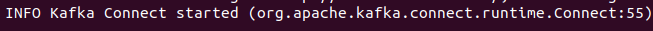
            </p>
        - **connect-distributed.properties** 에 설정하는 **커넥트 작업 프로세스의 핵심 구성 속성**
            1. **bootstrap.servers** : 커넥트와 함께 동작하는 **카프카 브로커의 리스트**다. 여기서는 카프카 클러스터의 모든 브로커를 지정할 필요가 없지만 최소 세 개는 지정할 것은 권한다. **이 속성에 지정된 브로커에 데이터를 전달하는 일은 커넥터가 수행**한다.
            2. **group.id** : 같은 그룹 ID를 갖는 모든 커넥트 작업 프로세스는 같은 **커넥트 클러스터**의 일부가 된다.
            3. **key.converter, value.converter** : **커넥트는 카프카에 저장된 여러 가지 형식의 데이터를 처리할 수 있다. 이 두가지 속성에는 카프카에 저장되는 메시지의 키와 값 부분에 대한 컨버터를 설정**한다. 기본값은 카프카에 포함된 JSONConverter이며, 이 컨버터는 JSON 형식을 사용한다. 이들 속성에는 컨플루언트 스키마 레지스트리의 일부인 AvroConverter를 설정할 수도 있다.
        - **일부 컨버터는 컨버터 특유의 구성 매개변수를 포함**한다. 예를 들어 JSON 메시지는 키 컨버터와 값 컨버터에 대해 스키마의 포함 여부를 설정할 수 있다. 키 컨버터의 경우에는 **key.converter.schemas.enable** = true 또는 false 를 설정하며, 값 컨버터의 경우에는 **value.converter.schemas.enable** = true 또는 false를 설정한다. Avro 메시지(데이터)도 스키마를 포함한다. 그러나 이 때는 **key.converter.schema.registry.url 과 value.converter.schema.registry.url** 을 사용해서 키와 값의 스키마 레지스트리 위치를 설정해야 한다.
        - **일반적으로 커넥터는 카프카 커넥트의 REST API를 통해서 구성 및 관리**된다. 이때 REST API에서 사용할 REST 호스트와 포트를 **rest.host.name과 rest.port** 매개 변수에 설정한다. **rest.host.name의 기본값은 없으며, rest.port의 기본값은 8083**이다.
            ```bash
            $ curl http://localhost:8083/
            ```
            <p align="center">
                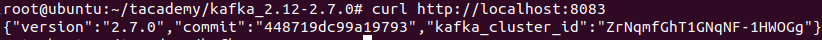
            </p>
        - **여기서는 로컬 호스트의 8083 포트로 REST API를 사용하며, 카프카 2.7.0 스냅샷 버전이 실행 중인 것을 알 수 있다.** 또한 다음과 같이 어떤 커넥터 플러그인들을 사용할 수 있는지도 확인할 수 있다. **FileStreamSourceConnector**는 파일 소스 커넥터고, **FileStreamSinkConnector**는 파일 싱크 커넥터이다.
            ```bash
            $ curl http://localhost:8083/connector-plugins
            ```
            <p align="center">
                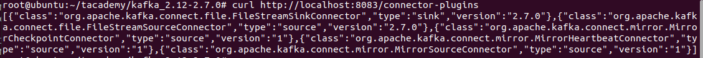
            </p>
        - 카프카 커넥트에서는 **독립 실행**(standalone) 모드도 있다. 이것은 분산 모드와 유사하지만, **bin/connect-distributed.sh 대신에 bin/connectstandalone.sh를 실행**하면 된다. 또한 REST API를 사용하는 대신 명령행에서 커넥터 구성 파일을 전달할 수 있다, 이 모드에서는 하나의 독립실행 작업 프로세스에서 모든 커넥터와 태스크가 실행된다. 시스템 개발과 문제점 해결에는 이 모드로 커넥트를 사용하기가 더 쉽다 또한 커넥터와 태스크가 특정 컴퓨터에서 실행되어야 할 경우에도 좋다.
    3. **커넥트 사용 예 : 파일 소스와 파일 싱크**
        - **분산 모드의 커넥트 작업 프로세스를 시작**시킨다. (예제는 하나만 실행)
            ```bash
            $ bin/connect-distributed.sh config/connect-dstributed.properties
            ```
        - **카프카 구성 파일을 읽어서 토픽으로 쓰도록 파일 소스 커넥터를 생성 및 구성하고 시작시킨다.**
            ```bash
            echo '{"name":"load-kafka-config", "config": {"connector.class": "FileStreamSource", "file":"config/server.properties", "topic": "kafka-config-topic"}}' | curl -X POST -d @- http://localhost:8083/connectors --header "content-Type:application/json"
            ```
            <p align="center">
                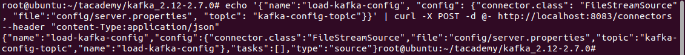
            </p>
        - 커넥터를 생성하기 위해 JSON 형식을 사용했다. 이때 **커넥터 이름인 load-kafka-config를 지정**하였으며, **커넥터 클래스**, **읽을 파일 이름**, **파일 데이터를 쓸 토픽 이름**을 **커넥터 구성 Map인 config에 포함**했다.
        - **echo 명령 실행이 끝나면 카프카 구성 파일의 데이터가 kafka-config-topic이라는 토픽에 저장**되었을 것이다. 카프카 콘솔 컨슈머를 사용해서 제대로 저장되었는지 확인한다.
            ```bash
            bin/kafka-topic.sh --zookeeper {AWS IP}:2181 --list
            bin/kakfa-console-consumer.sh --bootstrap-server={AWS IP}:9092 --topic kafka-config-topic --from-beginning
            ```
            <p align="center">
                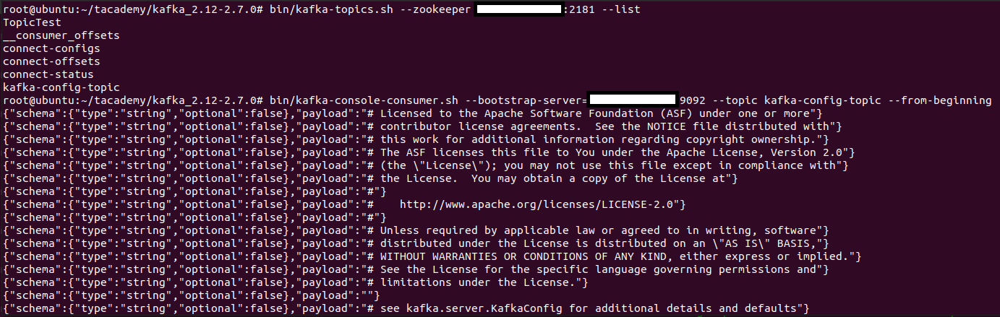
            </p>
        - **기본적으로 JSON 컨버터는 각 레코드에 스키마를 포함한다. 여기서는 스키마가 매우 간단해서 String 타입인 payload라는 이름의 열이 하나만 있다. 그리고 스키마 다음에는 파일의 한 줄을 하나의 레코드로 포함한다.**
        - **파일 싱크 커넥터**를 사용해서 **토픽의 내용을 파일로 쓴다**. JSON 컨버터가 각 JSON 레코드를 일반 텍스트 한줄로 변환해준다. 카프카 토픽의 데이터를 파일로 쓰도록 다음과 같이 **파일 싱크 커넥터를 생성 및 구성하고 시작**시킨다.
            ```bash
            echo '{"name":"dump-kafka-config", "config": {"connector.class": "FileStreamSink", "file": "copy-of-serverproperties", "topics": "kafka-config-topic"}}' | curl -X POST -d @- http://localhost:8083/connectors --header "content-Type:application/json"
            ```
            <p align="center">
                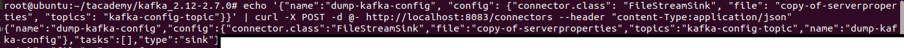
            </p>
        - **소스 커넥터 구성과 싱크 커넥터 구성의 다른 점**을 살펴보면 다음과 같다. 우선, **커넥터 클래스를 FileStreamSource가 아닌 FileStreamSink로 사용**한다. 그리고 **파일 속성은 여전히 포함되지만 여기서는 데이터를 쓰는 대상 파일을 나타낸다.** 또한 **토픽의 경우에는 커넥터 구성 Map의 키로 단수형의 topic 대신 복수형의 topics를 지정**한다. **싱크 커넥터는 카프카 토픽의 데이터를 읽어서 싱크 포인트 (다른 시스템이나 데이터베이스 및 파일 등)로 쓰는 것이므로, 여러 토픽의 데이터를 읽을 수 있기 때문**이다. **반면에, 소스 커넥터는 카프카 토픽에 데이터를 쓰는 것이므로 하나의 토픽만 지정할 수 있다.**
        - 모든 것이 잘 되었다면 copy-of-server-properties라는 이름의 파일이 생성되었을 것이다. 이 파일의 내용은 카프카 토픽에 쓸 때 사용했던 파일의 내용과 완전히 같을 것이다.
            <p align="center">
                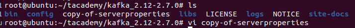
            </p>
    4. **커넥터를 삭제**할 때는 다음과 같이 하면 된다.
        - **명령어**
            ```bash
            $ curl -X DELETE http://localhost:8083/connectors/dump-kafka-config
            ```
            <p align="center">
                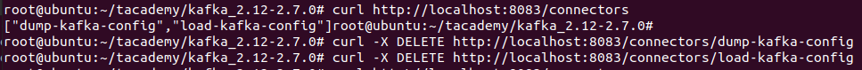
            </p>
        - **커넥터가 삭제된 후 커넥트 작업 프로세스 로그를 보면 다른 모든 커넥터가 자신들의 태스크를 다시 시작하는 것을 알 수 있다. 작업 프로세스들 간에 남은 태스크들의 작업량을 균등하게 재조정하기 위해서다.**
4. **커넥터 사용 예: MySQL에서 엘라스틱서치로**
    - **MySQL 데이터베이스 테이블의 데이터를 읽어서 카프카 토픽으로 쓴다. 그리고 그 데이터를 읽어서 엘라스틱 서치와 그것의 인덱스에 쓴다.**
    - **엘라스틱서치 설치**
        1. **Elastic Public GPG 키 추가**
            ```bash
            $ curl -fsSL https://artifacts.elastic.co/GPG-KEY-elasticsearch | sudo apt-key add -
            ```
        2. **sources.list.d 폴더에 Elastic 소스리스트를 추가**
            ```bash
            $ echo "deb https://artifacts.elastic.co/packages/7.x/apt stable main" | sudo tee -a /etc/apt/sources.list.d/elastic-7.x.list
            ```
        3. **package list 업데이트**
            ```bash
            $ sudo apt update
            ```
        4. **설치**
            ```bash
            $ sudo apt install elasticsearch
            ```
        5. **elasticsearch.yml 수정** (**ElasticSearch는 elasticsearch.yml 에서 설정 관리**)
            ```bash
            $ sudo vi /etc/elasticsearch/elasticsearch.yml
            
            # network.host 부분을 찾아서 아래와 같이 수정
            # Set the bind address to a specific IP (IPv4 or IPv6):
            #
            network.host: localhost
            ```
        6. **elasticsearch 실행, 상태 확인**
            ```bash
            $ sudo systemctl start elasticsearch
            $ service elasticsearch status
            ```
        7. **elasticsearch 설치 및 실행 간에 발생할 수 있는 에러, 해결방법**
            1. 설치 후 **실행할 때** [Job for elasticsearch.service failed because a timeout was exceeded.](https://sleeplessbeastie.eu/2020/02/29/how-to-prevent-systemd-service-start-operation-from-timing-out/)
            2. apt를 이용하여 **설치할 때** [Could not get lock](https://kgu0724.tistory.com/71)
    - **엘라스틱서치 서버를 시작시키고 그것의 로컬 포트로 접속하여 제대로 동작하는지 확인**
        <p align="center">
            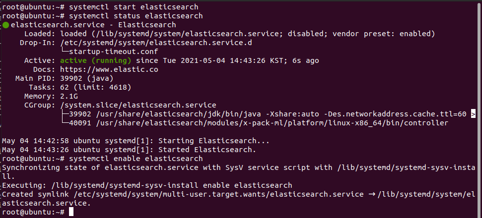
        </p>
        <p align="center">
            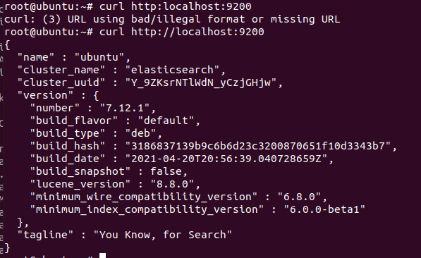
        </p>
    - **필요한 커넥터**
        1. **kafka-connect-elasticsearch** [다운로드](https://docs.confluent.io/kafka-connect-jdbc/current/index.html) <sub>작성자버전:11.0.4</sub>
        2. **kafka-connect-jdbc** [다운로드](https://www.confluent.io/hub/confluentinc/kafka-connect-jdbc?_ga=2.172112618.895701561.1620030238-722010024.1618582505&_gac=1.228981998.1619172056.Cj0KCQjw4ImEBhDFARIsAGOTMj9gLF7m9MfWjk9-SZm0dAkHjMSvkFu3z-TQWnIMLrAVW3f4Kr1OgJwaAmL0EALw_wcB) <sub>작성자버전:10.1.1</sub>
        3. **mysql-connector-java** [다운로드](https://downloads.mysql.com/archives/c-j/) <sub>작성자버전:8.0.23</sub>
    - **각 커넥터 jar파일과 드라이버를 카프카 홈의 libs 폴더로 이동**시킨다.
    - **JDBC 커넥터를 사용해서 카프카로 쓸 데이터를 저장할 MySQL의 테이블을 생성하고 데이터도 추가**한다. (데이터베이스와 테이블을 생성하고 세 개의 데이터를 추가)
        <p align="center">
            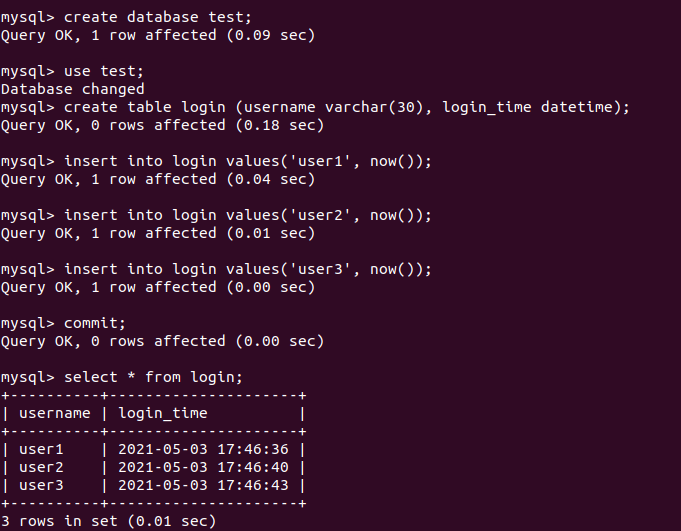
        </p>
    - **JDBC 소스 커넥터를 생성 및 구성하고 시작**한다. **앞의 echo 명령 실행이 끝나면 MySQL 데이터가 mysql.login이라는 토픽에 저장되었을 것이다.** 다음과 같이 카프카 콘솔 컨슈머를 사용해서 이 토픽의 데이터를 읽고 확인해보자.
        ```bash
        echo '{"name":"mysql-login-connector", "config":{"connector.class":"JdbcSourceConnector", "connection.url":"jdbc:mysql://127.0.0.1:3306/test?autoReconnect=true", "connection.user":"root", "connection.password":"root", "mode":"timestamp", "table.whitelist":"login", "validate.non.null":false, "timestamp.column.name":"login_time", "topic.prefix":"mysql."}}' | curl -X POST -d @- http://localhost:8083/connectors --header "content-Type:application/json"

        bin/kafka-console-consumer.sh --bootstrap-server {AWS IP}:9092 --topic mysql.login --from-beginning
        ```
        <p align="center">
            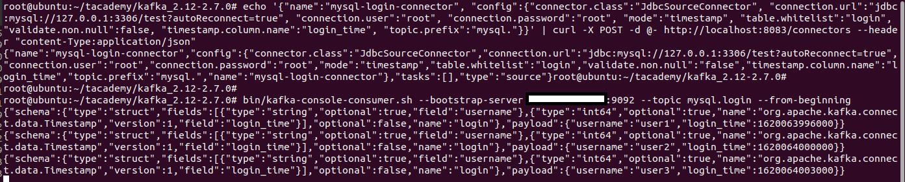
        </p>
    - **커넥터가 실행 중일 때 login 테이블에 새로운 행을 추가하면 카프카의 mysql.login 토픽에도 즉각 반영되는 것을 알 수 있다.**
        <p align="center">
            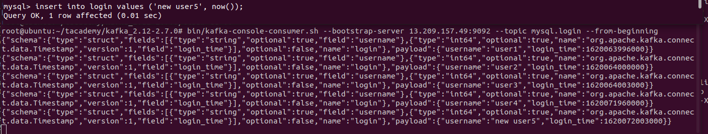
        </p>
    - **엘라스틱서치 싱크 커넥터를 사용**해서 **mysql.login 토픽의 데이터를 엘라스틱 서치에 쓰는 커넥터를 생성 및 구성하고 시작**시킨다.
        ```bash
        # echo '{"name": "elastic-login-connector", "config" : {"connector.class": "ElasticsearchSinkConnector", "connection.url": "http://localhost:9200", "type.name": "mysql-data", "topics": "mysql.login", "key.ignore": true}}' | curl -X POST -d @- http://localhost:8083/connectors --header "content-Type:application/json"
        ```
        <p align="center">
            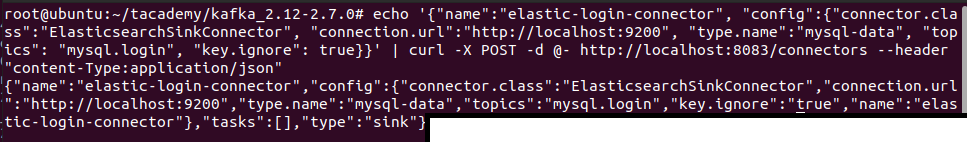
        </p>
    - **connection.url은 방금 전에 실행시킨 로컬 엘라스틱 서치 서버의 URL**이다. **기본적으로 카프카의 각 토픽은 별개의 엘라스틱 서치 인덱스가 되며, 인덱스는 토픽과 같은 이름으로 생성된다.** 여기서는 **mysql.login 토픽 데이터**만 엘라스틱서치에 쓴다.
    - **인덱스에 쓰는 토픽 데이터의 타입은 type.name에 지정하며 여기서는 mysql-data로 설정**하였다.
    - 앞에서 MySQL 데이터베이스의 테이블을 정의할 때 **기본 키를 지정하지 않았으므로 mysql.login 토픽의 데이터는 null 키를 갖는다.**
    - **따라서 key.ignore를 true로 설정하였다. 이 경우 엘라스틱서치 커넥터에서는 토픽 이름과 파티션 ID 및 오프셋이 각 데이터의 키로 사용된다.**
    - 이제 mysql.login 토픽의 데이터를 갖는 엘라스틱서치 인덱스가 생성되었는지 다음과 같이 확인해보자.
        ```bash
        $ curl 'localhost:9200/_cat/indices?v'
        ```
        <p align="center">
            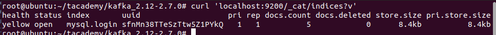
        </p>
    - **인덱스 검색**
        ```bash
        $ curl -s -X "GET" "http://localhost:9200/mysql.login/_search?pretty=true"
        ```
        <p align="center">
            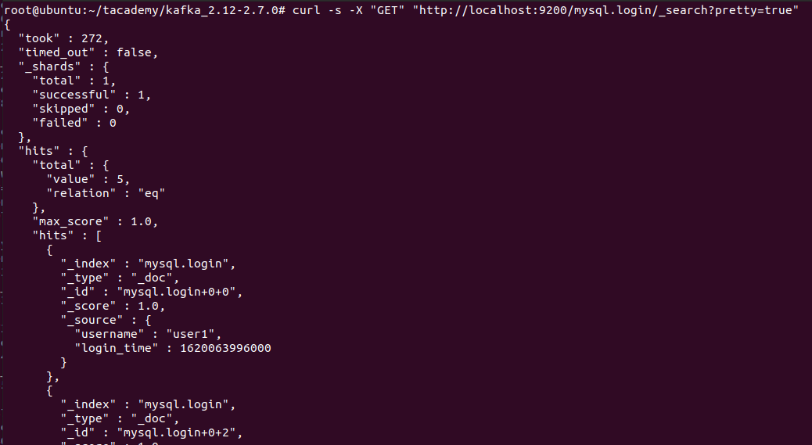
        </p>
    - **만일 MySQL 테이블에 새로운 레코드를 추가하면 카프카의 mysql.login 토픽 및 이와 연관된 엘라스틱 인덱스 모두에 자동으로 추가될 것이다.**
    - 소스와 싱크 커넥터는 우리의 용도에 맞게 짝을 이루어 생성하고 구성한 후 사용할 수 있다. 여러 기업이나 커뮤니티에서 작성하고 지원하는 것을 포함한 모든 커넥터의 내역은 컨플루언트에서 유지 관리한다. 따라서 그 중에서 원하는 것을 골라 깃허브 리포지터리에서 받아 생성 및 구성한 후 커넥트 작업 클러스터에서 실행하면 된다.
5. 카프카 커넥트 **구성 요소와 동작 원리**
    1. **커넥터 플러그인**
        - **커넥터 API를 구현**하며, **커넥터와 태스크를 포함**한다.
    2. **커넥터** (Connector)
        - **커넥터가 수행하는 일**
            1. **커넥터에서 얼마나 많은 태스크가 실행되어야 하는지 결정**
            2. **데이터 복사작업을 각 태스크에 어떻게 분담할 지 결정**
            3. **작업 프로세스로부터 태스크의 구성정보를 얻는다.**
        - 예를 들어, JDBC 소스 커넥터는 데이터 베이스에 연결하고 복사할 기존 테이블들을 찾은 후 그 결과에 기반하여 몇 개의 태스크가 필요한지 결정한다. 이때 tasks.max 구성 옵션의 하한 값과 테이블 개수를 선택한다. 그리고 몇 개의 태스크를 실행할 지 결정하면, 각 태스크의 구성 내역을 생성하며, 이때 커넥터 구성 (예를 들어 connection.url)과 각 태스크에서 복사하기 위해 할당된 테이블 리스트를 같이 사용한다.(실행을 원하는 각 태스크의 구성내역을 갖는 Map들을 taskConfigs() 메서드가 반환한다.) 그 다음에 작업 프로세스들이 테스크를 시작시키며, 이때 각 태스크가 자신에게 할당된 테이블을 복사할 수 있도록 고유한 구성을 전달한다. REST API를 사용해서 커넥터를 시작시킬 때는 어떤 노드에서도 시작시킬 수 있으며 이후에 시작시키는 태스크들도 마찬가지다.
    3. **태스크** (Task)
        - **테스크는 카프카의 데이터를 실제로 입출력하는 책임을 갖는다.** 모든 태스크는 관련 작업 프로세스로부터 컨텍스트를 받아 초기화한다. 소스 컨텍스트는 하나의 객체를 포함하며 이 객체는 소스 태스크가 소스 레코드의 오프셋 (예를 들어, 파일 소스 커넥터의 경우 오프셋은 파일 내부의 위치이며, JDBC 소스 커넥터의 경우에는 오프셋이 테이블의 기본 키 ID가 될수 있다)을 저장할 수 있게 해준다. 싱크 커넥터의 컨텍스트는 메소드들을 포함하며, 이 메서드들은 카프카로부터 받은 레코드들을 커넥터가 제어할 수 있게 해준다. 싱크 커넥터의 컨테스트는 정확히 한번 데이터 전달을 위해 오프셋 커밋의 재시도와 저장 등의 작업을 처리하는데 사용된다. 초기화된 태스크들은 Properties 객체를 전달받아 시작된다. 이 객체는 커넥터가 태스크를 위해 생성한 구성 정보를 갖는다. 그 다음에 시작된 소스태스크는 외부시스템의 데이터를 읽어서 레코드를의 리스트를 반환한다. 이것이 작업 프로세스가 카프카 브로커에게 전송할 데이터다. 이와는 달리 시작된 싱크 태스크는 작업 프로세스를 통해 카프카의 레코드들을 받아서 외부 시스템에 쓰는 작업을 수행한다.
    4. **작업 프로세스** (Worker process)
        - **작업 프로세스는 커넥터와 태스크를 실행하는 컨테이너 프로세스**이며, **커넥터와 커넥터의 구성을 정의하는 HTTP 요청을 처리하는 책임을 갖는다.** 또한, **커넥터 구성을 저장하고, 커넥터와 그것의 태스크를 시작**시킨다. 만일 특정 작업 프로세스가 중단되면 커넥트 클러스터의 다른 작업들이 그 사실을 알게되며 (카프카 컨슈머 프로토콜의 하트비트를 사용), 중단된 작업 프로세스에서 실행되던 커넥터와 태스크들이 나머지 작업 프로세스스들에게 재할당된다. 만일 새로운 작업 프로세스가 커넥트 클러스터에 합류하면, 다른 작업 프로세스들이 그 사실을 알게 되며, 모든 작업 프롯스의 작업량이 균등하게 조정되도록 새로 합류한 작업 프로세스에게 커넥터와 태스크가 할당된다.
        - 또한 작업 프로세스들은 소스와 싱크 커넥터 모두의 오프셋을 자동으로 커밋하고 에러가 생길 때 재시도를 처리하는 책임을 갖는다.
        - 커넥터와 태스크는 데이터 통합의 '이동되는 데이터' 부분만을 처리한다. 반면에 작업 프로세스는 REST API, 구성관리, 신뢰성, 높은 가용성, 확장성, 부하분산 등의 모든 작업을 처리하는 책임을 갖는다.
        - 이처럼 **역할을 분리하는 것이 커넥트 API 사용시의 장점**이며, 이것이 종래의 컨슈머/프로듀서 API와는 다른 점이다. 카프카로부터 데이터를 읽어서 데이터베이스에 추가하는 코드를 작성하려면 대략 하루나 이틀정도 걸리지만, 구성, 에러, REST API, 모니터링, 배포, 규모 확장/축소, 장애 등을 모두 처리하려면 수개월은 족히 소요된다는 것을 경험있는 개발자라면 알수 있을 것이다. 그러나 커넥터를 사용해서 데이터 복사를 구현할 때는 그런 복잡한 작업을 해주는 작업 프로세스에 우리 커넥터를 연결하면 된다.
    5. **커넥트 데이터 모델과 컨버터**
        - **컨버터는 MySQL 데이터베이스 테이블의 각 행을 JSON 레코드로 변환하는 컴포넌트** (커넥터가 카프카에 쓰는 것이 JSON 레코드)
        - 카프카의 커넥트 API에는 데이터 객체와 이 객체의 구조를 나타내는 스키마 모두를 갖는 데이터 API가 포함되어 있다. 예를 들어 JDBC 소스 커넥터는 데이터베이스에서 반환된 테이블 열의 데이터 타입을 기반으로 커넥트 스키마 객체를 구성한다. 그 다음에 그 스키마를 사용하여 데이터베이스 레코드의 모든 필드를 포함하는 구조체를 구성하며, 이 때 각 열에 대해 열 이름과 값을 저장한다. 모든 소스 커넥터가 이와 유사한 일을 수행한다. 즉, 소스 시스템으로부터 데이터를 읽어서 한쌍의 스키마와 값을 생성한다. 싱크 커넥터는 이와 반대의 일을 수행한다. 즉, 한쌍의 스키마와 값을 읽은 후 해당 스키마를 사용해서 값을 분석하고 대상 시스템에 쓴다.
        - 데이터 API 를 기반으로 데이터 객체를 생성하는 방법은 소스 커넥터가 알고 있다. 그러나 이 개체를 카프카에 저장하느 방법을 커넥트 작업 프로세스가 알아야 할 것이다. 컨버터가 개입되는 곳이 바로 여기다. 컨버터는 작업 프로세스(또는 커넥터)를 구성할 때 선택하며, 카프카에 데이터를 저장하기 위해 사용된다. 현재 선택 가능한 컨버터로는 Avro, JSON, 문자열 컨버터가 있다. JSON 컨버터는 최종 레코드에 스키마를 포함시키거나 포함하지 않게 구성될 수 있으므로, 구조를 갖는 데이터와 부분적으로 구조를 갖는 데이터 모두가 지원된다. 커넥터가 작업 프로세스에 데이터 API 레코드를 반환하면, 작업 프로세스는 사전 구성된 컨버터를 사용해서 Avro 객체, JSON 객체, 문자열 중 하나로 해당 레코드를 변환한다. 그 다음에 변환된 레코드가 카프카에 저장된다.
        - 싱크 커넥터는 소스 커넥터와 반대로 처리된다. 즉, 커넥트 작업 프로세스가 카프카로부터 레코드를 읽으면, 사전 구성된 컨버터를 사용해서 카프카 형식으로 된 해당 레코드를 커넥트 데이터 API 레코드로 변환한다. 그 다음에 해당 레코드를 싱크 커넥터에게 전달하며, 싱크 커넥터는 그 레코드를 대상 시스템에 쓴다.
        - 이처럼 커넥트 API는 커넥터 구현과는 무관하게 카프카에 저장된 서로 다른 형식의 데이터를 지원해준다. 따라서 사용가능한 컨버터만 있다면 어떤 커넥터도 레코드 형식에 구해바지 않고 사용될 수 있다.
    6. **오프셋 관리**
        - **오프셋 관리는 작업 프로세스가 커넥터를 위해 수행하는 편의 서비스 중 하나**다. 커넥터는 자신이 이미 처리했던 데이터가 어떤 것인지 알아야 한다. 이때 **커넥터는 카프카가 제공하는 API를 사용해서 이미 처리된 데이터에 관한 정보를 유지 관리할 수 있다.**
        - 소스 커넥터의 경우에는 커넥터가 커넥트 작업 프로세스에게 반환하는 레코드에 논리 소스 파티션과 소스 오프셋이 포함된다. 이것들은 카프카의 파티션과 오프셋이 아니며 필요에 따라 소스 시스템에서 사용하는 파티션과 오프셋이다. 예를 들어, 파일 소스에서는 하나의 파티션이 하나의 파일이 될 수 있으며, 하나의 오프셋은 파일의 줄 번호 또는 문자 위치번호가 될 수있다. JDBC 소스의 경우에는 하나의 파티션이 하나의 데이터베이스 테이블이 되며, 오프셋은 테이블의 레코드 ID가 된다. 소스 커넥터르 작성할 때는 소스시스템의 데이터를 파티션으로 분할하고 오프셋을 추적하는 좋은 방법을 결정해야 한다.
        - 소스 파티션과 소스 오프셋을 포함하는 레코드들을 소스 커넥터가 반환하면 작업 프로세스는 해당 레코드들을 카프카 브로커에게 전송한다. 그리고 브로커가 해당 레코드들을 성공적으로 쓰면, 작업 프로세스가 그 레코드들의 소스 오프셋을 저장한다. 이때 저장하는 매커니즘은 어떤 것을 사용해도 되지만, 주로 카프카의 다른 토픽에 저장한다. 이렇게 함으로써 커넥터가 다시 시작되거나 중단된 이후에도 갖아 최근에 저장되었던 오프셋부터 소스 시스템의 데이터를 읽을 수 있다. 싱크 커넥터는 소스 커넥터와 반대지만 처리절차는 유사하다. 즉, 싱크커넥터는 카프카에 저장된 레코드들을 읽는다. 이 레코드들은 카프카의 토픽과 파티션 및 오프셋을 갖고 있다. 그 다음에 싱크 커넥터는 커넥터 객체의 put() 메서드를 호출하여 해당 레코드들을 대상 시스템에 저장한다. 이 작업이 성공적일 경우 싱크 커넥터는 카프카로부터 받았던 오프셋을 커밋한다. 이때는 평상시에 컨슈머가 커밋하는 메소드들을 사용한다.

----------------------------------------------------

## Cross-cluster data mirroring
1. **복제와 미러링**
    - 대부분의 데이터베이스에서는 데이터베이스 서버 간의 지속적인 데이터 복사를 복제라고 한다.
    - 카프카에서는 같은 클러스터에 속하는 카프카 노드간의 데이터 이동/복사를 '복제'라고 한다
    - **크로스 클러스터**(cross cluster), 즉 **카프카 클러스터 간의 데이터 복사는 미러링**(mirroring)이라고 한다.
    - **카프카에는 미러링 도구로 미러메이커**(MirrorMaker)가 포함되어 있다.
2. **다중 클러스터 아키텍처**
    1. 크로스 데이터센터 통신의 현실적 고려사항
        - 높은 지연성, 제한된 대역폭, 더 높은 비용
    2. **대부분의 아키텍처에서 고려해야할 원칙**
        1. **데이터 센터당 하나의 클러스터만 설치**한다.
        2. **데이터 센터간에는 각 데이터를 정확히 한번만 복제**한다.
        3. **가능하다면, 원격 데이터 센터에 데이터를 쓰는 것보다는 읽는 형태로 아키텍처를 구현**한다.
    3. **허브-스포크 아키텍처** (hub-and-spokes)
        - **하나의 중앙 카프카 클러스터를 중심으로 다수의 지역 카프카 클러스터가 연결된 아키텍처**
        - 가장 간단한 형태로 두 개의 클러스터 즉, 리더와 팔로어만 갖는 형태가 있다.
        - **다수의 데이터 센터에서 데이터가 생성되고, 일부 컨슈머가 전체 데이터를 사용해야 할 때 적합하다.**
        - **각 데이터센터의 애플리케이션은 해당 데이터센터의 지역 데이터만 사용할 수 있고 다른 모든 데이터 센터의 데이터는 사용할 수 없다.**
        - **주된 장점은 데이터가 항상 지역 데이터 센터에서 생성되고 중앙 데이터 센터에는 한번만 미러링된다는 것이다.** 따라서 한 데이터 센터의 데이터를 처리하는 애플리케이션들은 해당 데이터 센터에 둘 수 있다.
        - **미러링은 항상 한 방향으로만 진행**되며, 각 컨슈머는 항상 같은 클러스터에서 데이터를 읽으므로 이 아키텍처는 배치와 구성 및 모니터링이 간단하다.
        - **한 지역의 데이터센터의 서버들이 다른 지역 데이터센터 서버의 데이터를 사용할 수 없다는 것이 단점이다.**
        - **이 아키텍처는 각 지역 데이터센터에서 완전히 따로 갖고 처리될 수 있는 데이터에 국한해서 사용된다.**
        - 이 아키텍처를 구현할 때는, 각 지역 데이터 센터를 미러링하는 프로세스가 최소한 하나씩 중앙 데이터 센터에서 실행되어야 한다. 이 프로세스는 각 원격 지역 클러스터의 데이터를 읽어서 중앙 클러스터에 쓴다. 만일 다수의 데이터 센터에 같은 이름의 토픽이 있으면, 해당 토픽의 모든 데이터를 같은 이름을 갖는 중앙 클러스터의 토픽에 쓰거나, 각 데이터센터에서 다른 이름의 별개 토픽으로 데이터를 쓰면 된다.
    4. **액티브-액티브 아키텍처**
        - **두 개 이상의 데이터 센터가 데이터의 일부 또는 모두를 공유하면서 각 데이터 센터가 모두 다 데이터를 쓰거나 읽을 수 있을 때 이 아키텍처가 사용**된다.
        - **주된 장점은 인근의 데이터센터에서 사용자들을 서비스할 수 있다는 것이다.** 따라서 사용 가능한 데이터의 제한으로 인한 기능성의 저하없이 성능 상의 이점을 갖는다.
        - **두번째 장점은 이중성과 회복력**이다. 모든 데이터 센터는 모든 기능을 동일하게 가지므로 만일 한 데이터 센터를 사용할 수없 다면 나머지 다른 데이터 센터로 사용자를 연결할 수 있다. 이런 형태의 장애 복구는 사용자의 네트워크 전환만 필요하며, 가장 쉽고 명료한 형태의 장애 복구다.
        - **주된 단점은 여러 위치에서 비동기적으로 데이터를 읽거나 변경할 때 충돌을 피하기 어렵다는 것**이다. 따라서 이 아키텍처는 데이터 미러링의 기술적인 어려움이 수반된다. 예를 들어, 같은 데이터가 클러스터 간을 오가면서 끝없이 미러링되지 않도록 해야한다. 그러나 이보다 중요한 것은 **두 데이터 센터간의 데이터 일관성을 유지하기 어렵다는 것**이다.
        - 만일 여러 데이터 센터의 같은 데이터를 비동기적으로 읽고 쓰는 어려움을 처리하는 방법을 찾았다면 이 아키텍처를 적극적으로 권장한다. 확장성, 회복력, 유연성이 가장 좋고, 비용 효율적인 선택이기 때문이다.
        - 특히 두 개 이상의 데이터 센터일때 액티브-액티브 미러링의 어려운 부분은, 각 쌍의 데이터 센터와 양방향에 대해 미러링 프로세스가 필요하다는 것이다. 예를 들어 다섯 개의 데이터 센터일 경우 최소 2-개의 미러링 프로세스를 유지 관리해야 한다. 그리고 높은 가용성을 위해 각 프로세스가 이중성이 필요하다면 40개가 될 수 있다.
        - 또한 같은 데이터가 클러스터 간을 오가면서 끝 없이 미러링되는 것을 막아야 한다. 이때는 각 데이터 센터에 논리 토픽을 별도로 두고 원격 데이터센터가 가진 원본 토픽의 복제를 막으면 된다.
    5. **액티브-스탠바이 아키텍처**
        - 때에 따라서는 **다중 클러스터가 재해 대비만을 위해서 필요할 수도** 있다. **이때는 같은 데이터센터에 두 개의 클러스터를 갖게 될 것**이다.
        - 하나의 클러스터는 모든 애플리케이션에서 사용하고 두번째 클러스터는 원본 클러스터의 모든 데이터를 포함하며, 만일 원본 클러스터가 완전히 사용 불가능하면 두번째 클러스터를 사용할 수 있다. 또한 지리적인 장애 복구가 필요할 수도 있다. 이 데이터센터는 비상시에 관리자가 시작시킬 수 있고 두번째 클러스터를 사용하는 모든 애플리케이션의 비활성 복사본을 갖는다.
        - 이 아키텍처의 **장점은 설치가 간단하고 어떤 이용 사례에서도 사용될 수 있다는 것이다. 즉, 두번째 클러스터를 추가로 설치하고, 한 클러스터에서 다른 클러스터로 모든 데이터를 전송하는 미러링 프로세스를 실행하면 된다. 이 경우 데이터 사용과 데이터 충돌 처리 및 아키텍처의 복잡도에 관해 걱정할 필요가 없다.**
        - **단점은 클러스터의 낭비**라는 것과 카프카 클러스터 간의 장애 복구가 실제로는 보기보다 훨씬 어렵다는 것이다. 일체의 데이터 유실이나 중복 데이터 없이 카프카 클러스터를 완벽하게 복구하는 것은 현재로는 불가능하기 때문이다. 데이터 유실과 중복 데이터를 최소화할 수는 있지만 아예 없앨 수는 없다.
        - 재해에 대비하여 대기하는 것 외에 아무일도 하지 않는 클러스터는 분명히 자원 낭비다. 재해는 드물게 생기므로 아무것도 하지 않는 클러스터를 지켜만 보는 꼴이 된다. 따라서 일부 조직이나 회사에서는 업무용 클러스터보다 훨씬 작은 규모의 재해복구용 클러스터르 고려하기도 한다. 그러나 이것은 위험한 생각이다. 소형화된 클러스터가 비상시에 견딜수 있는지 확신할 수 없기 때문이다.
        - 이와는 달리 다른 조직이나 회사에서는 재해가 없는 동안 읽기 전용의 일부 작업을 재해복구 클러스터에서 실행시켜서 그것을 유용하게 사용하기도 한다. 이것은 하나의 엔드포인트만 연결된 허브-스포크 아키텍처의 소규모 버전을 실행하는 것을 의미한다.
3. **장애 복구**
    1. **계획에 없던 장애 복구의 데이터 유실과 불일치**
        - **카프카의 다양한 미러링 솔루션은 모두 비동기 방식**이므로 재해복구용 클러스터는 주 클러스터의 가장 최근 메시지를 모두 갖지 못할 수 있다. 따라서 재해복구용 클러스터가 얼마나 뒤처져있는지 항상 모니터링하여 너무 뒤떨어지지 않게 해야 한다.
        - 계획된 장애 복구에서는 주 클러스터를 중단시킨 후 뒤처진 메시지들을 미러링 프로세스가 미러링하도록 기다림으로써 데이터 유실을 막을 수 있다.
        - 그러나 계획에 없던 장애 복구가 발생하여 수천개의 메시지가 유실되는 상황이 발생한다면 현재 카프카는 트랜잭션 개념을 갖고 있지 않으므로 여러 토픽의 일부 메시지들이 상호 관련이 있는 경우 그 중 일부는 장애 복구 시점에 재해 복구용 클러스터에 도착할 수 있지만 다른 메시지들은 그렇지 않을 것이다. 따라서 재해복구용 클러스터로 복구를 한 후에는 우리 애플리케이션에서는 그런 연관된 메시지들을 처리할 수 있어야 한다.
    2. **장애 복구 이후 애플리케이션의 시작 오프셋**
        1. **시작 오프셋**
            - 다른 클러스터로 **장애 복구를 할 때 가장 어려운 부분은 데이터 읽기를 시작해야 하는 위치**를 애플리케이션에서 알 수 있게 하는 것이다.
        2. **자동 오프셋 재설정** (auto offset reset)
            - **아프치 카프카 컨슈머는 이전에 커밋된 오프셋이 없을 때 어떻게 실행할 것인지를 나타내는 구성 속성**을 갖는다. 커밋하는 오프셋을 주키퍼에 쓰는 **구버전의 컨슈머**를 사용 중이면서 해당 오프셋을 어떻게 하든 미러링하지 않는다면 다음 중 하나의 옵션을 선택해야 한다.
            - 사용 가능한 데이터의 맨 앞부터 읽기 시작하면서 많은 중복 데이터를 처리하거나 (auto.offset.reset=**earliest**) 제일 끝으로 이동하여 알 수 없는 개수의 데이터를 유실하거나(auto.offset.redset=**latest**)
            - 만일 우리 애플리케이션에서 문제없이 중복데이터를 처리하거나 일부 데이터 유실이 그리 중요하지 않다면, 이 옵션의 선택은 매우 쉽다. 장애 복구중인 토픽의 제일 끝으로 이동하는 것이 여전히 가장 많이 사용하는 장애 복구 방법이기 때문이다.
        3. **오프셋 토픽을 복제하기** (replicate offsets topic)
            - **카프카 0.9 버전 이상의 컨슈머**를 사용 중이라면 컨슈머가 자신의 오프셋들을 주키퍼에 쓰지 않고 카프카의 특별한 토픽인 **__consumer_offsets**에 커밋한다. 만일 이 토픽을 재해 복구 클러스터에 미러링한다면, 컨슈머가 재해복구 클러스터의 데이터를 읽기 시작할 때 자신의 이전 오프셋을 선택하여 그 위치부터 계속 읽을 수 있다. 이것은 간단하지만 다음에 설명하는 **여러 가지 주의사항을 고려해야 한다.**
            - 첫번째, **주 클러스터의 오프셋이 재해 복구 클러스터의 오프셋과 일치한다는 보장이 없다.**
            - 두번째, 토픽이 처음 생성되었을 때 곧바로 미러링을 시작했고, 주 클러스터 토픽과 재해 복구 클러스터 토픽 모두 오프셋 0에서 시작한다고 하더라도 **프로듀서가 메시지 쓰기를 재시도하면 두 클러스터의 오프셋이 달라질 수 있다.**
            - 세번째, 주 클러스터와 재해 복구 클러스터의 오프셋이 완벽하게 보존되었더라도 **컨슈머가 커밋한 오프셋은 이 오프셋의 데이터보다 일찍 또는 늦게 처리될 수 있다.** 왜냐하면 주 클러스터와 재해 복구 클러스터 간의 지연과 카프카의 트랜잭션 처리 기능이 없기 때문이다. 따라서 장애 복구 중인 컨슈머가 자신이 커밋했던 오프셋의 데이터를 찾을 수 없게 될 수 있다. 또는 재해 복구 클러스터의 가장 최근 커밋 오프셋이 주 클러스터의 가장 최근 커밋 오프셋보다 이전 것일 수 있다.
            - 이 경우 재해복구 클러스터의 가장 최근 커밋 오프셋이 주 클러스터의 가장 최근 커밋 오프셋보다 이전 것이거나 커밋 재시도로 인해 재해 복구 클러스터의 데이터 오프셋이 주 클러스터의 데이터 오프셋보다 앞선 것이라면 일부 중복된 데이터가 생길수 있다.
            - 이에 추가하여 재해복구 클러스터의 가장 최근 커밋 오프셋이 자신과 일치하는 데이터가 없는 경우를 처리하는 방법을 알아야 한다.
            - 이 방법에는 제약이 따른다. 그러나 다른 방법에 비해 중복이나 유실되는 데이터의 수가 감소하고 여전히 다른 재해복구 클러스터에 장애 복구를 할 수 있다. 그리고 구현하기도 간단하다.
        4. **시간 기반 장애 복구** (time-based failover)
            - **카프카 0.10.0 버전 이상의 컨슈머**를 사용 중이라면, **각 메시지는 카프카에 전송되었던 시간을 나타내는 타임스탬프를 갖는다.** 그리고 **브로커는 타임스탬프로 오프셋을 찾는 API와 인덱스르 포함**한다. 따라서 재해복구 클러스터에 장애 복구를 할 때 특정 시점의 데이터부터 읽어서 처리를 시작할 수 있다.
            - 데이터가 중복 처리되겠지만, 다른 방법보다 더 좋고 어떻게 처리되는지 설명하기도 훨씬 쉽다. 따라서 이것은 좋은 절충안이 될 수 있다.
            - 컨슈머에게 특정 시점의 데이터부터 읽고 처리하도록 하는 방법은 사용자가 설정 가능한 시작 시간을 우리 애플리케이션에 넣는 것이다. 그리고 애플리케이션에서는 카프카의 새로운 API를 사용해서 해당 시작 시간부터 그 이후의 오프셋들을 읽고 처리한 후 종전처럼 오프셋들을 커밋하면 된다. 이때 커밋하는 오프셋들은 특정 사용자 그룹의 토픽과 파티션들의 오프셋들이다.
        5. **외부 오프셋 매핑** (external offset mapping)
            - **오프셋 토픽 복제 방법에서 가장 어려운 것은 주 클러스터와 재해 복구 클러스터의 오프셋이 다를 수 있다는 것**이다. 이것을 고려하여 일부 조직이나 회사에서는 아파치 **카산드라**와 같은 외부 데이터스토어를 사용하여 두 클러스터 간에 매핑되는 오프셋을 저장하며 자신들의 카프카 미러링 도구를 사용한다. 왜냐하면 데이터가 재해복구 클러스터에 저장될 때마다 주 클러스터와 재해복구 클러스터 모두의 오프셋들을 외부 데이터스토어에 전송하여 저장하기 때문이다. 또는 두 클러스터의 오프셋 간에 차이가 생길 때만 양쪽 오프셋 모두를 저장하는 방법을 사용한다.
            - 그러나 이 방법은 여전히 오프셋 커밋과 관련된 문제가 생길 수 있다. 즉, 데이터보다 그것의 오프셋이 먼저 커밋되는 문제와 제때에 재해복구 클러스터에 미러링되지 않은 오프셋 커밋이 생기는 문제다.
    3. **장애 복구 후**
        - **주 클러스터와 관련해서 장애가 생겼던 기존의 주 클러스터를 재해복구 클러스터로 바꾸고 복구된 재해복구 클러스터를 주 클러스터로 사용해야 한다.**
        - 이때 반대방향으로 미러링하기 위해 미러링 처리만 간단하게 변경한 후 새로운 주 클러스터로부터 이전의 주 클러스터로 미러링을 시작하고 싶을 것이다. 그러나 이것은 다음 두가지 의문을 초래한다.
            1. **어디서부터 미러링을 시작할지 알 수 없다.**
            2. **재해 복구 클러스터에 없는 데이터를 원래 주클러스터가 가지고 있을 가능성이 크다.**
        - **이런 이유로 재해 복구 클러스터가 된 원래의 주 클러스터를 정리해야 한다.** 즉, 모든 데이터와 커밋된 오프셋들을 삭제한 후 새로운 주 클러스터로부터 이 클러스터로 미러링을 시작한다. 이렇게 함으로써 새로운 주 클러스터와 같은 재해 복구 클러스터가 된다.
    4. **클러스터 찾기**
        - 액티브-스탠바이 아키택처의 스탠바이 클러스터를 계획할 때 고려해야 할 것이 있다. **장애가 생길때 스탠바이 클러스터와 통신을 시작하는 방법을 우리 애플리케이션에서 알아야 한다.** 만일 프로듀서와 컨슈머의 boostrap.servers 속성에 주 클러스터 브로커들의 호스트 이름을 IP 주소로 지정했다면 스탠바이 클러스터와의 통신이 어렵게 될 것이다.
        - 따라서 대부분의 조직이나 회사에서는 주클러스터 브로커들을 가리키는 DNS 이름을 생성하고 비상시에는 해당 DNS 이름이 스탠바이 클러스터의 브로커들을 가리킬 수 있게 한다. 그러나 클러스터의 모든 브로커가 DNS를 가질 필요는 없다. 왜냐하면 카프카 클라이언트가 하나의 브로커만 성공적으로 연결하면 그것의 클러스터에 관한 메타데이터를 받아서 다른 브로커들도 알 수 있기 때문이다. 따라서 연결이 안되는 브로커가 생길 경우를 고려하여 프로듀서와 컨슈머 속성에는 세 개의 브로커에 대한 DNS만 설정하는 것이 좋다.
4. **스트레치 클러스터** (stretch cluster)
    1. **스트레치 클러스터**
        - 액티브-스탠바이 아키텍처는 카프카 클러스터의 장애에 대비하여 사용되며 클러스터에 장애가 생길 때는 애플리케이션들이 스탠바이 클러스터와 통신한다.
        - **스트레치 클러스터는 한 데이터 센터 전체의 장애가 생길 때 카프카 클러스터를 보호하기 위해 필요**하다.
        - 이때는 **다수의 데이터 센터에 걸쳐 하나의 카프카 클러스터를 설치**한다.
        - 스트레치 클러스터는 다른 다중 데이터 센터의 경우와 근본적으로 다르다. 우선, **이 클러스터는 다중 클러스터가 아닌 하나의 클러스터만 갖는다.** 따라서 두 클러스터를 동기화하기 위한 **미러링이 필요없으며**, 클러스터의 모든 브로커를 동기화하기 위해 평상시처럼 **카프카의 동기화 복제 매커니즘이 사용된다.** 즉, 메시지가 성공적으로 카프카에 써진 후에 프로듀서가 카프카 브로커로부터 확인 응답을 받는다는 의미다. 그리고 하나가 아닌 두 데이터 센터의 카프카 브로커들에게 메시지가 성공적으로 써진 후에 확인 응답을 받도록 구성할 수 있다. 이때 각 파티션의 리플리카 브로커가 두 데이터 센터에 있는지 확인하기 위해 랙(rack)을 정의하고 사용한다. 또한 메시지를 쓸 때 최소한 두 데이터 센터로부터 확인 응답을 받도록 min.insync.replicas와 acks=all 속성을 사용한다.
        - **스트레치 클러스터 아키텍처의 장점은 카프카에 포함된 동기화 복제**다. 비즈니스에 따라서는 재해 복구 클러스터가 항상 주 클러스터와 100% 동기화되는 것을 필요로 한다. 이것은 법률적인 요구사항이며, 모든회사의 어떤 데이터스토어에도 적용된다. 또한 스트래치 클러스터의 데이터센터들과 브로커들이 모두 사용된다는 장점도 있다.
        - 스트레치 클러스터 아키텍처는 재해 중에도 데이터센터 장애만 대비할 수 있으며, 애플리케이션이나 카프카의 장애 복구는 안된다.
        - **이 아키첵터는 최소한 3개의 데이터센터에 카프카와 주키퍼를 설치할 수 있을 때만 실현할 수 있다. 또한 각 데이터 센터간에는 높은 대역폭과 낮은 지연이 보장되어야 한다.**
        - 아파치 카프카에서 사용하는 주키퍼에서는 하나의 클러스터에 홀 수 개의 노드를 필요로 하며, 이 노드들 중 과반수 노드가 사용 가능해야 하므로 최소한 3개의 데이터센터가 필요하다.
5. **아파치 카프카의 미러메이커**
    1. **미러메이커**
        - 아파치 카프카는 **미러메이커라는 두 개의 데이터센터 간에 데이터를 미러링 하는 간단한 도구를 포함**한다.
        - 내부적으로는 **컨슈머를 모아놓은 것**이다. (미러메이커 문서에서는 이 컨슈머들을 스트림(stream)이라고 한다.)
        - 이 컨슈머들은 같은 컨슈머 그룹에 속해 있고 복제할 토픽들의 데이터를 읽는다.
        - **미러메이커 프로세스에는 여러 개의 컨슈머가 포함되어있지만 프로듀서는 하나만 갖고있다.**
        - **작업 처리 절차**
            1. **미러메이커 프로세스는 각 컨슈머의 스레드를 실행시킨다.**
            2. **각 컨슈머는 소스 클러스터에 할당된 토픽과 파티션들의 데이터를 읽은 후 공유되는 프로듀서를 사용해서 그 데이터를 대상 클러스터에 전송**한다.
            3. 이때 컨슈머는 기본적으로 60초마다 한번씩 자신의 모든 데이터를 대상 카프카 클러스터로 전송하도록 프로듀서에게 알려주고 대상 카프카 클러스터의 확인 응답을 기다린다. 그 다음에 컨슈머는 소스 카프카 클러스터에 해당 데이터의 오프셋을 커밋한다. 이렇게 함으로써 데이터 유실이 생기지 않으며 최악의 경우 미러메이커 프로세스가 중단되더라도 60초 분량의 데이터 중복만 생긴다.
    2. **미러메이커 구성**
        - 미러메이커는 하나의 프로듀서와 다수의 컨슈머를 사용하므로 **프로듀서와 컨슈머의 모든 구성 속성을 사용하여 구성**될 수 있다. 또한 **미러메이커 자체의 구성 옵션들도 갖고 있다.**
        - **미러메이커 실행 명령**
            ```bash
            $ bin/kafka-mirror-maker --consumer.config etc/kafka/consumer.properties --producer.config etc/kafka/producer.properties --new.consumer --num.streams=2 --whitelist ".*"
            ```
        - **명령행 인자**
            1. **consumer.config**
                - 소스 클러스터에서 데이터를 읽는 모든 **컨슈머의 구성 속성**이다. 모든 미러메이커 컨슈머는 **하나의 구성 파일을 공유**한다. 이것은 **하나의 소스 클러스터**와 **하나의 그룹**(group.id)만 가질 수 있다는 의미다. 따라서 **모든 미러메이커 컨슈머는 같은 컨슈머 그룹의 일부**가 된다. 컨슈머 구성 파일(consumer.properties)에 있는 **필수 구성 속성으로는 group.id와 소스 클러스터의 bootstrap.servers**가 있으며, 이외에도 다른 속성을 설정할 수 있다.
                - 단, **변경하지 말고 그대로 두어야 할 속성으로 auto.commit.enable=false**가 있다. 미러메이커는 데이터가 대상 카프카 클러스터에 안전하게 도착한 후 카프카의 자동 커밋 기능을 사용하지 않고 자신이 제어하여 오프셋을 커밋한다. 따라서 **이 속성을 true로 변경하여 카프카의 자동 커밋 기능을 사용하면 데이터 유실이 생길 수 있다.**
                - **변경을 원하는 한 가지 속성은 auto.offset.reset**일 것이다. 이것의 기본값은 latest이며, 미러메이커가 시작된 이후 소스 클러스터에 도착했던 데이터들만 미러링한다는 것을 의미한다. **만일 기존 데이터도 미러링하고자 한다면 이 속성을 earliest로 설정하면 된다.**
            2. **producer.config**
                - 대상 클러스터에 데이터를 쓰기 위해 미러메이커가 사용하는 **프로듀서의 구성파일**을 나타낸다. 이 구성파일의 **유일한 필수 속성은 대상 클러스터의 bootstrap.servers**이다. 대상 카프카 클러스터에 최초로 연결하기 위해 미러메이커 프로듀서가 사용하는 브로커들의 host:port 목록을 이 속성에 설정한다.
            3. **new.consumer**
                - 미러메이커는 0.8버전 이상의 컨슈머를 사용할 수 있다. 그러나 **이 명령행 인자를 지정하면 더 새로운 버전의 컨슈머를 사용**한다.
            4. **num.streams**
                - **소스 클러스터로부터 데이터를 읽는 미러메이커 내부의 컨슈머를 스트림이라고 하며, 이 명령행 인자는 스트림의 수를 나타낸다.** 같은 미러메이커 프로세스의 모든 컨슈머는 같은 프로듀서를 공유한다는 것을 기억하자. 따라서 이 인자에 너무 많은 스트림개수르 지정하면 프로듀서가 포화상태가 되어 감당하기 어렵게 된다. **만일 미러링되는 데이터의 처리량을 늘려야 한다면 또 다른 미러메이커 프로세스를 사용해야 한다.**
            5. **whitelist**
                - **미러링되는 토픽 이름의 정규 표현식**을 나타낸다. 이 인자에 지정한 정규 표현식과 일치하는 이름의 모든 토픽들이 미러링된다. 이 예에서는 모든 토픽을 선택하였다. 그러나 prod.*와 같이 지정하여 원하는 토픽들만 선택하는 것이 좋다.
    3. **AWS 서버에 있는 카프카 토픽 데이터를 미러메이커를 사용하여 로컬에 저장하기**
        1. **AWS 서버에서 토픽 리스트를 확인한다.**
            ```bash
            $ ./kafka-topics.sh --zookeeper localhost:2181 --list
            ```
            <p align="center">
                
            </p>
        2. **my.login 토픽의 데이터를 확인한다.**
            ```bash
            $ ./kafka-console-consumer.sh --bootstrap-server localhost:9092 --topic mysql.login --from-beginning
            ```
            <p align="center">
                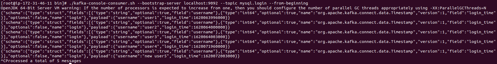
            </p>
        3. **Local에서 토픽 리스트를 확인한다.**
            ```bash
            $ ./kafka-topics.sh --zookeeper localhost:2181 --list
            ```
            <p align="center">
                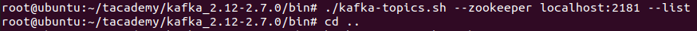
            </p>
        4. **Local에서 미러메이커 실행**
            - 미러메이커를 위한 별도의 **toMirror 폴더에 consumer.properties, producer.properties 생성, 구성**
            - "**mysql.login=LEADER_NOT_AVAILABLE**" 는 프로듀서가 토픽에 데이터를 쓰는 시점에 토픽을 미리 생성하지 않고 자동으로 생성되게 해서 (**auto.create.topics.enable, default=true**) 발생하는 WARN이다.
            <p align="center">
                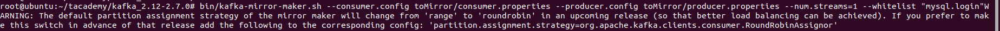
            </p>
            <p align="center">
                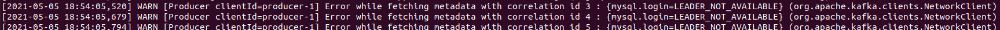
            </p>
        5. **실행 후 토픽 리스트와 데이터를 확인한다.**
            ```bash
            $ ./kafka-topics.sh --zookeeper localhost:2181 --list
            $ ./kafka-console-consumer.sh --bootstrap-server localhost:9092 --topic mysql.login --from-beginning
            ```
            <p align="center">
                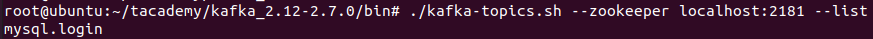
            </p>
            <p align="center">
                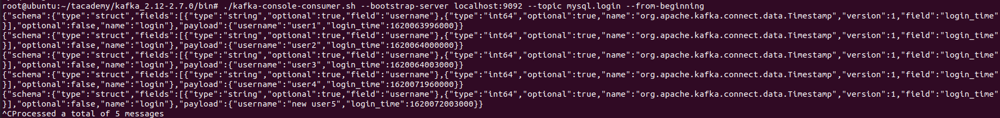
            </p>
    4. **미러메이커를 업무용으로 배포/설치하기**
        - 미러메이커를 사용하는 대부분 회사에서는 구성 매개변수를 포함하는 자신들의 시작 스크립트를 갖고 있다. Ansible, Puppet, Chef, Salt와 같은 업무용 배포/설치 시스템들은 배포/설치를 자동화하면서 많은 구성 옵션과 파일들을 관리해준다.
        - **가장 많이 알려진 방법으로는 도커 컨테이너 내부에서 미러메이커를 실행하는 것**이 있다. **미러메이커는 상태 정보를 자신이 갖고 있지 않으며, 일체의 디스크 스토리지도 필요로 하지 않는다.** 도커 컨테이너 내부에 미러메이커를 포함하면 하나의 컴퓨터에서 다수의 미러메이커 인스턴스를 실행할 수 있다. 미러메이커 인스턴스 하나가 처리할 수 있는 미러링 데이터의 처리량은 하나의 프로듀서 처리량에 국한되므로 다수의 미러메이커 인스턴스를 실행하는 것이 중요할 때가 있으며 도커가 그것을 쉽게 해준다.
        - **도커는 규모확장이나 축소도 더 쉽게 해준다.** 즉 더 많은 처리량이 필요할 때는 미러메이커를 포함하는 컨테이너를 추가하고 처리량이 적을 때는 컨테이너 수를 줄이면 된다. 만일 클라우드 환경에서 미러메이커를 실행중이라면 처리량과 요구에 따라 컨테이너를 실행하는 서버까지도 추가할 수 있다.
        - **가능한한 미러링 데이터를 쓰는 데이터 센터에서 미러메이커를 실행해야한다.** 이렇게 하는 이유는 장거리 네트워크가 데이터센터 내부보다 신뢰성이 떨어질 수 있기 때문이다. 만일 네트워크가 서브 네트워크로 분할되어있고 데이터 센터간의 연결이 끊어진다면 프로듀서가 클러스터에 연결될 수 없는 것보다 컨슈머가 연결될 수 없는 것이 훨씬 더 안전한다. 컨슈머가 연결될 수 없으면 데이터를 읽을 수는 없지만 해당 데이터는 여전히 소스 카프카 클러스터에 저장되어 오랫동안 남아있으므로 데이터가 유실될 위험이 없다. 이와는 달리 데이터가 이미 소비되었는데 네트워크 분할로 인해 프로듀서가 해당 데이터를 쓸 수 없다면 미러메이커에 의해 예기치않게 유실될 수 있는 위험이 항상 존재한다. 따라서 컨슈머가 원격지의 데이터를 읽는 것이 프로듀서가 원격지에 쓰는 것보다 더 안전하다.
        - 반대로 로컬 데이터센터의 데이터를 읽어서 원격지 데이터센터에 쓰는 경우는 데이터 센터 내부에서는 데이터를 암호화할 필요가 없지만 데이터 센터 간에 데이터가 전송될 때 암호화를 해야 할 경우다. 컨슈머가 SSL 암호화를 사용해서 카프카에 연결할 때는 프로듀서보다 훨씬 더 성능이 떨어진다. 그리고 이런 성능저하는 카프카 브로커에게도 영향을 준다. 따라서 **데이터센터 간의 데이터 전송시 암호화가 필요하다면 소스 데이터 센터에서 미러메이커를 실행하는 것이 더 좋다.** 로컬 데이터 센터에서 암호화되지 않은 데이터를 읽은 후 SSL 암호화 연결을 통해 원격 데이터 센터에 전송하여 쓰면 되기 때문이다. 이 경우 프로듀서는 SSL을 사용하여 카프카와 연결되지만 컨슈머는 그렇지 않으므로 성능에 그리 영향을 주지 않는다. 만일 이처럼 로컬 데이터센터의 데이터를 읽어서 원격 데이터 센터에 쓴다면, 미러메이커의 프로듀서 구성속성으로 acks=all 을 설정하고 재시도 횟수(retries)도 충분한 값으로 설정하여 미러메이커가 데이터를 유실하지 않게 하는 것이 좋다. 또한 전송에 실패 할때는 미러메이커가 종료되도록 구성하자. 계속 실행되게 하는 것보다 더 안전하고 데이터 유실 위험도 없기 때문이다.
        - 만일 소스와 대상 클러스터 간의 지연이 거의 없어야 한다면, 최소한 두 개의 서로 다른 서버에서 두 개의 미러메이커 인스턴스를 실행해야 할 것이다. 이렇게 하면 어떤 이유로든 하나의 서버가 중단되더라도 다른 서버의 미러메이커가 계속해서 데이터를 미러링할 수 있기 때문이다.
        - 미러메이커를 업무용으로 배포/설치할 때는 **다음과 같은 모니터링을 하는 것이 중요**하다.
            1. **지연 모니터링** (lag monitoring)
                - 대상 클러스터가 소스 클러스터보다 미러링에서 뒤처지고 있는지 알아야 한다. **소스 클러스터의 가장 최근 데이터와 대상 클러스터의 가장 최근 데이터간의 오프셋 차이가 지연이다.**
                - 추적하는 방법에는 두 가지가 있지만 둘 다 완벽하지는 않다.
                    1. **미러메이커가 소스 카프카 클러스터에 가장 최근에 커밋한 오프셋을 확인**한다. kafka-consumer-groups를 사용하면 미러메이커가 읽는 각 파티션의 정보를 확인할 수 있다. 예를 들어 해당 파티션의 마지막 데이터의 오프셋, 미러메이커가 커밋한 마지막 오프셋, 그리고 이 두 개의 오프셋 간의 지연 데이터 개수다. 이 정보는 100% 정확한 것은 아니다. 미러메이커가 항상 오프셋을 커밋하지는 않기 때문이다. 기본적으로 미러메이커는 매분 간격으로 오프셋을 커밋한다. 따라서 1분 동안의 지연 데이터 수가 증가했다가 갑자기 감소하는 것을 알게 될 것이다. **링크드인의 버로우**(Burrow)도 같은 정보를 모니터링한다. 그러나 지연이 실제 문제를 나타내는지 결정하는 더 복잡한 방법을 갖고 있으므로 조금 더 정확할 것이다.
                    2. **미러메이커가 가장 최근에 읽은 오프셋을 확인**한다. 미러메이커에 포함된 컨슈머들은 **JMX**(Java Management eXtensions)의 핵심 메트릭들을 제공하며 (**JMX는 애플리케이션, 장치 등의 모니터링 기능을 제공하는 자바 API다**), 그 중 하나가 컨슈머 자신이 읽는 모든 파티션에 관한 최대 지연 데이터 개수다. 이 지연값은 100% 정확하지는 않다. 컨슈머가 읽기는 했지만 대상 카프카 클러스터로 프로듀서가 전송하고 성공 확인 응답을 받았는지 고려하지 않은 데이터개수를 기준으로 변경되기 때문이다.
                - 미러메이커가 데이터를 건너뛰거나 삭제하면 어떤 방법을 사용해도 그것을 알 수 없다. 어떤 방법이든 가장 최근의 오프셋만 추적하기 때문이다. 컨플루언트의 Control Center에서는 데이터 수와 체크섬을 모니터링하여 그런 모니터링 격차를 줄여준다.
            2. **매트릭 모니터링** (metrics monitoring)
                - 미러메이커는 하나의 프로듀서와 컨슈머를 포함하며, 둘 다 여러가지 사용 가능한 매트릭을 가지므로 그런 트릭들을 수집하고 추적할 것을 권한다. 카프카 문서를 보면 사용할 수 있는 모든 메트릭이 나와있지만, 미러메이커의 성능을 튜닝하는데 유용한 몇가지 매트릭을 보면 다음과 같다.
                - **컨슈머 메트릭** : fetch-size-avg, fetch-size-max, fetch-rate, fetch-throttle-time-avg, fetch-throttle-time-max
                - **프로듀서 메트릭** : batch-size-avg, batch-size-max, requests-in-flight, recordretry-rate
                - **컨슈머와 프로듀서 모두의 메트릭** : io-ratio, io-wait-ratio
    5. **미러메이커 튜닝**
        1. **미러메이커 클러스터의 크기**
            - **필요한 처리량과 허용 가능한 지연에 따라 달라진다.**
            - 만일 일체의 지연을 허용할 수 없다면, 최고의 처리량을 유지하는 데 충분한 용량으로 미러메이커의 크기를 조정해야 한다.
            - 반면에 일부 지연을 허용할 수 있다면, 미러메이커의 크기를 최고 수준의 75~80% 정도로 조정할수 있다. 그러면 처리량이 최고조에 달하는 피크 타임때 일부 지연이 생기겠지만, 대부분의 시간에는 미러메이커가 여분의 용량을 가지므로, 피크타임이 끝나면 지연된 데이터를 따라잡을 것이기 때문이다.
        2. **컨슈머 스레드**
            - 컨슈머 스레드(**num.streams**)의 개수를 다르게 조정하면서 미러메이커로부터 얻은 처리량을 측정한다.
            - 카프카에는 kafka-performance-producer 도구가 포함되어 있다. 이것을 사용해서 소스 클러스터에 데이터를 생성하자. 그런 다음에 미러메이커에 연결한 후 그 데이터의 미러링을 시작하자. 이때 미러메이커 컨슈머 스레드의 개수를 1,2,4,8,16,24,32개로 변경하면서 테스트한다. 그리고 언제 성능이 점차 떨어지는지 지켜보고, 그때의 스레드 개수 바로 밑의 숫자로 num.streams의 값을 설정한다.
            - 만일 압축된 데이터를 읽거나 쓴다면, 미러메이커가 데이터의 압축을 풀고 재압축할 것이다. 이것은 CPU를 많이 사용하므로 스레드 개수를 증가시킬 때는 CPU 사용률을 주시해야 한다.
        3. **만일 파악된 최대 처리량이 충분하지 않으면 미러메이커 인스턴스를 추가하여 테스트 해본다. 단, 미러메이커 인스턴스가 추가될 때는 서버도 추가되어야 한다.**
        4. 이와 더불어 지연이 적어야 하고 미러링되는 데이터가 가능한 한 소스데이터와 일치해야 하는 **민감한 데이터를 저장한 토픽**의 경우에는 **자신의 컨슈머 그룹을 갖는 별도의 머리메이커 클러스터로 분리해야 할 것이다.** 이런 데이터를 다른 데이터와 같은 토픽에 저장하면 특정 토픽이 너무 커질수 있고, 프로듀서가 해당 토픽에 데이터를 쓸 때 성능을 저하시킬수 있기 때문에 이것을 방지하기 위해서다.
        5. **만일 데이터 센터 간에 미러메이커를 실행 중이라면 다음과 같이 리눅스의 네트워크 구성을 최적화해야 할 것이다.**
            1. **TCP 버퍼 크기**를 증가시킨다. (net.core.rmem_default, net.core.rmem_max, net.core.wmem_default, net.core.wmem_max, net.core.optmem_max)
            2. **자동 윈도우 크기** 조절을 활성화 한다.
                - 방법1) sysctl -w net.ipv4.tcp_window_scaling=1
                - 방법2) net.ipv4.tcp_window_scaling=1 를 /etc/sysctl.conf 에 추가
            3. TCP가 시작될 때 **네트워크의 최대 전송 속도**를 찾을 때까지 전송 속도를 서서히 올리도록 /proc/sys/net/ipv4/tcp_slow_start_after_idle을 0으로 설정한다.
        6. **미러메이커에서 실행되는 프로듀서와 컨슈머**
            1. **프로듀서나 컨슈머에서 병목현상이 생기지 않는지 판단**해야한다. 즉 더 많은 데이터를 가져오기 위해 프로듀서가 컨슈머를 기다리거나 그 반대로 컨슈머가 프로듀서를 기다리지 않는지다. 이때는 우리가 모니터링하는 프로듀서와 컨슈머의 메트릭을 살펴보는 것이 한가지 방법이다. 만일 프로세스는 쉬고 있는데 다른 것들은 최대한으로 사용 중이라면 어느 것의 튜닝이 필요한 지 알 수 있다.
            2. 또 다른 방법은 여러 스레드의 덤프를 출력하여 (jstack 사용) 미러메이커의 스레드들이 폴링 또는 전송하느라 대부분의 시간을 소비하는지 살피는 것이다. 폴링하는데 더 많은 시간을 소비한다는 것은 컨슈머에 병목현상이 있다는 것을 의미하고 데이터를 전송하는데 더 많은 시간을 소비한다는 것은 프로듀서에 병목현상이 생긴다는 것을 의미한다.
            3. **프로듀서를 튜닝**할 때
                1. **max.in.flight.requests.per.connection**
                    - 기본적으로 미러메이커에는 이 값이 **1로 설정되어 있다.** 즉, 프로듀서가 전송하는 모든 데이터 쓰기 요청은 대상 클러스터로부터 확인 응답을 받은 후에 그 다음 요청이 전송된다는 의미다. 이 경우 데이터 처리량을 제한할 수 있다. 특히 대상 클러스터의 브로커가 데이터 수신을 확인하기까지 지연이 많이 생기면 더욱 그렇다. 그럼에도 불구하고 미러메이커에서 이 값을 1로 제한하는 이유는, 데이터의 전송 순서대로 저장되도록 카프카가 보장하는 유일한 방법이 이것이기 때문이다. **만일 저장되는 데이터 순서가 중요하지 않다면, max.in.flight.requests.per.connection을 더 큰 값으로 설정해도 된다. 그리고 이러하게 하면 처리량이 크게 증가할 수 있다.**
                2. **linger.ms와 batch.size**
                    - 카프카에서는 여러 개의 데이터를 배치로 모아서 일괄 전송한다. 만일 완전히 채워지지 않은 배치를 프로듀서가 계속 전송하는 것으로 모니터링 결과가 나왔다면 배치 전송의 지연시간이나 크기를 늘려서 처리량을 증가시킬 수 있다. linger.ms의 값을 설정하면 그 시간동안 배치가 채워지도록 프로듀서가 기다린 후 해당 배치를 전송한다. 배치가 가득찬 후 전송되게 할때는 batch.size의 값을 증가시켜서 더 큰 크기의 배치를 전송할 수 있지만 메모리가 더 필요하다. linger.ms와 batch.size는 상호 연관된다.
            4. **컨슈머를 튜닝**할 때
                1. **partition.assignment.strategy**
                    - 기본적으로 미러메이커의 파티션 할당 전략은 범위다. 이 전략은 컨슈머들이 구독하는 모든 토픽의 파티션들을 각 컨슈머마다 연속적으로 할당하며, **org.apache.kafka.clients.consumer.RangeAssignor** 로 설정하면 된다. 그러나 이때는 각 컨슈머에게 파티션이 고르게 할당되지 않을 수 있다. 미러메이커의 경우에는 라운드로빈 전략으로 변경하는 것이 좋을 때가 많다. 특히 많은 수의 토픽과 파티션을 미러링할 때가 그렇다. 이때는 **org.apache.kafka.clients.consumer.RoundRobinAssignor** 로 설정한다.
                2. **fetch.max.bytes**
                    - 만일 **fetch-size-avg**와 **fetch-size-max** 컨슈머 메트릭이 **fetch.max.bytes** 매개변수에 근접한 값으로 모니터링 결과에 나왔다면, 컨슈머가 자신에게 허용된 크기만큼의 데이터를 브로커로부터 읽고 있는 것이다. 따라서 메모리를 추가로 사용할 수 있다면 각 읽기요청에서 컨슈머가 더 많은 데이터를 읽을 수 있게 하기 위해 더 큰 값으로 설정한다.
                3. **fetch.min.bytes와 fetch.max.wait.ms**
                    - 만일 **fetch-rate** 컨슈머 메트릭이 높은 값으로 모니터링 결과에 나왔다면, 컨슈머가 브로커에게 읽기 요청을 많이 전송하지만 각 요청에서는 충분히 많은 데이터를 받지 못하고 있다는 것이다. 이때는 **fetch.min.bytes**와 **fetch.max.wait.ms**를 더 큰 값으로 설정해보자. 이렇게 하면 컨슈머가 각 요청에서 더 많은 데이터를 받을 것이고 충분한 데이터가 모일 때까지 브로커가 기다렸다가 컨슈머 요청에 응답할 것이다.
                    
----------------------------------------------------

## Kafka management
1. **토픽** (Topic)
    1. **명령행 인터페이스**
        - **kafka-topics.sh 명령**을 사용하면 대부분의 토픽 작업(클러스터의 토픽 생성, 변경, 삭제, 정보 조회)을 쉽게 할 수 있다. **이 명령을 사용하려면 --zookeeper 인자를 사용해서 클러스터의 주키퍼 연결 문자열을 지정**해야 한다.
        - **구성 변경은 kafka-configs.sh 도구에서 한다.**
    2. **새로운 토픽 생성**
        - **클러스터에 새로운 토픽을 생성하려면 kafka-topics.sh를 실행할 때 반드시 세 개의 인자를 지정**해야 한다.
            1. **토픽 이름** : 생성하기 원하는 토픽의 이름 (영문자, 숫자, _, -, . 사용 가능)
                - 두 개의 밑줄로 시작되는 토픽 이름도 사용할 수 있지만 권장하지 않는다. 이런 식의 이름을 갖는 토픽들은 카프카 클러스터가 내부적으로 사용하는 토픽으로 간주하기 때문이다. (예를 들어, __consumer_offsets 는 컨슈머 그룹의 오프셋들을 저장하는 토픽이다.) 또한 하나의 클러스터에서 구두점과 밑줄을 사용해서 토픽 이름을 짓는 것도 권장하지 않는다. 왜냐하면 그런 이름의 토픽들이 카프카 내부의 메트릭 이름에 사용될 때는 구두점이 밑줄로 변경되기 때문이다. (예를 들어, 'topic.1' 이라는 토픽 이름은 메트릭에서 'topic_1'이 된다.)
            2. **복제 팩터** : 클러스터의 토픽을 유지 관리하는 리플리카의 개수 (리플리카는 별개의 서버로 실행되는 브로커다.)
            3. **파티션** : 토픽에 생성할 파티션 개수
        - **토픽 구성을 지정하는 방법은 토픽을 생성할 때 해당 토픽의 리플리카들을 명령행에서 지정하거나 kafka-topics.sh의 인자로 --config를 지정하여 해당 토픽의 구성 오버라이드를 설정할 수 있다.**
        - **스크립트**
            ```bash
            $ kafka-topics.sh --zookeeper localhost:2181 --create --topic {topic 이름} --replication-factor {정수} --partitions {정수}
            
            // 예를 들어, 8개의 파티션과 2개의 리플리카를 갖는 'my-topic' 이라는 이름의 토픽을 생성
            $ kafka-topics.sh --zookeeper localhost:2181 --create --topic my-topic --replication-factor 2 --partitions 8
            
            ```
        - 이 명령에서는 지정된 이름의 토픽과 이 토픽의 파티션들을 클러스터에 생성한다. 이때 각 파티션의 데이터를 읽고 쓰는 리플리카가 선정된다. 만일 랙-인식(rack-aware) 리플리카 할당이 사용되면, 각 파티션의 리플리카는 별개의 랙에 위치하게 된다. **랙-인식 할당을 원하지 않을 때는 --disable-rack-aware 인자를 지정**하면 된다.
        - 앞의 스크립트를 실행할 때 같은 이름의 토픽이 이미 있으면 에러가 발생한다. 이때 **--if-not-exists 인자를 추가로 지정하면, 같은 이름의 토픽이 없을 때만 토픽을 생성하므로 에러가 생기지 않는다.**
    3. **파티션 추가**
        - 때로는 **토픽의 파티션 개수를 증가시켜야 하며, 이때는 --alter 명령을 사용**한다. 파티션 개수를 증가시키는 가장 흔한 이유는, 토픽의 크기를 확장하거나 각 파티션의 처리량을 줄이기 위해서다. 또한 컨슈머가 하나의 그룹에서 더 많은 파티션을 사용해야 한다면 토픽의 개수를 늘릴 수도 있다. 하나의 파티션은 컨슈머 그룹의 한 멤버만이 읽을 수 있기 때문이다.
        - 같은 이름의 토픽이 이미 있는지를 확인해주는 --if-exists 인자를 --alter 명령과 같이 사용하는 것은 권장하지 않는다. 이 인자를 사용하면 변경되는 토픽이 존재하지 않을 때 --alter 명령에서 에러를 반환하지 않기 때문이다. 이렇게 되면 이미 생성되었어야 할 토픽이 존재하지 않는 문제가 있는데도 그것을 알 수 없게 된다.
        - **키**(key)**가 있는 메시지들을 갖는 토픽에는 파티션을 추가하기 어려울 수 있다. 파티션 개수가 변경되면 각 메시지의 키에 매핑되는 파티션이 달라져서 컨슈머가 읽는 메시지의 순서가 바뀔 수 있기 때문이다. 따라서 키가 있는 메시지들을 포함하는 토픽의 경우에는 토픽을 최초 생성할 때 설정한 파티션 개수를 변경하지 않는 것이 좋다.**
        - **스크립트**
            ```bash
            $ kafka-topics.sh --zookeeper localhost:2181 --alter --topic my-topic --replication-factor 2 --partitions 8
            ```
            <p align="center">
                
            </p>
        - **파티션 개수 줄이기 : 토픽의 파티션 개수는 늘릴 수는 있어도 줄일 수는 없다. 토픽의 파티션을 삭제하면 토픽에 저장된 데이터의 일부도 삭제되므로 클라이언트의 관점과 일치하지 않는 데이터가 되기 때문이다. 또한 데이터의 순서가 달라지게 되므로 다른 파티션에 데이터를 재분배하기도 어렵다. 따라서 굳이 파티션의 개수를 줄여야 한다면, 토픽을 삭제하고 다시 생성해야 한다.**
    4. **토픽 삭제**
        - 데이터가 하나도 없는 토픽일지라도 디스크 공간, 열린 파일 핸들, 메모리 등의 클러스터 자원을 사용한다. **만일 토픽이 더 이상 필요 없다면 그런 자원을 해제하기 위해 --delete 명령으로 삭제할 수 있다.**
        - 그리고 **이때는 클러스터 브로커들의 delete.topic.enable 속성이 true로 설정되어 있어야 한다.** 만일 false로 설정되어 있으면 토픽 삭제 요청이 무시된다. (버전 1.0.0 이후 default : delete.topic.enable = true)
        - 토픽을 삭제하면 그것의 모든 데이터도 삭제된다. 또한 삭제 이전 상태로 되돌릴 수 없으므로 조심해야 한다.
        - **스크립트**
            ```bash
            $ kafka-topics.sh --zookeeper localhost:2181 --delete --topic my-topic
            ```
    5. **클러스터의 모든 토픽 리스트 조회**
        - **--list 명령을 사용하면 클러스터의 모든 토픽 리스트를 조회할 수 있다.** 이때 출력되는 결과에는 한 줄에 하나의 토픽이 나타나며, 특정 순서는 없다.
        - **스크립트**
            ```bash
            $ kafka-topics.sh --zookeeper localhost:2181 --list
            ```
    6. **토픽 상세 내역 조회**
        - **--describe 명령을 사용하면 클러스터에 있는 하나 이상의 토픽에 관한 상세 정보를 볼 수 있다.** 출력에는 파티션 개수, 토픽 구성 오버라이드, 각 파티션과 이것에 할당된 리플리카 내역이 포함된다.
        - **--topic 인자를 추가로 지정할 경우에는 하나의 토픽에 관한 상세 정보만 볼 수 있다.**
        - **스크립트**
            ```bash
            $ kafka-topics.sh --zookeeper localhost:2181 --describe
            ```
        - **--describe 명령은 또한 출력을 필터링하는 몇 가지 유용한 옵션**을 갖고 있어서 클러스터 문제를 진단하는 데 유용할 수 있다. 이 옵션에는 --topic 인자를 지정하지 않는다. 왜냐하면 클러스터의 모든 토픽과 파티션에 대해 지정된 조건과 일치하는 것을 찾는 것이기 때문이다. 또한 이 옵션들은 토픽 이름만 보여주는 --list 명령과는 함께 동작하지 않는다.
            1. **--topics-with-overrides** : 구성 오버라이드 (구성 속성들의 기본값을 무시하고 재설정한 것)를 갖는 모든 토픽을 찾을 때 사용한다. 이렇게 하면 클러스터의 기본 구성과 다른 구성이 설정된 토픽들만 보여준다.
            2. **--under-replicated-partitions** : 리더 리플리카가 있으면서 하나 이상의 리플리카가 동기화되자 않는 모든 파티션을 보여준다.
            3. **--unavailable-partitions** : 리더 리플리카가 없는 모든 파티션을 보여준다.
            4. **스크립트**
                ```bash
                $ kafka-topics.sh --zookeeper localhost:2181 --describe --under-replicated-partitions
                ```
2. **컨슈머 그룹**
    1. **컨슈머 그룹 정보**
        - 아파치 카프카 구버전(0.9.0.0 이전)의 컨슈머는 주키퍼에 관련 정보가 저장되고 유지 관리되며, 신버전(0.9.0.0과 그 이후)에서는 카프카 브로커 내부에서 유지 관리된다.
        - **kafka-consumer-groups.sh 도구**를 사용하면 모든 버전의 컨슈머 그룹 리스트(멤버 내역)와 오프셋 정보를 포함한 상세 내역을 조회할 수 있다.
        - 또한 컨슈머 그룹과 오프셋 정보를 삭제하는 데도 사용할 수 있지만, 주키퍼에서 유지 관리되는 구버전의 컨슈머로 실행되는 컨슈머 그룹에만 가능하다.
        - **주키퍼의 컨슈머 그룹을 사용 중일때는 --zookeeper 인자를 지정해서 카프카 클러스터를 사용한다. 이와는 달리, 신버전의 컨슈머 그룹일 때는 --bootstrap-server 인자로 카프카 브로커의 로스트 이름과 포트 번호를 지정하여 카프카 클러스터에 연결한다.**
    2. **컨슈머 그룹의 리스트와 상세 정보 조회**
        - **구버전의 컨슈머 클라이언트를 사용해서 컨슈머 그룹의 리스트를 보려면 --zookeeper와 --list 인자를 지정하면 된다. 신버전의 컨슈머일 때는 --bootstrap-server, --list 인자를 사용한다.**
        - **스크립트**
            ```bash
            // 구버전
            $ kafka-consumer-groups.sh --zookeeper localhost:2181 --list
            //신버전
            $ kafka-consumer-groups.sh --bootstrap-server localhost:9092 --list
            ```
        - **리스트에 출력된 어떤 그룹에 대해서도 상세 정보를 조회할 수 있으며 이때는 --list 를 --describe로 변경하고 --group 인자를 추가**하면 된다. 그러면 해당 컨슈머 그룹에서 소비하는 각 토픽 파티션의 오프셋은 물론이고, 모든 토픽의 내용도 같이 보여준다.
        - **스크립트**
            ```bash
            $ kafka-consumer-group.sh --boostrap-server localhost:9092 --describe --group {그룹이름}
            ```
        - **--describe 로 확인할 수 있는 필드**
            1. **TOPIC** : 소비되는 토픽의 이름
            2. **PARTITION** : 소비되는 파티션의 ID 번호
            3. **CURRENT-OFFSET** : 컨슈머 그룹에 의해 커밋된 이 토픽 파티션의 마지막 오프셋, 이것이 파티션 내부의 컨슈머 위치다.
            4. **LOG-END-OFFSET** : 이 토픽 파티션에 저장된 데이터의 끝을 나타내며(브로커가 관리), 이것이 파티션에 쓰고 클러스터에 커밋된 마지막 메시지의 오프셋이다.
            5. **LAG** : 컨슈머의 Current-Offset과 브로커의 Log-End-Offset 간의 차이를 나타낸다.
    3. **컨슈머 그룹 삭제**
        - **컨슈머 그룹 삭제는 구버전의 컨슈머 클라이언트에게만 지원**되며, 삭제할 그룹이 소비 중인 모든 토픽에 저장된 오프셋들을 포함해서 주키퍼에 저장된 컨슈머 그룹의 모든 정보를 삭제한다. 삭제를 수행하려면 해당 그룹의 모든 컨슈머가 셧다운되어야 한다. 만일 그렇지 않으면 해당 그룹의 주키퍼 메타데이터를 사용 중에 삭제하는 것이므로, 컨슈머가 비정상적으로 실행될 수 있다.
        - **스크립트**
            ```bash
            $ kafka-consumer-groups.sh --zookeeper localhost:2181 --delete --group {그룹이름}
            ```
        - **특정 그룹의 모든 정보를 삭제하지 않고 한 토픽의 오프셋들을 삭제할 때도 같은 명령을 사용**할 수 있다. 컨슈머 그룹 삭제와 마찬가지로 삭제하기 전에 해당 컨슈머그룹이 중단되어 있거나 삭제되는 토픽을 소비하지 못하게 구성되어야 한다.
        - 스크립트
            ```bash
            $ kafka-consumer-groups.sh --zookeeper localhost:2181 --delete --group {그룹이름} --topic {토픽이름}
            ```
3. **오프셋 관리**
    - **구버전의 컨슈머 클라이언트를 사용해서 컨슈머 그룹의 오프셋들을 조회하거나 삭제할 뿐만 아니라 저장된 오프셋을 가져오거나 새로운 오프셋을 저장하는 것도 가능**하다.
    - 이 기능은 컨슈머의 오프셋들을 재설정하는 데 유용하다. 예를 들어, 메시지들을 다시 읽어야 하는 문제가 생겼을 때, 또는 컨슈머에 문제가 있는 메시지 다음의 오프셋으로 이동할 때다.
    - 이 기능은 주키퍼에 오프셋이 커밋되는 구버전 컨슈머에게만 사용할 수 있다. 카프카에 커밋되는 컨슈머 그룹의 오프셋을 관리하려면 클라이언트 API를 사용해서 커밋해야 한다.
    - **오프셋 내보내기**
        - 오프셋을 파일 등으로 내보내는 스크립트는 없다. 그러나 **kafka-run-class.sh** 스크립트를 사용해서 카프카 내부의 자바 클래스를 호출하면 그렇게 할 수 있다. 오프셋 내보내기를 수행하면 컨슈머 그룹의 각 토픽 파티션과 그것의 오프셋들을 포함하는 파일을 생성한다. 그리고 생성된 파일은 한 줄에 하나의 토픽 파티션을 가지며, 다음 형식을 따른다. /consumers/그룹이름/offsets/토픽이름/파티션ID:오프셋
        - 'testgroup'이라는 컨슈머 그룹의 오프셋들을 offsets 라는 파일로 내보내는 예, 이때 --output-file을 인자로 지정한다.
            ```bash
            $ kafka-run-class.sh kafka.tools.ExportZkOffsets --zkconnect localhost:2181 --group {그룹이름} --output-file offsets
            ```
    - **오프셋 가져오기**
        - 오프셋 내보내기로 생성된 파일을 읽어서 컨슈머 그룹의 현재 오프셋들을 설정하는 데 사용한다.
        - 컨슈머 그룹의 현재 오프셋들을 파일로 내보낸 후 그 파일을 복사하고 원하는 값으로 오프셋들을 수정하는 경우에 주로 사용한다.
        - **오프셋 가져오기를 할 때는 인자로 --input-file을 지정하며, --group인자는 사용하지 않는다. 가져오려는 파일 안에 컨슈머 그룹 이름이 포함되어 있기 때문이다.**
        - 오프셋 가져오기를 할 때는 해당 그룹의 모든 컨슈머들이 먼저 중단되어야 한다. 그렇지 않으면 가져온 오프셋들을 컨슈머들이 읽지 않고 덮어쓰기 때문이다.
        - offsets 파일로부터 오프셋들을 가져오는 예
            ```bash
            $ kafka-run-class.sh kafka-tools-ImportZkOffsets --zkconnect localhost:2181 --input-file offsets
            ```
4. **동적 구성 변경**
    - **클러스터가 실행 중인 동안에도 토픽과 클라이언트의 구성을 변경할 수 있다.**
    - 이때 **kafka-configs.sh**를 사용하면 특정 토픽과 클라이언트 ID의 구성을 설정할 수 있다. 그리고 설정된 구성들은 클러스터에 영구적으로 적용된다.
    - 이 설정들은 주키퍼에 저장되며, 각 브로커가 시작될 때 읽는다.
    - 이와 같은 동적 구성을 토픽당 (per-topic) 구성 또는 클라이언트당 (per-client) 구성이라고 하며, **오버라이드** (override) 라고도 한다. 각 토픽이나 클라이언트의 기본 설정을 무시하고 재설정하는 것이기 때문이다.
    - kafka-configs.sh 를 실행할 때는 앞의 스크립트 도구들과 같이 --zookeeper 인자를 사용해서 클러스터의 주키퍼 연결 문자열을 지정해야 한다.
    - **토픽 기본 구성을 재설정**하기
        - 서로 다른 이용사례에 맞추기 위해 하나의 클러스터에서 토픽마다 개별적으로 변경할 수 있는 구성옵션에는 여러가지가 있다. 이것 중 대부분은 브로커 구성에서 지정된 기본값을 갖고 있어서 재설정하지 않으면 해당 기본값이 적용된다.
        - **스크립트**
            ```bash
            $ kafka-configs.sh --zookeeper localhost:2181 --alter --entity-type topics --entity-name {토픽이름} --add-config {키}={값}[,{키}={값},...]
            ```
        - 변경할 구성 옵션은 하나 이상을 지정할 수 있으며, 구성 옵션을 나타내는 키와 그것의 설정값을 함께 지정한다.
        - **토픽의 구성 키**
            1. **cleanup.policy** : compact로 설정하면 지정된 키를 갖는 가장 최근 메시지만 남겨두고 이 토픽의 메시지들이 삭제된다.
            2. **delete.retention.ms** : 이 토픽의 삭제되는 톰스톤 메시지를 보존하는 시간이며 압축 로그 토픽에만 유효하다.
            3. **min.cleanable.dirty.ratio** : 이 토픽의 타피션을 얼마나 자주 압출할 것인지를 나타내며, 전체 로그 세그먼트 파일의 개수에 비해 압축되지 않은 로그 세그먼트 파일 개수가 얼마나 되는지를 나타내는 비율이다. 압축 로그 토픽에만 유효하다.
            4. **compression.type** : 이 토픽의 메시지 배치를 디스크에 쓸 때 브로커가 사용하는 압축 타입이며, 현재 지정 가능한 값으로는 gzip, snappy, lz4가 있다.
            5. **file.delete.delay.ms** : 이 토픽의 로그 세그먼트 파일과 인덱스를 디스크에서 삭제하기 전에 기다리는 시간
            6. **flush.messages** : 이 토픽의 메시지들을 디스크로 쓰기 전에 수신할 메시지 개수
            7. **flush.ms** : 이 토픽의 메시지들을 디스크로 쓰기 전에 기다리는 시간
            8. **index.interval.bytes** : 로그 세그먼트 인덱스의 항목 간에 쓸 수 있는 메시지들의 바이트 크기
            9. **max.message.bytes** : 이 토픽에 저장되는 메시지 하나의 최대 크기
            10. **message.format.version** : 메시지를 디스크에 쓸 때 브로커가 사용하는 메시지 형식이며, 반드시 유효한 API 버전 번호여야 한다. (예를 들어, "0.10.0")
            11. **message.timestamp.type** : 메시지를 시크르에 쓸 때 사용할 타임스탬프 타입이다. 클라이언트가 지정하는 타임스탬프 타입은 CreateTime이며, 브로커가 메시지를 파티션에 쓰는 시간은 LogAppendTime 타입이다.
            12. **message.timestamp.difference.max.ms** : 메시지가 수신될 때 그 메시지의 타임스탬프와 브로커의 타임스탬프 간에 허용되는 최대 차이 시간이며, message.timestamp.type이 CreateTime으로 설정된 경우에만 유효하다.
            13. **min.insync.replicas** : 사용 가능한 것으로 간주되는 토픽의 각 파티션에 대해 반드시 동기화되어야 하는 최소한의 리플리카 개수
            14. **preallocate** : 만일 true로 설정하면, 새로운 세그먼트가 생성될 때 이 토픽의 로그 세그먼트들이 사전 할당된다.
            15. **retention.bytes** : 이 토픽에 보존할 메시지들의 크기
            16. **retention.ms** : 이 토픽에 메시지들을 보존하는 시간
            17. **segment.bytes** : 파티션들의 로그 세그먼트 (로그 파일) 하나에 쓰는 메시지 크기
            18. **segment.index.bytes** : 로그 세그먼트 인덱스 하나의 최대 크기
            19. **unclean.leader.election.enable** : 만일 false로 설정하면, 이 토픽의 언클린 리더 선출이 허용되지 않는다.
        - 'my-topic'이라는 토픽의 데이터 보존시간을 1시간으로 설정하는 예
            ```bash
            $ kafka-configs.sh --zookeeper localhost:2181 --alter --entity-type topics --entity-name my-topic --add-config retention.ms=3600000
            ```
    - **클라이언트 기본 구성을 재설정**하기
        - **kafka-configs.sh를 사용**해서 재설정할 수 있는 카프카 클라이언트의 동적 구성 옵션으로는 프로듀서와 컨슈머의 할당량이 있다. 이것은 지정된 클라이언트 ID의 모든 클라이언트에게 허용되는 초당 바이트 비율이며, 하나의 브로커를 기준으로 프로듀서가 메시지를 쓰거나 컨슈머가 메시지를 읽을 때 허용된 한도를 나타낸다. 예를 들어, 하나의 클러스터에 5개의 브로커가 있고, 클라이언트의 프로듀서 할당량이 10MB/초라면, 이 클라이언트는 각 브로커가 동시에 10MB/초의 메시지를 쓸 수 있으므로 전체 합계는 50MB/초가 된다.
        - **스크립트**
            ```bash
            $ kafka-configs.sh --zookeeper localhost:2181 --alter --entity-type clients --entity-name {클라이언트ID} --add-config {키}={값}[, {키}={값}, ...]
            ```
        - **클라이언트의 구성 키**
            1. **producer_bytes_rate** : 1초 동안에 하나의 브로커에게 메시지를 쓰기 위해 하나의 클라이언트 ID에 허용된 메시지 용량
            2. **consumer_bytes_rate** : 1초 동안에 하나의 브로커로부터 메시지를 읽기 위해 하나의 클라이언트 ID에 허용된 메시지 용량
    - **구성 오버라이드 내역 조회**하기
        - 토픽이나 클라이언트의 모든 구성 오버라이드 내역도 kafka-configs.sh 를 사용해서 조회할 수 있다. 이때는 다른 도구와 유사하게 --describe 명령을 사용하면 된다.
        - **스크립트**
            ```bash
            $ kafka-configs.sh --zookeeper localhost:2181 --describe --entity-type topics --entity-name my-topic
            ```
        - **클러스터의 기본 구성 내역은 바로 앞의 출력에 포함되지 않으며, 오버라이드된 구성 내역만 나타난다.**
    - **구성 오버라이드 삭제**하기
        - 토픽과 클라이언트의 모든 동적 구성 오버라이드는 삭제될 수 있으며, 만일 삭제되면 해당 구성 옵션의 값이 클러스터의 기본 값으로 환원된다.
        - **동적 구성 오버라이드를 삭제할 때는 --alter 명령과 --delete-config 인자를 사용한다.**
        - **스크립트**
            ```bash
            $ kafka-configs.sh --zookeeper localhost:2181 --alter --entity-type topics --entity-name my-topic --delete-config retention.ms
            ```
5. **파티션 관리**
    - 파티션 관리 도구
        1. 리더 리플리카 재선출
        2. 브로커에게 파티션 할당
    - **선호 리플리카 선출**
        - 신뢰성을 높이기 위해 파티션은 다수의 리플리카를 가질 수 있다. 그러나 그 중 하나의 리플리카 브로커만이 파티션 리더가 될 수 있으며, 모든 프로듀서와 컨슈머의 메시지 쓰기와 읽기 작업은 그 브로커에서 수행된다. 카프카 내부에서는 그 브로커가 첫번째 동기화 리플리카 (in-sync replica, ISR) 로 정의된다. 그러나 그 브로커가 중단되었다가 다시 시작될 때는 어떤 파티션의 리더도 맡지 않게 된다.
        - 브로커들이 자동으로 파티션 리더를 선출하는 것은 여러 가지 상황에서 생길 수 있으며 이 경우 클러스터 컨트롤러가 자동으로 파티션의 이상적인 리더를 선택한다.
        - 그러나 **kafka-preferred-replica-election.sh를 사용하면 우리가 원할 때 선호 리플리카 선출을 통해 각 파티션의 리더를 선출할 수 있다.**
        - **클러스터의 모든 파티션에 대해 선호 리플리카를 선출을 시작시키는 예**
            ```bash
            $ kafka-preferred-replica-election.sh --zookeeper localhost:2181
            ```
        - 그러나 **파티션 개수가 많은 클러스터의 경우에는 한번의 선호 리플리카 선출로 실행될 수 없을 것**이다. 그 이유는 이렇다. 선호 리플리카 선출 요청은 클러스터 메타데이터의 주키퍼 노드에 저장되어야 한다. 그러나 요청 내용의 크기가 주키퍼 노드보다 크면 해당 요청의 실행에 실패하게 된다. 따라서 **이때는 JSON 객체를 포함하는 파일을 생성**해야 한다. 그리고 **JSON 객체에는 여러 단계로 나누어서 실행되도록 리더 선출 파티션 내역이 포함**되어야 한다.
            ```json
            {
                "partitions": [
                    {
                        "partition": 1,
                        "topic": "foo"
                    },
                    {
                        "partition": 2,
                        "topic": "foobar
                    }
                ]
            }
            ```
        - **partitions.json 이라는 파일에 저장된 파티션 리스트를 사용해서 선호 리플리카 선출을 시작시키는 예**
            ```bash
            $ kafka-preferred-replica-election.sh --zookeeper localhost:2181 --path-to-json-file partitions.json
            ```
    - **파티션의 리플리카 변경**하기
        - 변경하는 경우
            1. 토픽의 파티션들이 브로커들에게 고르게 배분되지 않았을 때
            2. 하나의 브로커가 오프라인이 될 때
            3. 새로운 브로커가 추가되어 클러스터의 작업량을 공유할 필요가 있을 때
        - 이때 **kafka-reassign-partitions.sh를 사용할 수 있다.**
        - 이 도구는 세 단계로 사용하며, 마지막 세 번째 단계는 생략할 수 있다.
            1. 브로커 리스트와 토픽 리스트를 사용하여 파티션 재할당 리스트를 생성한다.
            2. 그 리스트에 있는대로 파티션 재할당을 실행한다.
            3. 재할당으로 생성된 리스트를 사용해서 파티션 재할당의 진척도나 완료를 확인한다.
        - **파티션 재할당 리스트를 생성하기 위해서는 해당 파티션들을 지정한 토픽 리스트의 JSON 객체를 포함하는 파일을 생성**해야 한다.
            ```json
            {
                "topics": [
                    {
                        "topic": "foo"
                    },
                    {
                        "topic": "foo1"
                    }
                ],
                "version": 1
            }
            ```
        - 'topics.json' 이라는 파일에 JSON 객체로 저장된 토픽 리스트를 사용해서 각 토픽들의 파티션을 0과 1의 ID를 갖는 브로커로부터 ID가 2와 3인 브로커로 재할당하기 위해 파티션 재할당 리스트를 생성하는 예는 다음과 같다. 브로커 리스트는 쉼포로 구분된 브로커 ID들을 인자로 지정한다.
            ```bash
            $ kafka-reassign-partitions.sh --zookeeper localhost:2181 --generate --topics-to-move-json-file topics.json --broker-list 2,3
            ```
        - **실행 결과는 두 개의 JSON 객체로 출력된다. 하나는 현재 할당되어 있는 각 토픽들의 파티션을 나타내고, 다른 것은 제안되어 생성된 파티션 할당 리스트를 나타낸다.**
        - 현재의 파티션 할당을 나타내는 첫 번째 JSON 객체는 향후에 반대로 다시 재할당해야 할때를 대비해서 보존될 수 있다. 그리고 제안된 파티션 재할당을 나타내는 JSON 객체는 kafka-reassign-partitions.sh 를 실행하여 파티션 재할당을 할 때 새로운 이름의 파일로 저장되어야 한다.
        - **두번째 JSON 객체를 저장하는 파일 이름을 'reassign.json'으로 지정하고 제안된 파티션 재할당을 실행하는 예**
            ```bash
            $ kafka-reassign-partitions.sh --zookeeper localhost:2181 --execute --reassignment-json-file reassign.json
            ```
        - 이렇게 하면 지정된 파티션을 현재의 리플리카 브로커들로부터 새로운 브로커들에게 재할당하는 작업이 시작된다. 이때 클러스터 컨트롤러는 각 파티션의 리플리카 리스트에 새로운 리플리카들을 추가하여(복제 팩터 값이 증가됨) 이 작업을 수행한다.
        - 그리고 새로운 리플리카 브로커들은 현재의 리더 리플리카로부터 각 파티션의 기존 메시지 모두를 복사한다.
        - 디스크의 파티션 크기에 따라 이 작업은 많은 시간이 소요될 수 있다. 네트워크를 통해서 새로운 리플리카로 데이터가 복사되기 때문이다.
        - 그리고 데이터 복사가 끝나면 컨트롤러가 리플리카 리스트로부터 이전 리플리카를 삭제한다. 이때 증가시켰던 복제 팩터 값을 감소시켜서 원래의 값으로 되돌린다.
        - 하나의 브로커로부터 많은 파티션이 삭제될 때는 해당 브로커를 셧다운했다가 다시 시작시킨 후에 파티션 재할당을 시작하는 것이 좋다. 이렇게 하면 해당 브로커가 리더로 할당되었떤 파티션들의 새로운 리더로 클러스터의 다른 브로커들이 지정된다(자동 리더 선출이 false일 때). 또한 파티션 재할당의 처리 성능을 많이 증가시키고 클러스터에 주는 영향을 줄일 수 있다.
        - **파티션 재할당이 실행 중이거나 완료된 후에는 kafka-reassign-partitions.sh 도구를 사용해서 재할당의 상태를 확인할 수 있다. 이때는 재할당 실행에 사용되었던 JSON 객체를 갖는 파일을 인자로 지정해야 한다.**
            ```bash
            $ kafka-reassign-partitions.sh --zookeeper localhost:2181 --verify --reassignment-json-file reassign.json
            ```
        - 파티션 재할당 작업은 클러스터의 성능에 큰 영향을 준다. 메모리 페이지 캐시를 변경하고 네트워크 사용과 디스크 입출력을 많이 하기 때문이다. 따라서 재할당 작업을 작은 단위(예를 들어, 토픽별)로 나누어서 하는 것이 좋다.
    - **복제 팩터 변경**하기
        - 파티션 재할당 도구의 문서화되지 않은 기능이 있다. 이 기능을 사용하면 파티션의 복제 팩터 값을 증가 또는 감소시킬 수 있다. 잘못된 복제 팩터를 갖는 파티션을 생성했을 때 이 기능이 필요할 수 있다. 이때는 앞에서 설명한 파티션 재할당의 실행 단계에서 사용되는 JSON 객체에 복제 팩터를 추가하면 된다. 그러면 클러스터가 파티션 재할당을 완료하고 복제 팩터를 새로운 값으로 보존한다.
        - 예를 들어 하나의 파티션을 갖고 복제 팩터가 1인 'my-topic'이라는 토픽의 현재 파티션 할당 JSON 객체는 다음과 같다.
            ```json
            {
                "partitions": [
                    {
                        "topic": "my-topic",
                        "partitions": 0,
                        "replicas": [
                            1
                        ]
                    }
                ],
                "version": 1
            }
            ```
        - 그리고 파티션 재할당의 실행 단계에서 다음의 JSON 객체를 포함하는 파일을 지정하면 복제 팩터가 2로 증가한다.
            ```json
            {
                "partitions": [
                    {
                        "partition": 0,
                        "replicas": [
                            1,
                            2
                        ],
                        "topic": "my-topic"
                    }
                ],
                "version": 1
            }
            ```
        - 여기서는 복제 팩터를 1에서 2로 증가시켰지만 줄일 수도 있다.
    - **로그 세그먼트 내용 보기**
        - 만일 메시지의 특정 내용을 살펴봐야 한다면, 파티션의 로그 세그먼트 파일의 내용을 해독해서 알기 쉽게 보여주는 도구를 사용하면 된다. 이 도구를 사용하면 각 메시지를 읽고 해독할 필요 없이 바로 볼 수 있다. 이 도구를 실행할 때 로그 세그먼트 파일들을 쉼표로 구분하여 인자로 전달하면, 그 파일들에 저장된 메시지의 요약 정보 또는 상세한 메시지 데이터를 출력해준다.
        - **00000000000052368601.log 라는 로그 세그먼트 파일의 메시지 요약 정보를 보는 예**
            ```bash
            $ kafka-run-class.sh kafka.tools.DumpLogSegments --files 00000000000052368601.log
            ```
        - **00000000000052368601.log 라는 로그 세그먼트 파일의 메시지 데이터를 보는 예**
            ```bash
            $ kafka-run-class.sh kafka.tools.DumpLogSegments --files 00000000000052368601.log --print-data-log
            ```
        - **로그 세그먼트의 인덱스 파일을 확인할 때도 이 도구를 사용할 수 있다. 인덱스 파일은 메시지를 검색할 때 사용되며, 만일 손상되면 컨슈머가 메시지를 읽을 때 에러가 발생한다. 따라서 브로커가 언클린 상태에서 시작될 때는 항상 검사가 수행된다. 그러나 우리가 직접할 수도 있다.**
        - **인덱스를 검사하는 옵션**은 두개가 있다.
            1. **--index-sanity-check** : 인덱스가 사용 가능한 상태인지 검사하며, 모든 인덱스 항목을 출력한다.
            2. **--verify-index-only** : 메시지 데이터와 일치하지 않는 인덱스 항목을 검사한다. 단, 모든 인덱스 항목을 출력하지는 않는다.
        - 로그 세그먼트 파일인 00000000000052368601.log의 인덱스 파일을 index-sanity-check 옵션으로 검사하고 확인하는 예
            ```bash
            $ kafka-run-class.sh kafka.tools.DumpLogSegments --files 00000000000052368601.index, 00000000000052368601.log --index-sanity-check
            ```
    - **리플리카 확인**
        - 파티션 복제 작업은 통상적인 카프카 컨슈머 클라이언트가 하는 일과 유사하다. 즉, 팔로어 리플리카가 현재의 오프셋까지 주기적으로 메시지를 복제한다. 그러나 여러 가지 이유로 리플리카 간에 메시지 차이가 생길 수 있다.
        - **클러스터 전체의 파티션 리플리카들이 메시지 차이 없이 복제를 하고 있는지 확인하기 위해 kafka-replica-verification.sh 도구를 사용할 수 있다.** 이 도구는 지정된 토픽 파티션들의 모든 메시지가 모든 리플리카에 있는지 읽어서 검사한다. 이때 우리가 확인하려는 토픽들의 이름과 일치하는 정규 표현식을 인자로 지정하여 실행해야 한다. 만일 지정하지 않으면 모든 토픽을 확인한다. 또한 연결할 브로커들도 인자로 지정해야 한다.
        - 리플리카 확인 도구는 파티션 재할당과 유사하게 클러스터에 영향을 준다. 리플리카를 확인하기 위해 가장 오래된 오프셋부터 모든 메시지를 읽어야 하기 때문이다. 또한 각 파티션의 모든 리플리카로부터 병렬로 메시지를 읽으므로 주의해서 사용해야 한다.
        - **두 개의 리플리카 브로커들에 대해 이름이 'my-' 으로 시작하는 토픽들을 확인하는 예**
            ```bash
            $ kafka-replica-verification.sh --broker-list {AWS IP1}:9092, {AWS IP}:9092 --topic-white-list 'my-.*'
            ```
6. **메시지 읽기와 쓰기 도구**
    1. 아파치 카프카를 관리하거나 애플리케이션을 개발할 때 수작업으로 메시지를 읽거나 샘플 메시지를 써야 할 경우가 자주 있다. 이때 유용한 도구로 **콘솔 컨슈머인 kafka-console-consumer.sh 와 콘솔 프로듀서인 kafka-console-producer.sh** 가 있다. 이것들은 자바 클라이언트 라이브러리를 사용하여 작성되었으며, 애플리케이션을 작성하지 않고 명령행에서 카프카 토픽을 사용할 수 있게 해준다.
    2. **콘솔 컨슈머**
        - **콘솔 컨슈머인 kafka-console-consumer.sh 도구는 카프카 클러스터에 있는 하나 이상의 토픽으로부터 메시지를 읽는 수단을 제공한다.**
        - 읽은 메시지들은 표준 출력으로 출력되고, 각 메시지는 별도의 라인으로 출력된다.
        - 기본적으로 콘솔 컨슈머는 DefaultFormatter를 사용하여 별도의 형식없이 있는 그대로 메시지를 출력한다.
        - **콘솔 컨슈머는 카프카 클러스터와 같은 버전을 사용하는 것이 중요하다. 구버전의 콘솔 컨슈머는 잘못된 방법으로 주키퍼와 상호작용함으로써 클러스터에 심각한 손상을 줄 수 있기 때문이다.**
        - **구버전**(0.9.0.0 이전)의 컨슈머를 사용할 때는 **--zookeeper** 옵션 다음에 클러스터의 연결 문자열만 인자로 지정하면 된다. 이와는 달리 **신버전**(0.9.0.0과 그 이후)의 컨슈머를 사용한다면 **--bootstarp-server** 옵션을 지정해야 한다. 그리고 --bootstrap-server 옵션 다음에는 처음에 연결할 브로커를 설정한다.
        - 그 다음에 읽고자 하는 토픽들을 지정해야 하며, 이때는 --topic, --whitelist, --blacklist 중 하나를 사용한다.
            1. **--topic** : 하나의 토픽을 읽을 때 사용
            2. **--whitelist** : 정규 표현식과 일치하는 이름의 모든 토픽을 읽을 때
            3. **--blacklist** : 정규 표현식과 일치하는 것을 제외한 모든 토픽을 읽을 때
        - **스크립트**
            ```bash
            // 구버전
            $ kafka-console-consumer.sh --zookeeper localhost:2181 --topic my-topic
            // 신버전
            $ kafka-console-consumer.sh --bootstrap-server localhost:9092 --topic my-topic
            ```
        - 기본 명령행 옵션에 추가하여 카프카 컨슈머의 어떤 구성 옵션도 콘솔 컨슈머에게 전달할 수 있다. 이때는 전달이 필요한 옵션 개수와 우리가 선호하는 형태에 따라 두가지 방법을 사용할 수 있다.
            1. --consumer.config 구성파일 을 지정하여 컨슈머 구성파일을 전달하는 방법
            2. 명령행에서 지정하는 방법, 이때는 --consumer-property 키=값 의 형태로 하나 이상의 인자로 지정한다. 여기서 키는 구성 옵션 이름이고, 값은 설정될 값을 의미한다. 이 방법은 컨슈머 그룹 ID 설정과 같은 컨슈머 옵션에 사용하면 유용하다.
            3. 콘솔 컨슈머와 콘솔 프로듀서 모두에 사용할 수 있는 --property 명령행 옵션이 있다. 그러나 이 옵션은 클라이언트 자체가 아닌 메시지 포맷터(formatter)에 구성 옵션을 전달할 때만 사용한다.
        - **콘솔 컨슈머에서 사용하는 옵션**
            1. **--formatter 클래스이름** : 메시지를 해독하는 데 사용되는 메시지 포맷터 클래스를 지정하며, 기본값은 kafka.tools.DefaultFormatter 이다.
            2. **--from-beginning** : 하나 이상의 토픽에 저장된 메시지를 가장 오래된 오프셋부터 읽는다. 이 옵션을 지정하지 않으면 가장 최근 오프셋의 메시지부터 읽기 시작한다.
            3. **--max-messages Num** : 콘솔 컨슈머가 종료되기 전까지 최대 Num 개의 메시지를 읽는다.
            4. **--partition Num** : ID가 Num인 파티션에서만 메시지를 읽는다. 단, 이 옵션은 신버전의 컨슈머에서만 사용할 수 있다.
        - **메시지 포맷터는 메시지를 해독하고 약속된 형태로 출력하는 클래스를 말하며, 기본값인 kafka.tools.DefaultFormatter 외에도 세가지 메시지 포맷터가 있다.**
            1. **kafka.tools.LoggingMessageFormatter** : 표준 출력이 아닌 로거를 사용해서 로그 메시지 형태로 출력한다. 메시지는 INFO 레벨로 출력되며, 타임스탬프와 키 및 값을 포함한다.
            2. **kafka.tools.ChecksumMessageFormatter** : 메시지의 체크섬만 출력한다.
            3. **kafka.tools.NoOpMessageFormatter** : 메시지를 읽지만 출력하지 않는다.
        - **kafka.tools.DefaultMessageFormatter도 유용한 옵션들을 갖고 있으며 이 옵션들은 --property 명령행 옵션을 사용해서 전달될 수 있다.**
            1. **print.timestamp** : 'true'로 설정하면 각 메시지의 타임스탬프를 보여준다. (메시지에 타임스탬프가 있을 때만 가능)
            2. **print.key** : 'true'로 설정하면 메시지 값에 추가하여 키도 보여준다.
            3. **key.separator** : 메시지를 출력할 때 키와 값을 구분하는 문자를 지정한다.
            4. **line.separator** : 각 메시지를 구분하는 데 사용할 문자를 지정한다.
            5. **key.deserializer** : 직렬화된 메시지 키를 역직렬화하여 출력하기 위해 사용되는 클래스 이름을 지정한다.
            6. **value.deserializer** : 직렬화된 메시지 값을 역직렬화하여 출력하기 위해 사용되는 클래스 이름을 지정한다. 이 클래스는 반드시 org.apache.kafka.common.serialization.Desirializer 인터페이스를 구현해야 한다. 그리고 콘솔 컨슈머는 이 클래스 인스턴스의 toString 메서드를 호출하여 출력할 값을 가져온다. 역직렬화하는 클래스는 자바로 구현한다. 그리고 kafka-console-consumer.sh를 실행하기 전에 CLASSPATH 환경 변수에 그 클래스의 경로를 추가해야 한다.
        - **오프셋 토픽 읽기**
            - 콘솔 컨슈머로 **__consumer_offsets**라는 토픽을 읽으면 된다. 이 토픽에는 모든 컨슈머의 오프셋들이 메시지로 저장되어 있다.
            - 그리고 이 토픽의 메시지들을 해독하려면, 포맷터 클래스인 kafka.coordinator.GroupMetadataManager$OffsetsMessageFormatter 를 사용해야 한다. (카프카 버전 0.11부터는 포맷터 클래스 이름인 kafka.coordinator.group.GroupMetadataManager$OffsetsMessageFormatter 다.)
            ```bash
            // 구버전
            $ kafka-console-consumer.sh --zookeeper localhost:2181 --topic __consumer_offsets --formatter 'kafka.coordinator.GroupMetadataManager$OffsetsMessageFormatter' --max-messages 1
            // 신버전
            $ kafka-console-consumer.sh --bootstrap-server localhost:9092 --topic __consumer_offsets --formatter 'kafka.coordinator.group.GroupMetadataManager$OffsetsMessageFormatter' --max-messages 1
            ```
    3. **콘솔 프로듀서**
        - **콘솔 프로듀서인 kafka-console.producer.sh 도구를 사용하면 클러스터의 카프카 토픽에 메시지를 쓸 수 있다.**
        - 이때 토픽에 쓸 메시지에는 기본적으로 한 라인에 하나의 메시지를 작성하며, 메시지 키와 값은 탭 문자로 구분하면 된다. (만일 탭 문자가 없으면 키는 null로 간주한다.)
        - 토픽에 쓸 메시지의 각 라인을 읽는 클래스는 우리가 작성할 수 있다. 이때는 우리 클래스에서 kafka.common.MessageReader를 상속받아야 하며, ProducerRecord 객체를 생성해야 한다. 그리고 --line-reader 옵션을 콘솔 프로듀서의 인자로 지정해야 한다. 또한 우리 클래스를 초함하는 JAR 파일의 경로를 CLASSPATH 환경 변수에 추가해야 한다.
        - **콘솔 프로듀서에는 최소한 두 개의 인자를 지정해야 한다.**
            1. **--broker-list**에는 **호스트이름:포트 형태**로 클러스터의 브로커를 지정한다.
            2. **--topic** 에는 메시지를 쓸 토픽을 지정한다.
        - 이와 더불어 콘솔 프로듀서로 쓸 메시지의 제일 끝에는 EOF(end-of-file) 문자(Ctrl+D)를 추가해야 한다. 그래야만 콘솔 프로듀서 클라이언트의 실행을 정상적으로 끝낼 수 있기 때문이다.
        - **스크립트**
            ```bash
            $ kafka-console-producer.sh --broker-list localhost:9092 --topic my-topic
            ```
        - 콘솔 컨슈머퍼럼 카프카 프로듀서의 어떤 구성옵션도 두가지 방법으로 콘솔 프로듀서에게 전달할 수 있다.
            1. --producer.config 구성파일 을 지정하여 프로듀서 구성 파일을 전달
            2. 명령행에서 지장하는 방법, 이때는 --producer-property 키=값 형태로 하나 이상의 인자를 지정한다. 이 방법은 메시지 배치 구성과 같은 프로듀서 옵션(예를 들어, linger.ms 또는 batch.size)에 사용하면 유용하다.
        - **콘솔 프로듀서 명령행 옵션**
            1. **--key-serializer 클래스이름** : 메시지 키를 직렬화하기 위해 사용되는 클래스를 지정. 기본 값은 kafka.serializer.DefaultEncoder
            2. **--value-serializer 클래스이름** : 메시지 값을 직렬화하기 위해 사용되는 클래스를 지정. 기본 값은 kafka.serializer.DefaultEncoder
            3. **--compression-codec 문자열** : 메시지 압축 형식을 지정. none, gzip, snappy, lz4 중 하나, 기본값은 gzip
            4. **--sync** : 동기화 방식으로 메시지를 쓴다. 즉, 전송된 각 메시지를 받은 브로커로부터 확인 응답이 온 후에 그 다음 메시지를 전송한다.
        - **메시지 라인을 읽는 리더 클래스의 옵션**
            - 표준 입력으로부터 메시지를 읽어서 프로듀서 레코드를 생성하는 kafka.tools.LineMessageReader 클래스도 유용한 옵션들을 갖고 있다. 이것들은 --property 명령행 옵션을 사용해서 콘솔 프로듀서에게 전달될 수 있다.
                1. **ignore.error** : parse.key가 'true'로 설정되고 키의 구분자가 없을 때 이 옵션에 'false'가 설정되어 있으면 예외를 발생시킨다. 기본값은 'true'
                2. **parse.key** : 'false'로 설정하면 항상 키를 null로 지정한다. 기본값은 'true'
                3. **key.separator** : 메시지를 읽을 때 키와 값을 구분하는 문자를 지정한다. 기본값은 탭 문자
            - 메시지를 쓸 때 LineMessageReader는 key.separator의 첫 번째 인스턴스에 맞춰 입력 메시지를 키와 값으로 분리하며, 키 다음에 남은 문자가 없으면 해당 메시지의 값은 빈 상태가 된다. 만일 해당 라인에 키 구분 문자가 없거나 parse.key가 false 면 키는 null이 된다.
7. **안전하지 않은 작업**
    1. 발생한 문제를 진단하면서 더 마땅히 시도해볼 만한 해결책이 없거나 일시적으로 해결해야 하는 특정 결함을 발견했을 경우. 그러나 정상적인 클러스터 운영에는 권장하지 않으며, 작업을 실행하기 전에 신중하게 고려해야 한다.
    2. **클러스터 컨트롤러 변경하기**
        - 모든 카프카 클러스터는 컨트롤러를 가지며, 이것은 여러 브로커 중 하나에서 실행되는 스레드다. 컨트롤러는 클러스터 작업을 감독하는 책임이 있다. 때로는 컨트롤러를 다른 브로커로 변경해야 할 경우가 있다.
        - 예를 들어, 컨트롤러에서 많은 예외가 생기거나 실행은 되고 있지만 제대로 기능을 하지 못하는 경우다. 이런 경우에는 컨트롤러의 변경이 큰 위험이 되지는 않는다. 그러나 직접 컨트롤러를 변경하는 것은 정상적이 아니며, 정기적으로도 수행하지 말아야할 작업이다.
        - 현재의 컨트롤러 브로커 정보는 주키퍼의 클러스터 경로에서 최상위 노드인 /controller에 등록된다. 따라서 이 주키퍼 노드를 직접 삭제하면 클러스터에서 새로운 컨트롤러를 자동 선출한다.
    3. **파티션 재할당 작업 없애기**
        - 파티션 재할당의 정상적인 작업 처리 흐름
            1. 재할당이 요청된다(이때 주키퍼 노드가 생성된다).
            2. 클러스터 컨트롤러가 새로운 브로커들에게 파티션들을 할당한다.
            3. 데이터가 동기화될 때까지 새로운 브로커들이 각 파티션을 복제하기 시작한다.
            4. 파티션 리플리카 리스트에 등록된 이전 브로커들을 클러스터 컨트롤러가 삭제한다.
        - 모든 재할당 작업은 병렬로 시작되므로 진행중인 재할당 작업이 취소되는 경우는 없다. 단, 재할당 작업 도중 브로커에 장애가 생겨 곧바로 다시 시작될 수 없을 때는 예외다. 이 경우 재할당작업이 완료되지 않으며 어떤 추가적인 재할당 작업도 시작할 수 없게 된다. 이런 경우에는 클러스터가 진행중인 재할당작업을 없던 일로 하게끔 할수 있다.
            1. 주키퍼 노드의 카프카 클러스터 경로에서 /admin/reassign_partitions를 삭제
            2. 강제로 컨트롤러를 변경
        - 재할당 작업을 제거한 후에는 재할당 작업이 진행 중이었던 파티션들의 복제 팩터 값이 올바르게 설정되어 있는지 확인하는 것이 좋다.
    4. **토픽 삭제하기**
        - 토픽을 삭제하기 위해 명령행 도구를 사용할 때는 삭제를 요청하는 주키퍼 노드가 생성된다. 정상적인 상황에서는 이것이 클러스터에 의해 곧바로 실행된다.
        - 그러나 명령행 도구는 해당 클러스터의 토픽 삭제가 가능한지 알 방법이 없으므로, 그냥 토픽의 삭제를 요청한다.
        - 따라서 토픽 삭제가 비활성화된 경우네는 예기치 않은 결과를 초래할 수 있다. 이것을 막으려면 토픽 삭제를 기다리는 요청을 제거하면 된다.
        - 즉, 토픽의 삭제가 요청되면 주키퍼 노드의 /admin/delete_topic 밑에 해당 토픽 이름의 자식 노드가 생성되므로 이 노드를 삭제하면 대기 중인 삭제 요청이 제거된다.
    5. **수동으로 토픽 삭제하기**
        - 토픽 삭제가 비활성화된 클러스터를 실행 중이거나 일부 토픽을 삭제해야 할때는 수동으로 클러스터의 토픽을 삭제할 수 있다. 이때는 클러스터의 모든 브로커를 완전히 셧다운해야 하므로, 클러스터의 브로커 중 하나라도 실행중인것이 있으면 할 수 없다.
        - 클러스터로부터 토픽을 안전하게 삭제하려면 다음과 같이 한다.
            1. 클러스터의 모든 브로커를 셧다운한다.
            2. 주키퍼의 카프카 클러스터 경로에서 /brokers/topics/토픽이름을 삭제한다.(여기서 토픽이름은 삭제하려는 토픽이다.) 단, 이 노드에 자식노드가 있을 때는 그것을 먼저 삭제해야 한다.
            3. 각 브로커의 로그 디렉터리에서 해당 파티션 디렉터리들을 삭제한다. 이 디렉터리들의 이름은 토픽이름-NUM이다(여기서 NUM은 파티션 ID다).
            4. 모든 브로커를 다시 시작시킨다.
            
----------------------------------------------------

## Kafka monitoring
1. **메트릭 개요**
    1. **메트릭**
        - **아파치 카프카 애플리케이션은 많은 메트릭**(metric, **성능이나 상태를 모니터링하기 위한 측정 지표**)**을 갖는다.**
        - 전체적인 처리 속도에 관한 간단한 메트릭부터, 모든 요청 타입의 상세한 메트릭이나 토픽과 파티션 메트릭에 이르기까지 다양하다. 메트릭은 또한 브로커의 모든 작업에 대한 상세한 관점도 제공한다.
        - 카프카의 모든 메트릭은 **JMX**(**Java Management Extensions**) 인터페이스를 통해 사용할 수 있다.
        - 외부 모니터링 시스템에서 카프카 메트릭을 사용할 때는 해당 모니터링 시스템에서 제공하는 모니터링 에이전트(메트릭을 수집하는 에이전트)를 카프카 프로세스에 연결하는 것이 가장 쉬운 방법이다.
        - 모니터링 에이전트는 해당 시스템에서 실행되면서 JMX 인터페이스와 연결되는 별개의 프로세스가 될 수 있다. 또한 HTTP 연결을 통해 메트릭을 활용하기 위해 카프카 프로세스에서 직접 실행되는 JMX 에이전트를 사용할 수도 있다.
        - 카프카 브로커의 JMX에 직접 연결하는 애플리케이션을 도와주기 위해, 주키퍼에 저장된 브로커 정보에는 **JMX 포트**가 설정되어 있다. 저장된 위치는 주키퍼의 /brokers/ids/ID 노드(여기서 ID는 브로커 ID)이며, 여기에 hostname과 jmx_port 키 설정이 있는 JSON형식의 브로커 데이터가 포함되어 있다.
    2. **내부와 외부 메트릭**
        - **JMX와 같은 인터페이스를 통해 제공되는 메트릭은 내부 메트릭이며, 우리가 모니터링하는 애플리케이션에서 생성하고 제공한다.**
        - **요청의 전체 소요시간이나 특정 요청 타입의 사용 가능 여부와 같은 외부적으로 측정될 수 있는 메트릭들이 있다.** (카프카에서 수행되는 모든 작업은 요청에 의해 수행된다. 예를 들어, 카프카에 데이터를 쓰는 것은 produce 요청 타입, 데이터를 읽는 것은 fetch 요청 타입이다. 그리고 내부적으로 각 요청 타입은 사전 정의된 코드 값이 있으며, 카프카의 이진 와이어 프로토콜에서 사용된다.) 이것은 카프카 클라이언트나 다른 서드파티 애플리케이션이 서버에 대한 메트릭을 제공한다는 것을 의미한다. 예를 들어 가용성이나 지연과 같은 메트릭이다. 이런 메트릭들은 애플리케이션의 더 유익한 외부적인 관점을 제공한다.
        - 웹 사이트의 건강 상태를 모니터링 하는 것이 외부 메트릭의 전형적인 예다. 웹서버가 제대로 실행 중이면 그것이 알려주는 모든 메트릭에는 잘 동작중이라고 나타난다. 그러나 웹 서버와 외부 사용자간에는 네트워크로 인한 문제가 생길 수 있다. 이런 경우에 네트워크 외부에서 실행되면서 해당 웹 사이트의 사용 가능 여부를 확인하는 외부 모니터링에서는 그런 문제를 알아내어 경고 알림을 줄 수 있다.
    3. **메트릭 범위**
        - **카프카에서 제공하는 많은 메트릭을 고려할 때는 우리가 살펴볼 것을 선택하는 것이 중요**하다.
        - **고수준의 범위를 갖는 소수의 경고 알림을 설정하는 것이 더 유리**하다.
        - 예를 들어, 중대한 문제지만, 그 문제의 정확한 본질을 결정하기 위해 추가 데이터를 수집해야 한다는 것을 나타내는 하나의 경고 알림을 가질 수 있다. 이것을 자동차의 엔진 확인 경고등처럼 생각하자. 만일 각각의 문제를 보여주는 100개의 서로 다른 표시기가 계기판에 있다면 혼란스러울 것이다. 대신에 하나의 표시기가 문제가 있음을 알려주고, 정확하게 문제가 무엇인지 알려주기 위해 더 자세한 정보를 알아내는 방법이 있으면 된다.
2. **카프카 브로커 메트릭**
    1. **카프카 브로커 메트릭**
        - 카프카 브로커 메트릭의 대부분은 저수준 메트릭이며, 특정 문제를 조사할 때 또는 향후의 디버깅 목적을 위해 카프카 개발자들에 의해 추가되었다.
    2. **미복제 파티션** (under replicated partition)
        1. **미복제 파티션 메트릭**
            |메트릭 이름|미복제 파티션|
            |:--------:|:---------:|
            |JMX MBean|kafka.server:type=ReplicaManager,name=UnderReplicatedPartitions|
            |값의 범위|0 이상의 정수|
        2. **미복제 파티션**
            - **만일 카프카 브로커를 모니터링할 수 있는 메트릭을 하나만 선택하라면, 그것은 미복제 파티션의 수일 것이다.**
            - **클러스터의 각 브로커가 제공하는 이 메트릭은 리더 리플리카 브로커의 파티션을 팔로어 리플리카 브로커들이 복제하지 못한 파티션들의 총계를 제공**한다.
            - 이 메트릭은 카프카 클러스터에 문제가 생긴 것을 알 수 있게 해준다. 이 메트릭이 나타낼 수 있는 문제는 매우 다양하므로, 0이 아닌 값일 때 어떻게 대응할지 자세히 살펴봐야 한다.
            - 클러스터 전체의 미복제 파티션 수를 의미하는 이 메트릭의 값으로 0이 아닌 숫자가 꾸준히 나타날 때는 클러스터의 브로커 중 하나가 오프라인 상태라는 것을 나타낸다. 이 숫자는 다운된 브로커에 할당된 파티션의 수와 같을 것이다. 그리고 다운된 브로커는 이 메트릭의 값을 보고하지 못한다. 이 경우 해당 브로커에 무슨 문제가 생겼는지 조사해서 해결해야 한다.
            - 이런 문제는 하드웨어 결함인 경우가 많지만, OS나 자바 문제 때문일 수도 있다.
            - **문제의 진단을 시도하기 전에 먼저 할 것은 최근에 선호 리플리카 선출을 했는지 확인하는 것**이다. 파티션 리더 리플리카에 문제가 생겨서 리더십을 상실한 경우에 해당 리플리카가 정상 복구되더라도 자동으로 파티션 리더십을 돌려받지 못한다. 이것은 리더 리플리카가 클러스터에서 쉽게 불균형 상태가 될 수 있고 이로 인해 미복제 파티션이 생길 수 있다는 것을 의미한다. 선호리플리카 선출은 안전하고 실행하기 쉬우므로 일단 먼저 해보고 문제가 해결되었는지 확인해보는 것이 좋다.
            - 만일 미복제 파티션의 수가 변동되거나 변동은 없지만, 오프라인 상태의 브로커가 하나도 없다면, 대개 클러스터의 성능 문제를 나타낸다.
            - 이런 유형의 문제들은 원인이 다양하므로 진단하기 매우 어렵다. 그러나 문제의 원인을 좁히기 위해 몇 가지 단계의 시도를 해볼 수 있다.
            - 즉, 하나의 브로커에 관련된 문제인지 또는 전체 클러스터에 관련된 것인지 결정하는 것이 첫 번째 단계다. 이것은 답을 찾기 어려울 수 있다. 그러나 만일 미복제 파티션들이 하나의 브로커에 할당된 것이라면 그 브로커에 문제가 있는 것이다. 이 경우 다른 브로커들이 그 브로커의 메시지를 복제하는 데 문제가 있다는 에러가 나타날 것이다.
            - 만일 여러 브로커가 미복제 파티션을 갖는다면, 그것은 클러스터 문제일 수 있지만, 여전히 한 브로커 때문일 수도 있다. 이 경우 한 브로커가 모든 곳의 메시지를 복제하는 문제를 갖고 있기 때문이라면 그것이 어떤 브로커인지 찾아야 한다.
            - 이때는 **클러스터의 미복제 파티션 리스트에서 모든 미복제 파티션에 특정 브로커가 공통으로 나타나는지 살펴보는 방법**이 있다. **kafka-topics.sh 도구**를 사용하면 미복제 파티션 리스트를 볼 수 있다.
                ```bash
                $ kafka-topics.sh --zookeeper localhost:2181 --describe --under-replicated-partitions
                ```
            - **이때 공통적으로 나타나는 브로커가 있다면 이 브로커가 메시지 복제 문제를 갖고 있다는 것을 나타낸다. 따라서 이 브로커를 집중적으로 살펴보면 된다.**
            - **만일 공통으로 나타나는 브로커가 없다면 클러스터 전반에 걸친 문제일 가능성이 크다.**
        2. **클러스터 수준의 문제**
            - 대개 클러스터 문제는 다음 둘 중 하나의 유형에 해당한다.
                1. **부하 불균형** (unbalanced load)
                2. **자원 고갈** (resource exhaustion)
            - 첫번째 유형의 문제인 불균형 파티션이나 리더십은 가장 찾기 쉽다. 이 문제를 진단하기 위해서는 클러스터의 브로커들로부터 다음 메트릭들을 받아야 한다.
                - **파티션 개수, 리더 파티션 개수, 모튼 토픽의 메시지 입력 처리 속도, 모든 토픽의 바이트 입력 처리 속도, 모든 토픽의 바이트 출력 처리 속도**
                - **완전하게 균형이 잡힌 클러스터에서는 이 수치들이 클러스터의 모든 브로커에 고르게 나타날 것이다.**
                - 이것은 모든 브로커가 거의 같은 양의 트래픽을 갖는다는 것을 나타낸다.
                - **만일 선호 리플리카 선출을 이미 실행했는데 큰 편차가 있다면, 그것은 클러스터의 트래픽이 불균형하다는 것을 나타낸다.**
                - **이것을 해결하려면 부하가 많은 브로커의 파티션을 부하가 적은 브로커로 재할당 해야 한다. 이것은 kafka-reassign-partitions.sh 도구를 사용해서 하면 된다.**
            - 두번째 유형은 브로커의 능력을 초과해서 요청을 서비스할 때 발생한다.
                - 성능을 저하할 수 있는 요인은 많다. 예를 들어, CPU, 디스크 입출력, 네트워크 처리량 등이다. 모든 브로커는 디스크가 찰 때까지 제대로 동작하므로 디스크 사용률은 해당되지 않는다.
                - 용량 문제를 진단할 때는 다음의 OS 수준의 메트릭들을 모니터링 해야 한다.
                - **CPU 사용, 인바운드 네트워크 처리량, 아웃바운드 네트워크 처리량, 디스크 평균 대기 시간, 디스크 사용 백분율**
                - **이런 자원 중 어느 것이라도 고갈되면 미복제 파티션 문제로 나타난다.**
                - 브로커의 복제 처리는 다른 카프카 클라이언트와 똑같은 방법으로 수행된다는 것을 기억하자. 만일 클러스터에 복제 문제가 생긴다면, 우리 고객들에게도 메시지를 쓰고 읽는 문제가 생기게 된다. 따라서 클러스터가 제대로 동작할 때 앞의 메트릭들의 기준값을 찾고 그것을 임계값으로 설정하는 것이 좋다. 또한 클러스터가 커지는 데 따른 추세를 이 메트릭들을 사용해서 검토해야 한다.
        3. **호스트 수준의 문제들**
            - 만일 카프카의 성능 문제가 클러스터 전체에 있지 않고 하나 또는 두 개의 브로커에 국한된 것이라면, 해당 서버 및 이것이 클러스터의 나머지 서버와 다른 점이 무엇인지 알아야 한다.
            - 이런 문제는 다음유형으로 분류된다.
                - 하드웨어 장애, 다른 프로세스와의 충돌, 로컬 구성 차이
            - 서버가 작동을 멈출 때처럼 하드웨어 장애가 분명할 때가 있다. 그러나 성능 문제를 일으키는 분명하지 않은 문제들도 있으며, 이런 문제들은 시스템이 계속 실행될 수 있게 해주지만 작동 능력을 저하시킨다. 이것은 메모리 일부가 나쁜 것일 수 있으며, 이때는 시스템에서 그것을 알아내어 해당 메모리 세그먼트를 우회하게 하면 된다. 단, 전체 사용 가능 메모리는 줄어든다.
            - CPU 장애도 마찬가지도. 이런 문제들의 경우에는 IPMI(intelligent platform management interface, 지능형 플랫폼 관리 인터페이스)와 같은 하드웨어 제공 기능을 사용해서 하드웨어의 건강 상태를 모니터링하면 될 것이다.
            - **카프카의 성능 저하를 초래하는 더 흔한 유형의 하드웨어 장애는 디스크 장애**다. 아파치 카프카는 메시지 보존을 디스크에 의존한다. 그리고 프로듀서의 성능은 디스크에서 얼마나 빨리 데이터를 커밋해주는가에 직결된다. 이때 처리 속도에 편차가 생기면 프로듀서와 리플리카의 성능 문제로 나타나며, 리플리카의 경우에는 미복제 파티션 문제를 초래할 수 있다. 따라서 항상 디스크의 건강을 모니터링하고 문제가 생기면 즉시 해결하는 것이 중요하다.
            - 한 브로커의 하나의 디스크 장애는 전체 클러스터의 성능을 저하시킬 수 있다. 프로듀서 클라이언트들은 토픽의 파티션들의 리더인 모든 브로커에 연결되기 때문이다. 그리고 모범 사례를 따라 제대로 클러스터를 생성했다면, 그런 파티션들은 클러스터 전체에 균등하게 분산될 것이다. 그런데 만일 한 브로커의 성능이 나빠져서 produce 요청 처리가 늦어지게 되면, 결국 모든 브로커에 대한 요청도 느리게 된다.
            - 디스크의 경우는 우선, IPMI나 하드웨어 제공 인터페이스를 사용해서 디스크의 하드웨어 상태 정보를 모니터링한다. 또한 OS에서 정기적으로 디스크를 모니터링하고 테스트하기 위해 SMART(Self-Monitoring, Analysis and Reporting Technology) 도구를 실행해야 한다. 이렇게 하면 앞으로 생길 장애를 경고해줄것이다. 또한 디스크 컨트롤러를 지켜보는 것이 중요하다. 특히 RAID 기능이 있다면 더욱 그렇다. 많은 컨트롤러가 보드 자체에 캐시를 갖고 있다. 단, 이 캐시는 컨트롤러가 건강하고 배터리 백업 유닛(BBU)이 잘 동작할 때만 사용된다. 따라서 BBU에 장애가 생기면 캐시를 사용할 수 없게 되어 디스크 성능을 저하시킨다.
            - 네트워크의 경우에는 부분적인 장애가 문제를 일으킬 수 있다. 이런 문제들 일부는 하드웨어 문제(예를 들어, 네트워크 케이블이나 커넥터 불량)다. 또한 구성 문제일 수도 있다. 예를 들어, 연결속도나 이중방식 설정 등이다. 네트워크 구성 문제는 OS 문제도 될 수 있다. 예를 들어 크기가 부족한 네트워크 버퍼, 메모리를 많이 사용하는 너무 많은 네트워크 연결 등이다.
            - 만일 하드웨어에 문제가 없다면, 시스템에서 실행되는 다른 애플리케이션이 자원을 많이 사용하여 카프카에 부담을 주지 않는지 살펴본다. 예를 들어 모니터링 에이전트와 같은 프로세스에 문제가 있을 수 있다. 또한 top와 같은 도구를 사용해서 CPU나 메모리를 예상보다 더 많이 사용하는 프로세스가 있는지 찾아본다.
    3. **추가 브로커 메트릭**
        1. **액티브 컨트롤러 수치**
            - **액티브 컨트롤러 수치 메트릭**
                |메트릭 이름|**액티브 컨트롤러 수치**|
                |:--------:|:---------:|
                |JMX MBean|kafka.controller:type=KafkaController,name=ActiveControllerCount|
                |값의 범위|정수이면서 0 또는 1|
            - **해당 브로커가 클러스터의 컨트롤러인지를 나타낸다.**
            - **이 메트릭의 값은 0 또는 1이며, 해당 브로커가 현재 컨트롤러이면 1이 된다.**
            - 클러스터에는 반드시 하나의 컨트롤러만 있어야 하며 ,항상 하나의 브로커만 컨트롤러가 될 수 있다.
            - 따라서 만일 두 개의 브로커가 서로 컨트롤러라고 한다면, 둘 중 하나의 컨트롤러 스레드는 종료되어야 하는데 그렇지 못한 문제가 있는 것이다.
            - 이것은 파티션 이동과 같은 관리 작업을 제대로 실행할수 없는 문제를 유발할수있다.
            - 따라서 이 문제를 해결하기 위해 최소한 두 브로커 모두를 다시 시작시켜야 한다. 그러나 이처럼 클러스터에 추가 컨트롤러가 있을 때는 브로커의 셧다운을 수행하는 데 문제가 생길 수 있다.
            - 만일 클러스터에 컨트롤러 브로커가 없을 때는 토픽이나 파티션 생성 또는 브로커 장애 발생등과 같은 상태 변경이 생길 때 클러스터가 제대로 대응할 수 없다. 이런 상황에서는 컨트롤러 스레드가 제대로 동작하지 않는 이유를 찾아야 한다.
            - 예를 들어 주키퍼 클러스터의 네트워크 파티션이 이런문제를 초래할 수 있다.
            - 그리고 일단 문제가 해결되면, 컨트롤러스레드의 상태를 재설정하기 위해 클러스터의 모든 브로커를 다시 시작시키는 것이 좋다.
        2. **요청 핸들러 유휴 비율**
            - **요청 핸들러 유휴 비율 메트릭**
                |메트릭 이름|**요청 핸들러 평균 유휴 비율**|
                |:--------:|:---------:|
                |JMX MBean|kafka.server:type=KafkaRequestHandlerPool,name=RequestHandlerAvgIdlePercent|
                |값의 범위|실수(float 타입)면서 0과 1 사이 값|
            - 카프카는 모든 클라이언트 요청을 처리하기 위해 두 개의 스레드 풀(thread pool), 즉 **네트워크 스레드 풀**과 **요청 핸들러**(request handler) 스레드 풀을 사용한다. (**요청 핸들러는 입출력 스레드라고도 한다.**)
            - 네트워크 스레드는 네트워크를 통해 클라이언트와 데이터를 읽고 쓰는 책임을 지며, 특별히 의미가 있는 처리를 필요로 하지 않는다. 따라서 네트워크 스레드 풀에서 사용가능한 스레드가 당장 부족하더라도 그리 우려할 것은 못된다.
            - 그러나 **요청 핸들러 스레드는 디스크의 메시지를 읽거나 쓰는 클라이언트 요청에 서비스하는 책임이 있다. 따라서 브로커들의 작업량이 많을 때는 요청 핸들러 스레드 풀에 막대한 영향을 끼친다.**
            - **요청 핸들러 유휴 비율 메트릭은 요청 핸들러가 사용 중이 아닌 시간의 백분율**(%)을 나타낸다.
            - **이 숫자가 작을수록 브로커의 작업 부담은 커진다. 유휴비율이 20% 미만이면 잠재적인 문제가 있음을 나타내며, 10% 미만일 때는 성능 문제가 진행 중임을 나타낸다.**
            - 클러스터의 크기가 작은 것외에도, 요청 핸들러 스레드 풀의 스레드 사용률이 높은 이유는 두 가지가 있다.
                1. 스레드 풀의 스레드 수가 충분하지 않은 경우다 일반적으로 요청 핸들러 스레드 개수는 해당 시스템의 프로세서 개수와 같게 설정한다.
                2. 스레드들이 각 요청의 불필요한 작업을 수행하는 경우다. 카프카 0.10 이전 버전에서는 요청 핸들러 스레드가 모든 입력 메시지 배치의 압축 해제, 메시지 검사, 오프셋 지정을 수행하였으며, 디스크에 쓰기 전에는 오프셋을 갖는 해당 메시지 배치를 다시 압축하였다. 그러나 0.10버전부터는 메시지 배치에 상대적인 오프셋을 허용하는 새로운 메시지 형식이 추가되었다. 따라서 신버전의 프로듀서는 메시지 배치를 전송하기 전에 상대적인 오프셋을 설정하여 브로커가 해당 메시지 배치의 재압축을 생략할 수 있게 하였다. 그리고 모든 프로듀서와 컨슈머 클라이언트가 0.10 메시지 형식을 지원하게 해주고, 브로커에서 메시지 형식 버전을 0.10으로 변경할 수 있게 해준다. 이것이 가장 큰 성능 개선 중 하나다. 그럼으로써 요청 핸들러 스레드의 사용률을 현저하게 감소시키게 되었다.
        3. **모든 토픽의 바이트 입력**
            - **초당 바이트 입력 수 메트릭**
                |메트릭 이름|**초당 바이트 입력 수**|
                |:--------:|:---------:|
                |JMX MBean|kafka.server:type=BrokerTopicMetrics,name=BytesInPerSec|
                |값의 범위|처리 속도는 double 타입, 개수는 정수 타입|
            - **초당 바이트로 나타내는 모든 토픽의 바이트 입력은 프로듀서 클라이언트로부터 브로커가 받는 메시지 트래픽이 얼마나 되는지 측정하는 데 유용**하다.
            - **클러스터를 확장해야 하거나 데이터 증가에 따른 다른 작업을 해야 할 시기를 결정하는 데 도움을 주는 메트릭이 이것**이다.
            - 또한 이 메트릭은 클러스터의 한 브로커가 다른 브로커보다 더 많은 메시지 트래픽을 받는지 평가할 때 유용하다. (**클러스터의 파티션들을 리밸런싱해야 하는지**)
            - 이것은 **속도 관련 메트릭으로 이런 유형의 메트릭에서 제공하는 속성들이 있다. 모든 처리 속도 메트릭은 7개의 속성을 가지며 그 중에서 어느 것을 사용하는 가는 우리가 원하는 메트릭의 유형에 달려있다. 이 속성들은 다양한 시간 주기에 걸친 평균 이벤트 개수는 물론이고 이벤트의 이산형 총계를 제공한다.**
                1. **EventType** : 모든 속성의 측정 단위 (여기서는 바이트)
                2. **RateUnit** : 처리 속도의 시간 주기 (여기서는 초)
                3. **OneMinuteRate** : 지난 1분간의 평균
                4. **FiveMinuteRate** : 지난 5분간의 평균
                5. **FifteenMinuteRate** : 지난 15분간의 평균
                6. **MeanRate** : 브로커가 시작된 이후의 평균
                7. **Count** : 모든 토픽의 바이트 입력 메트릭의 경우에 Count는 프로세스가 시작된 이래로 브로커에게 쓴 전체 바이트 수를 나타낸다. 브로커가 시작된 시간 이래로 끊임없이 증가하는 메트릭값이다. 수치를 지원하는 메트릭과 함께 사용되면, Count는 평균적인 처리 속도가 아닌 전체 합계된 관점의 측정치를 제공한다.
        4. **모든 토픽의 바이트 출력**
            - **초당 바이트 출력 수 메트릭**
                |메트릭 이름|**초당 바이트 출력 수**|
                |:--------:|:---------:|
                |JMX MBean|kafka.server:type=BrokerTopicMetrics,name=BytesOutPerSec|
                |값의 범위|처리 속도는 double 타입, 개수는 정수 타입|
            - 바이트 입력 속도와 유사하게, 모든 토픽의 바이트 출력 속도는 또 다른 전체적 증가 메트릭이다.
            - 이 경우 **바이트 출력 속도는 컨슈머가 메시지를 읽는 속도**를 보여준다.
            - 바이트 출력 속도는 바이트 입력 속도와 다르게 크기가 변경될 수 있다. 카프카가 다수의 컨슈머를 쉽게 처리해주기 때문이다.
            - 바이트 출력 속도는 또한 리플리카 트래픽도 포함한다. 예를 들어, 모든 토픽의 복제팩터가 2로 구성되어 있다면, **컨슈머 클라이언트가 없을 때의 바이트 출력 속도는 바이트 입력 속도와 같은** 것을 알 수 있다. 그러나 클러스터의 모든 메시지를 읽는 하나의 컨슈머 클라이언트가 있다면, 바이트 출력 속도는 바이트 입력 속도의 두 배가 된다.
        5. **모든 토픽의 메시지 입력**
            - **초당 메시지 입력 수 메트릭**
                |메트릭 이름|**초당 메시지 입력 수**|
                |:--------:|:---------:|
                |JMX MBean|kafka.server:type=BrokerTopicMetrics,name=MessagesInPerSec|
                |값의 범위|처리 속도는 double 타입, 개수는 정수 타입|
            - **바이트 처리 속도는 바이트 값으로 브로커 트래픽을 보여준다. 반면에 메시지 입력 속도는 메시지 크기와 무관하게 초당 입력되는 개별적인 메시지 수를 나타낸다. 이것은 프로듀서 트래픽의 서로 다른 측정 기준으로 유용**한다.
            - 또한 이것은 평균 메시지 크기를 결정하기 위해 바이트 입력 속도와 함께 사용될 수도 있다.
            - 또한 바이트 입력 속도처럼 브로커들 간의 불균형도 볼 수 있다.
        6. **파티션 총계**
            - **파티션 총계 메트릭**
                |메트릭 이름|**파티션 총계**|
                |:--------:|:---------:|
                |JMX MBean|kafka.server:type=ReplicaManager,name=PartitionCount|
                |값의 범위|정수이면서 0 이상|
            - 한 브로커의 파티션 총계는 자주 변경되지 않는다. 브로커에게 할당된 파티션의 전체 개수이기 때문이다.
            - 이것은 브로커가 각 파티션의 리더나 팔로어 중 어느것이든 관계없이 그 브로커가 갖는 모든 리플리카 파티션을 포함한다.
            - **토픽 자동 생성이 활성화된 클러스터에서는 이 메트릭을 모니터링하는 것이 더 중요하다. 왜냐하면 클러스터를 실행하는 사람의 제어 한계를 벗어나서 토픽이 생성될 수 있기 때문이다.**
        7. **리더 개수**
            - **리더 개수 메트릭**
                |메트릭 이름|**리더 개수**|
                |:--------:|:---------:|
                |JMX MBean|kafka.server:type=ReplicaManager,name=LeaderCount|
                |값의 범위|정수이면서 0 이상|
            - **브로커가 현재 리더인 파티션의 수를 보여준다. 대부분의 다른 브로커 메트릭과 마찬가지로 이것도 클러스터의 모든 브로커에 걸쳐 균등해야 한다.**
            - 이 메트릭은 정기적으로 확인하게 경계하는 것이 중요하다. 리플리카의 개수나 크기가 클러스터에 걸쳐 완전하게 균형을 이루었더라도, 언제든 클러스터에 불균형이 생길때는 브로커들의 리더 개수가 서로 달라질수 있끼 때문이다.
            - 이런 현상이 생기는 이유는 다음과 같다. 즉, 여러 이유로 브로커가 특정 파티션의 리더를 그만두게 될 수 있으며, 문제점이 해결되더라도 자동으로 다시 리더가 될 수 없기 때문이다.
            - 이런 경우에 이 메트릭의 값은 더 작은 수 또는 0이 될 것이며, 이것은 클러스터 리더들의 균형을 맞추기 위해 **선호 리플리카 선출**(prefered replica election)을 실행해야 한다는 것을 나타낸다.
            - 이 메트릭은 해당 브로커가 리더인 파티션의 백분율(%)을 보여주기 위해 파티션 총계 메트릭과 같이 사용하면 유용하다. 예를 들어, 복제 팩터를 2로 사용하는 균형이 잘 잡힌 클러스터의 경우에 모든 브로커들은 자신들이 담당하는 파티션의 약 50%에서 리더가 되어야 한다. 만일 복제 팩터가 3 이면 이 비율은 33%가 될 것이다.
        8. **오프라인 파티션**
            - **오프라인 파티션 총계 메트릭**
                |메트릭 이름|**오프라인 파티션 총계 메트릭**|
                |:--------:|:---------:|
                |JMX MBean|kafka.controller:type=KafkaController,name=OfflinePartitionsCount|
                |값의 범위|정수이면서 0 이상|
            - **미복제 파티션 메트릭과 마찬가지로 오프라인 파티션 총계는 모니터링에 매우 중요한 메트릭이다.**
            - **이 메트릭의 측정값은 클러스터의 컨트롤러 브로커에 의해서만 제공**되며 (**이외의 다른 브로커들은 0을 알려준다**) 클러스터에서 현재 리더가 없는 파티션 개수를 나타낸다.
            - 리더가 없는 파티션은 다음 두 가지 이유로 생길 수 있다.
                1. 해당 파티션의 리더나 팔로어인 모든 브로커들이 다운되었을 때
                2. 해당 파티션의 리더와 팔로어 간의 메시지 개수 불일치로 인해 리더가 될수 있는 동기화 리플리카가 없고 언클린 리더 선출이 비활성화되어 있을때
        9. **요청 메트릭**
            - **카프카 프로토콜은 서로 다른 많은 요청**이 있다. 그리고 각 요청이 어떻게 수행되고 있는지를 나타내는 메트릭이 제공된다. 메트릭이 제공되는 요청의 내역은 다음과 같다.
            - ApiVersions, ControlledShutdown, CreateTopics, DeleteTopics, DescribeGroups, Fetch, FetchConsumer, FetchFollower, GroupCoordinator, Heartbeat, JoinGroup, LeaderAndIsr, LeaveGroup, ListGroups, Metadata, OffsetCommit, OffsetFetch, Offsets, Produce, SaslHandshake, StopReplica, SyncGroup, UpdateMetadata
            - **이런 요청의 각각에 대해 8개의 메트릭이 제공되며, 이것들은 요청 처리의 각 단계를 더 자세히 파악할 수 있게 해준다.**
            - **Fetch 요청 메트릭**
                |이름|**JMX MBean**|
                |:--------:|:---------:|
                |전체 시간|kafka.network:type=RequestMetrics,name=TotalTimeMs,request=Fetch|
                |요청 큐 시간|kafka.network:type=RequestMetrics,name=RequestQueueTimeMs,request=Fetch|
                |로컬 시간|kafka.network:type=RequestMetrics,name=LocalTimeMs,request=Fetch|
                |원격 시간|kafka.network:type=RequestMetrics,name=RemoteTimeMs,request=Fetch|
                |스로틀 시간|kafka.network:type=RequestMetrics,name=ThrottleTimeMs,request=Fetch|
                |응답큐 시간|kafka.network:type=RequestMetrics,name=ResponseQueueTimeMs,request=Fetch|
                |응답전송 시간|kafka.network:type=RequestMetrics,name=ResponseSendTimeMs,request=Fetch|
                |요청 시간|kafka.network:type=RequestMetrics,name=RequestsPerSec,request=Fetch|
            - 제일 밑의 **초당 요청 메트릭**(RequestsPerSec)은 **처리 속도 메트릭이며, 수신되어 처리된 해당 요청 타입의 전체 개수**를 나타낸다. 이 메트릭은 요청 빈도 수에 대한 관점을 제공한다.
            - **나머지 7개의 시간 관련 메트릭들은 처리 속도 메트릭과 유사하게 각 요청의 Count 속성과 백분위 수들을 제공**한다. 그리고 이 메트릭들은 모두 브로커가 시작된 이래의 시간으로 산출된다.
            - **각 메트릭 시간 내역**
                1. **전체 시간** : 브러카가 해당 요청을 처리(요청 수신부터 응답 전송까지) 하는데 걸린 전체 시간
                2. **요청 큐 시간** : 요청 수신후 처리 시작에 앞서 큐에 넣는데 소요된 시간
                3. **로컬 시간** : 파티션 리더 브로커가 요청을 처리하는데 걸린 시간. 디스크에 전달하는 시간을 포함한다.
                4. **원격 시간** : 요청 처리가 완전히 끝나기 전에 복제를 위해 팔로어를 기다리는 시간
                5. **스로틀 시간** : 클라이언트의 쿼터 설정을 만족시키기 위해 응답을 보존해야 하는 시간
                6. **응답 큐 시간** : 요청자에게 응답이 전송되기 전에 큐에서 소요되는 응답 시간
                7. **응답 전송 시간** : 응답을 실제로 전송하는데 소요된 시간
            - **각 메트릭에 제공되는 속성**
                1. **Percentiles** : 50thPercentiles, 75thPercentiles, 95thPercentiles, 98thPercentiles, 99thPercentiles, 999thPercentiles
                2. **Count** : 프로세스가 시작된 이후로 요청 개수
                3. **Min** : 모든 요청의 최저값
                4. **Max** : 모든 요청의 최댓값
                5. **Mean** : 모든 요청의 평균값
                6. **StdDev** : 전체적인 요청 시간 측정치의 표준 편차
            - 모든 요청 타입에 대해 최소한 전체 시간 메트릭, 초당 요청 수 메트릭의 높은 백분위 수 중 하나, 그리고 평균 측정치를 수집해야 한다. 이것은 카프카 브로커의 전체 성능에 대한 관점을 제공한다.
            - 그리고 가능하다면, 각 요청 타입에 대해 나머지 6개의 시간 메트릭 측정치도 수집해야 한다. 이것은 요청 처리의 특정 단계에서 성능 관련 문제가 없는지 알 수 있기 때문이다.
            - 시간 메트릭의 경고 임계값 설정은 어려울 수 있다. 예를 들어 메시지를 읽는 Fetch 요청의 각종 시간은 여러 요인에 따라 폭넓게 달라질 수 있다.
            - 그러나 최소한 전체 시간의 백분위 수 측정치의 기준선을 나름대로 찾고 이것을 경고 임계값으로 사용하면, 특히 메시지를 쓰는 Produce 요청의 경우에 매우 유용하다. 미복제 파티션 메트릭과 흡사하게, Produce 요청의 백분위 수 측정치가 급증하면 광범위한 성능 문제에 관한 경고를 나타내는 것이기 때문이다.
3. **토픽과 파티션 메트릭**
    1. **토픽 메트릭**
        - 모든 토픽 메트릭의 측정치는 앞에서 설명한 **브로커 메트릭과 매우 유사**하다.
        - **토픽 이름이 지정된다는 것과 지정된 토픽에만 각 메트릭이 국한된다는 점이 다르다.**
        - **각 토픽의 메트릭**
            |이름|JMX MBean|
            |:--------:|:---------:|
            |바이트 입력|kafka.server:type=BrokerTopicMetrics,name=BytesInPerSec,topic=토픽이름|
            |바이트 출력|kafka.server:type=BrokerTopicMetrics,name=BytesOutPerSec,topic=토픽이름|
            |읽기 실패 요청 수|kafka.server:type=BrokerTopicMetrics,name=FailedFetchRequestsPerSec,topic=토픽이름|
            |쓰기 실패 요청 수|kafka.server:type=BrokerTopicMetrics,name=FailedProduceRequestsPerSec,topic=토픽이름|
            |입력 메시지 수|kafka.server:type=BrokerTopicMetrics,name=MessagesInPerSec,topic=토픽이름|
            |전체 읽기 요청 수|kafka.server:type=BrokerTopicMetrics,name=TotalFetchRequestsPerSec,topic=토픽이름|
            |전치 쓰기 요청 수|kafka.server:type=BrokerTopicMetrics,name=TotalProduceRequestsPerSec,topic=토픽이름|
    2. **파티션 메트릭**
        - 지속적으로 사용하는 관점에서는 파티션 메트릭이 토픽 메트릭에 비해 덜 유용한 편이다. 더군다나 수백개의 토픽에는 족히 수천개의 파티션이 있을수 있으므로 메트릭의 측정치가 너무 많이 생긴다.
        - 그럼에도 불구하고 파티션 메트릭은 일부 제한된 상황에서 유용할 수 있다. 특히 파티션 크기 메트릭은 해당 파티션의 디스크에 저장된 현재 데이터 양을 나타낸다. 따라서 이것을 합산하면 하나의 토픽에 저장된 데이터 양을 나타내므로 카프카의 비용을 각 클라이언트에게 할당하는데 유용할 수 있다.
        - 같은 토픽의 두 파티션 크기가 다를 경우에는 메시지들이 고르게 분산되어 저장되어있지 않다는 문제점을 나타낸다.
        - 로그 세그먼트 개수 메트릭은 해당 파티션의 디스크에 저장된 로그 세그먼트 파일 수를 나타낸다. 이것은 파티션 크기과 마찬가지로 자원 추적 관리에 유용할 수있다.
        - **각 파티션의 메트릭**
            |이름|JMX MBean|
            |:--------:|:---------:|
            |파티션 크기|kafka.log:type=Log,name=Size,topic=토픽이름,partition=파티션ID|
            |로그 세그먼트 개수|kafka.log:type=Log,name=NumLogSegments,topic=토픽이름,partition=파티션ID|
            |로그 끝 오프셋|kafka.log:type=Log,name=LogEndOffset,topic=토픽이름,partition=파티션ID|
            |로그 시작 오프셋|kafka.log:type=Log,name=LogStartOffset,topic=토픽이름,partition=파티션ID|
        - 로그 끝 오프셋과 로그 시작 오프셋 메트릭은 해당 파티션 메시지의 제일 큰 오프셋과 제일 작은 오프셋이다.
        - 그러나 이 두 수치 간의 차이가 반드시 해당 파티션의 메시지 개수를 나타내는 것은 아니다. 같은 키의 메시지들이 여러개 있을 때, 압축 로그에서는 최신메시지만 남기고 이전 메시지의 오프셋을 파티션에서 삭제하므로 사라진 오프셋들이 생길 수 있기 때문이다.
        - 일부 환경에서는 파티션의 이런 오프셋들을 추적 관리하는데 유용할 수 있다. 예를 들어 컨슈머 클라이언트가 특정 시간으로 오프셋을 쉽게 되돌릴 수 있도록 타임스탬프를 오프셋에 매칭하는 경우다. (카프카 0.10.1 버전부터는 시간기반 인덱스 검색이 가능하므로 이렇게하지 않아도 된다.)
4. **JVM 모니터링**
    1. **가비지 컬렉션** (GC, Garbage Collection)
        - **JVM의 경우에 가장 중요한 모니터링 대상은 가비지 컬렉션의 상태**다. **이 정보를 알기 위해 모니터링해야 하는 특정 빈들은 사용중인 GC 설정은 물론이고 우리가 사용하는 JRE**(**Java Runtime Environment**)**에 따라 달라진다.**
        - G1이라는 가비지 컬렉션을 사용하는 오라클 자바 1.8 JRE에 사용되는 빈
            |이름|JMX MBean|
            |:--------:|:---------:|
            |Full GC 사이클|java.lang:type=GarbageCollector,name=G1 Old Generation|
            |Young GC 사이클|java.lang:type=GarbageCollector,name=G1 Young Generation|
        - 여기서 Old와 Full은 같은 의미의 GC다. 이 **두 메트릭 각각에 대해서 살펴봐야 할 속성은 CollectionCount와 CollectionTime** 두개다.
        - **CollectionCount는 JVM이 시작된 이후의 해당 타입의 GC 사이클 횟수다.**
        - **CollectionTime은 JVM이 시작된 이후의 해당 타입의 GC 사이클에 소요된 밀리초 시간이다.**
        - 이 측정치들은 수치이므로, GC 사이클의 횟수와 단위 시간당 GC에 소요된 시간을 알려주기 위해 메트릭 시스템에서 사용될 수 있다. 또한 정상적인 운영에서는 덜 유용하지만, GC 사이클당 평균 시간을 제공하기 위해 사용될 수도 있다.
        - **이 메트릭 들의 각각은 LastGcInfo 속성도 갖는다. 이것은 복합 값이며, 해당 빈에 기술된 GC 타입의 마지막 GC 사이클 정보를 제공하는 5개의 필드로 구성된다. 그 중에서 살펴볼 중요한 것이 duration 값이며, 이것은 마지막 GC 사이클에 소요된 밀리초 시간을 알려준다.** 복합 값의 다른 값들인 GcThreadCount, id, startTime, endTime은 단순 정보 제공용이며, 그리 유용하지는 않다.
        - 이런 속성들을 사용하더라도 모든 GC 사이클의 시간을 알 수는 없다. 특히 young GC 사이클은 자주 실행될 수 있기 때문이다.
    2. **자바 OS 모니터링**
        - JVM은 java.lang:type=OperatingSystem 빈을 통해서 OS의 일부 정보를 제공할 수 있다.
        - 그러나 이 정보는 제한적이며, 브로커를 실행하는 시스템에 관해 우리가 알아야 할 모든 것을 보여주지는 않는다. OS에서는 수집하기 어렵지만 여기서 수집될 수 있는 두 개의 속성들은 MaxFileDescriptorCount와 OpenFileDescriptorCount다.
        - **MaxFileDescriptorCount는 JVM에게 허용된 FD**(**file desriptor**)**의 최대 개수**를 알려준다.
        - **그리고 OpenFileDescriptorCount는 현재 열린 FD의 개수**를 알려준다.
        - 모든 로그 세그먼트와 네트워크 연결은 FD로 열리므로, 열린 FD의 개수는 빠르게 늘어날 수 있다. 따라서 네트워크 연결을 정상적으로 닫지 못하는 문제가 발생하면, 브로커에게 허용된 FD 개수가 빠르게 고갈될 수 있다.
5. **OS 모니터링**
    - JVM이 실행되는 시스템에 관해 우리가 알아야 할 모든 정보를 JVM은 제공할 수 없다. 이런 이유로 브로커로부터 메트릭을 수집하는 것은 물론이고, OS 자체에서도 메트릭을 수집해야 한다.
    - 대부분의 모니터링 시스템에서는 우리가 관심을 두는 것보다 더 많은 OS 정보를 수집하는 에이전트를 제공한다.
    - **OS 정보 중에 주로 살펴봐야 할 것은 CPU 사용, 메모리 사용, 디스크 사용, 디스크 입출력, 네트워크 사용**이다.
    - CPU 사용의 경우에는 적어도 시스템 부하 평균 정도는 살펴봐야 한다. 이것은 하나의 숫자이며, 프로세서들의 상대적인 사용을 나타낸다.
    - 또한 타입별로 세분된 CPU 사용률을 캡처하면 유용할 수 있다.
    - 수집 방법과 OS에 따라서, 다음 약어로 된 CPU 사용률 중 일부 또는 전체를 알 수 있다.
        1. **us : 사용자 메모리 영역에서 소요된 시간**
        2. **sy : 커널 메모리 영역에서 소요된 시간**
        3. **ni : 낮은 우선순위의 프로세스들에 소요된 시간**
        4. **id : 유휴 시간**
        5. **wa : 디스크에서 대기 시간**
        6. **hi : 하드웨어 인터럽트 처리에 소요된 시간**
        7. **si : 소프트웨어 인터럽트 처리에 소요된 시간**
        8. **st : 하이퍼바이저(hypervisor)의 대기시간**
    - **카프카 브로커는 요청을 처리하기 위해 CPU를 많이 사용한다. 이런 이유로 카프카를 모니터링할 때는 CPU사용을 추적 관리하는 것이 중요**하다. 브로커 자체를 추적관리하는데 메모리는 그다지 중요하지 않다. 카프카는 상대적으로 작은 크기의 JVM 힙(heap) 영역을 사용해서 실행되기 때문이다.
    - 그리고 데이터 압축을 위해 힙 영역 밖의 작은 메모리를 사용하며 대부분의 시스템 메모리는 캐시에 사용하기 위해 남겨둔다.
    - 그렇더라도 다른 애플리케이션이 브로커를 침해하지 않도록 메모리 사용을 추적 관리해야 한다. 또한 전체 메모리와 스왑 메모리를 모니터링하여 스왑 메모리가 사용되지 않게 해야 한다.
    - **카프카에서는 디스크가 가장 중요한 서브시스템**이다. **모든 메시지는 디스크에 저장되므로 카프카의 성능은 디스크의 성능에 의해 좌우**된다. 따라서 용량이 부족하지 않도록 디스크 공간과 inode(이것은유닉스 파일시스템의 파일과 디렉터리 메타데이터 객체다) 모두의 사용을 모니터링하는 것이 중요하다. 카프카 데이터가 저장되는 파티션의 경우에는 특히 그렇다.
    - 또한 디스크가 효율적으로 사용되는지 알기 위해 디스크 입출력 통계치도 모니터링해야한다. 카프카 데이터가 저장되는 디스크의 경우에는, 초당 읽기와 쓰기, 읽기와 쓰기 큐의 평균 크기, 평균 대기 시간, 디스크 사용률을 모니터링하자.
    - 끝으로, 브로커들의 네트워크 사용을 모니터링한다. 이것은 초당 비트수로 나타나는 인바운드와 아웃바운드 네트워크 트래픽의 처리량을 보면 된다. 컨슈머의 수에 따라 아웃바운드 네트워크 트래픽은 인바운드 트래픽보다 훨씬 더 클 수 있다. 따라서 경고 임계값을 설정할 때는 이것을 고려해야 한다.
6. **로깅** (logging)
    - 다른 많은 애플리케이션처럼, 우리가 그냥 놔두면 카프카 브로커는 수분 내로 모든 디스크를 로그 메시지로 가득 채울 것이다. 따라서 로깅으로부터 유용한 정보를 얻으려면 적합한 로거를 적합한 레벨로 사용하는 것이 중요하다. (로거는 로그 데이터를 수록하는 컴포넌트이며, 로그 레벨은 어떤 유형의 정보를 로깅할 것인지를 나타낸다.)
    - 만일 모든 로그 메시지를 INFO 래밸로 로깅하면, 브로커의 상태에 관한 엄청난 양의 중요한 정보를 파일로 캡쳐할 수 있다. 그러나 이 경우에는 다음과 같이 두 개의 로거를 구분해서 사용하는 것이 유용하다.
    - 첫번째 로거는 **kafka.controller**이며, INFO 래밸로 로깅한다. 이 로거는 **클러스터 컨트롤러와 관련된 메시지를 제공하기 위해 사용**된다. 카프카에서는 언제든 하나의 브로커만이 컨트롤러가 되므로 이 로거에는 하나의 브로커만이 데이터를 쓸 수있다. **여기에 포함되는 정보로는 토픽 생성과 변경, 브로커 상태 변경, 클러스터 자체 작업 등**이 있다.
    - 또 다른 로거로는 **kafka.server.ClientQuotaManager**가 있으며 이것도 INFO 래밸로 로깅한다. **이 로거는 프로듀서와 컨슈머 쿼터 작업과 관련된 메시지를 보여주기 위해 사용**된다. 이 정보도 유용하기는 하지만 브로커 로그 파일에는 포함하지 않는 것이 좋다.
    - 이외에 로그 압축 스레드들의 상태에 관한 로그 정보도 도움이 된다. 이 스레드들의 건강 상태는 하나의 매트릭으로 알 수 없다. 대신에 kafka.log.LogCleaner, kafka.log.Cleaner, kafka.log.LogCleanerManager 로거들을 DEBUG 래밸로 사용하면 로그 압축 스레드들의 상태에 관한 정보가 출력된다. 여기에는 압축되는 각 파티션에 관한 정보가 포함된다. 정상적인 운영 상황에서는 이 로거들의 메시지가 그리 많지 않다. 따라서 기본적으로 활성화될 수 있다.
    - 카프카를 디버깅할 때 사용하면 유용할 수 있는 로거들도 있다. 예를 들어 DEBUG나 TRACE 래밸이 가능한 kafka.request.logger가 있다. 이 로거는 브로커로 전송되는 모든 요청에 관한 정보를 로깅한다. DEBUG 래밸에서는 연결 엔드 포인트, 요청 타이밍, 요약 정보가 로그에 포함된다. 그리고 TRACE 래밸에서는 토픽과 파티션 정보도 포함된다. 어느 래밸에서든 이 로거는 엄청난 양의 데이터를 생성한다. 따라서 디버깅할 필요가 없다면 사용을 권장하지 않는다.
7. **클라이언트 모니터링**
    1. **프로듀서 메트릭**
        - 신버전(0.10.0 이상)의 카프카 프로듀서 클라이언트는 적은 수의 mbean 속성으로 메트릭을 갖는다. 이와는 반대로 이전 버전의 프로듀서 클라이언트(더 이상 지원되지 않는다)는 많은 수의 mbean을 사용하여 더 상세한 많은 메트릭을 갖고 있었다. 따라서 넓은 범위의 관점을 모니터링할 수 있었지만 사용이 어려웠다.
        - **모든 프로듀서 메트릭은 빈 이름에 해당 프로듀서 클라이언트의 클라이언트 ID를 갖는다.**
        - 카프카 프로듀서 메트릭 MBean
            |이름|JMX MBean|
            |:--------:|:---------:|
            |전체 프로듀서|kafka.producer:type=producer-metrics,client-id=CLIENTID|
            |프로듀서-브로커|kafka.producer:type=producer-node-metrics,client-id=CLIENTID,node-id=node-BROKERID|
            |프로듀서-토픽|kafka.producer:type=producer-topic-metrics,client-id=CLIENTID,topic=TOPICNAME|
        - **각 메트릭 빈은 해당 프로듀서의 상태를 나타내는 데 사용할 수 있는 여러 속성이 있다.**
        - **전체 프로듀서 메트릭**
            - 메시지 배치의 크기부터 메모리 버퍼 사용에 이르기까지의 모든 것을 나타내는 속성들을 제공한다. 이것들 대부분은 디버깅에 사용되며, 정기적으로 모든 모니터링 해야할 것들도 있다. 그리고 평균값을 갖는 메트릭도 있고 최대 값을 갖는 것도 있다.
            - **record-error-rate 는 경계를 해야 할 속성이며 항상 0이어야 한다. 만일 0보다 큰 값이면, 프로듀서가 카프카 브로커에 메시지 전송을 시도하다가 실패하여 삭제한 것을 나타낸다.** 즉, 프로듀서가 브로커에 메시지를 전송할 때 프로듀서에 구성된 재시도 횟수를 모두 사용했는데도 전송이 안되면 해당 메시지는 삭제된다.
            - **재시도를 나타내는 record-retry-rate 속성이 있지만 이것은 그리 중요하지 않다. 왜냐하면 정상적인 경우에도 프로듀서의 재시도는 생길 수 있기 때문이다.**
            - **request-latency-avg는 브로커가 produce 요청을 받을 때까지 소요된 평균 시간**이다. 이 값이 정상인지 판단하려면, 정상적인 경우에 걸리는 시간의 기준값을 찾아야 한다. 그리고 그 기준값으로 경고 임계값을 설정하면 된다. 이 속성의 값이 증가한다는 것은 produce 요청이 점점 더 느려진다는 것을 의미한다. 이것은 네트워크 문제가 원인이거나 브로커에 문제가 생겼음을 나타낸다. 어떤 이유든, 이것은 성능상의 문제이므로 프로듀서 애플리케이션에 여러가지 문제를 초래할 수 있다.
            - 이런 중요한 메트릭에 추가하여 **프로듀서가 전송하는 메시지의 트래픽이 얼마나 되는지 알기 위해 세가지 서로 다른 관점을 제공하는 메트릭이 있다.**
                1. **outgoint-byte-rate : 초당 입력되는 메시지의 절대 크기** (바이트)
                2. **record-send-rate : 초당 쓰는 메시지 개수**
                3. **request-rate : 브로커에게 전송되는 초당 produce 요청 수**
            - 하나의 produce 요청에는 하나 이상의 메시지 배치가 포함되며, 하나의 메시지 배치에는 하나 이상의 메시지가 포함된다. 물론 각 메시지는 여러 바이트로 구성된다.
            - **ProducerRequestMetrics라는 프로듀서 메트릭 빈이 있다. 이것은 요청 처리 속도의 몇가지 이동 평균은 물론이고, 요청 지연의 백분위 수도 제공한다. 그러나 이 메트릭은 프로듀서의 각 스레드에 의해 별도로 제공된다. 그래서 사용을 권장하지 않는다.**
            - **메시지, 요청, 메시지 배치의 크기를 나타내는 메트릭들도 있다.**
                1. **request-size-avg : 브로커에게 전송되는 produce 요청의 평균 크기**
                2. **batch-size-avg : 한 메시지 배치의 평균 크기**
                3. **record-size-avg : 한 레코드의 평균 크기**
                4. **records-per-request-avg : 하나의 produce 요청에 있는 메시지의 평균 개수**
            - 하나의 토픽을 사용하는 프로듀서의 경우에 이 메트릭들은 카프카에 쓰는 메시지에 관한 유용한 정보를 제공한다. 그러나 미러메이커와 같이 다수의 토픽을 사용하는 프로듀서의 경우에는 덜 유용하다.
            - **마지막으로 권장하는 전체 프로듀서 메트릭 속성으로 record-queue-time-avg가 있다. 이것은 애플리케이션이 한 메시지를 전송한 후 실제로 카프카에 쓰기 전에 해당 메시지가 프로듀서에서 대기하는 평균 시간**이다. 애플리케이션이 메시지를 전송하기 위해 프로듀서 클라이언트를 호출하면 프로듀서는 다음 중 하나의 조건을 만족할 때까지 기다린다.
                1. batch.size 구성 옵션에 지정된 크기까지 배치가 메시지로 채워질 때
                2. 마지막 배치가 전송된 이래로 linger.ms 구성 옵션에 지정된 시간이 경과될 때
            - 즉, 현재의 배치가 가득 찼거나 linger.ms에 설정된 제한 시간이 되면 프로듀서가 현재 생성중인 메시지 배치를 닫고 브로커에게 그것을 전송한다. 쉽게 말해서, 많은 메시지를 쓰는 바쁜토픽은 첫번째 조건이 적용되고, 쓰는 메시지가 별로 없는 한가한 토픽은 두번째 조건이 적용될 것이다. record-queue-time-avg는 메시지를 쓰는데 걸리는 시간을 나타낸다. 따라서 애플리케이션의 지연 요구사항을 만족하기 위해 앞의 두 구성 옵션을 튜닝하는 데 도움이 된다.
        - **프로듀서-브로커와 프로듀서-토픽 메트릭**
            - 전체 프로듀서 메트릭에 추가하여, 메시지를 쓰는 각 토픽은 물론이고, 각 카프카 브로커의 연결에 관한 제한된 수의 속성을 제공하는 메트릭 빈들이 있다. 이 메트릭들은 특정 상황의 문제점을 디버깅하는 데 유용하다. 그러나 지속적으로 모니터링 해야하는 메트릭은 아니다. **이 메트릭 빈들의 모든 속성은 이미 알아본 전체 프로듀서 메트릭 빈의 속성과 같고 의미도 동일**하다. (**특정 브로커나 토픽에 적용한다는 것만 다르다**)
            - **프로듀서-브로커 메트릭에서 제공하는 가장 유용한 메트릭은 request-latency-avg**다. 이것은 거의 변화가 없는 메트릭이지만, 특정 브로커와의 연결에 관한 문제점을 알 수 있다.
            - 그리고 outgoing-byte-rate와 request-latency-avg 등의 다른 속성들의 측정값은 각 브로커가 리더인 파티션에 따라 달라지기 쉽다. 즉, 이 측정값들은 카프카 클러스터의 상태에 따라 어떤 시점에서든 빠르게 변경될 수 있다는 의미다.
            - 프로듀서-토픽 메트릭은 프로듀서-브로커 메트릭보다 약간 더 중요하다. 그러나 두 개 이상의 토픽을 사용하는 경우에만 유용하다. 예를 들어, 미러메이커는 수백 또는 수천개의 토픽에 메시지를 쓸 수 있다. 이런 경우에 그런 모든 메트릭 측정치를 검토하기는 어려우며, 각 메트릭에 대해 적합한 경고 임계값을 설정하는 것도 거의 불가능하다. 따라서 프로듀서-브로커 메트릭과 마찬가지로 프로듀서-토픽 메트릭은 특정 문제점을 조사할 때 많이 사용된다.
            - 예를 들어, record-send-rate와 record-error-rate 속성들은 삭제된 메시지들을 특정 토픽에 분리시키기 위해 사용될 수 있다.
            - 이와 더불어 **byte-rate 메트릭도 있다. 이 메트릭은 해당 토픽의 초당 메시지 전송 속도**를 제공한다.
    2. **컨슈머 메트릭**
        - 신버전의 프로듀서 클라이언트와 유사하게, 신버전의 카프카 컨슈머는 불과 수 개 정도의 메트릭 빈들의 속성으로 많은 메트릭들을 통합하였다. 컨슈머가 메시지를 읽는 로직은 브로커에 메시지를 쓰는 것보다 약간 더 복잡하므로, 컨슈머의 메트릭은 프로듀서에 비해 조금 더 많다.
        - **카프카 컨슈머 메트릭 MBean**
            |이름|JMX MBean|
            |:--------:|:---------:|
            |전체 컨슈머|kafka.consumer:type=consumer-metrics,client-id=CLIENTID|
            |Fetch 매니저|kafka.consumer:type=consumer-fetch-manager-metrics,client-id=CLIENTID|
            |컨슈머-토픽|kafka.consumer:type=consumer-fetch-manager-metrics,client-id=CLIENTID,topic=TOPICNAME|
            |컨슈머-브로커|kafka.consumer:type=consumer-node-metrics,client-id=CLIENTID,node-id=node-BROKERID|
            |컨슈머 조정자|kafka.consumer:type=consumer-coordinator-metrics,client-id=CLIENTID|
        - **Fetch 매니저 메트릭**
            - **컨슈머에서는 전체 컨슈머 메트릭 빈이 덜 중요하다. 중요한 메트릭들이 컨슈머 대신 fetch 매니저 빈에 있기 때문**이다.
            - 전체 컨슈머 빈은 저수준의 네트워크 작업에 관련된 메트릭들을 갖고 있다. 반면에 fetch 매니저 빈은 바이트, 요청, 레코드 읽기 속도에 관련된 메트릭들을 갖는다. 프로듀서 클라이언트와 다르게, 컨슈머에서 제공하는 메트릭들을 살펴뵈에는 유용하지만, 경고 알림을 설정하기에는 유용하지 않다.
            - **fetch 매니저의 경우에 모니터링과 경고 알림 모두에 설정할 수 잇는 속성이 하나 있는데 이것은 fetch-latency-avg다.** 프로듀서 클라이언트의 request-latency-avg와 동일하게, fetch-latency-avg 메트릭은 fetch 요청을 브로커가 받는데 걸리는 시간을 알려준다. 단 컨슈머 구성 옵션인 fetch.min.bytes와 fetch.max.wait.ms에 의해 지연이 제어된다는 것이 이 메트릭의 문제다. 따라서 처리가 느린 토픽은 지연이 일정치 않다. 때로는 브로커가 지연없이 빨리 응답하지만, fetch.max.wait.ms에 지정된 시간동안 응답하지 않을 때도 있기 때문이다. **정기적으로 많은 메시지가 입력되는 토픽을 읽을 때는 fetch-latency-avg 메트릭을 살펴보는 것이 유용하다.**
            - 컨슈머 클라이언트가 처리하는 메시지 트래픽이 어느 정도인지 알기 위해서는 bytes-consumed-rate나 records-consumed-rate 또는 둘 다 캡쳐해야 한다. 이 메트릭들은 현재 클라이언트 인스턴스가 읽는 메시지 트래픽을 나타낸다. (**bytes-consumed-rate는 초당 바이트, records-consumed-rate는 초당 메시지 수**) 컨슈머가 충분히 작업하고 있는지 알기 위해 일부 사용자들은 이 메트릭의 경고 임계값을 최저로 설정한다. 그러나 이렇게 할 때는 다음에 주의해야 한다. 카프카는 컨슈머와 프로듀서 클라이언트를 분리해서 독립적으로 작업할 수 있게 해준다. 그러나 컨슈머가 메시지를 읽을 수 있는 속도는 프로듀서가 제대로 동작하는지 여부에 달려있다. 따라서 이 컨슈머 메트릭들의 모니터링은 프로듀서의 상태를 가정하고 하는 것이므로 컨슈머 클라이언트에 잘못된 경고 알림을 줄 수 있다.
            - 바이트, 메시지, 요청과 fetch 매니저 간의 관계를 알아두는 것도 좋다. **fetch-rate 측정치는 컨슈머가 수행하는 초당 fetch 요청 수**를 알려준다. **fetch-size-avg 메트릭은 그런 fetch 요청의 평균 크기**를 제공한다. 끝으로 **records-per-request-avg 메트릭은 각 fetch 요청의 평균 메시지 수를 제공**한다. 컨슈머는 프로듀서의 record-size-avg 메트릭과 같은 메트릭을 제공하지 않는다. 따라서 이것이 종요하다면, 다른 사용 가능한 메트릭으로부터 그것을 추론하거나 컨슈머로부터 메시지들을 받은 후에 애플리케이션에서 캡쳐해야 한다.
        - **컨슈머-브로커와 컨슈머-토픽 메트릭**
            - 각 브로커 연결과 각각 읽는 토픽에 관해 컨슈머 클라이언트가 제공하는 메트릭들은 프로듀서 클라이언트처럼 문제점을 디버깅할 때 유용하다. 그러나 매일 살펴볼 필요는 없을 것이다.
            - fetch 매니저와 마찬가지로, 컨슈머-브로커 메트릭 빈이 제공하는 request-latency-avg 속성은 우리가 읽는 토피의 메시지 트래픽에 따라 제한적으로 유용하다.
            - 그리고 incoming-byte-rate와 request-rate 메트릭은 fetch 매니저가 제공하는 컨슈머 메시지 메트릭을 초당 브로커 바이트와 초당 요청 수로 세분화 한것이다. 이 메트릭들은 컨슈머가 특정 브로커에 연결할때 생기는 문제들을 구분할때 사용하면 도움이 될 수있다.
            - 컨슈머 클라이언트가 제공하는 컨슈머-토픽 메트릭들은 하나 이상의 토픽을 읽을 때 유용하며, 그렇지 않을 때는 fetch 매니저의 메트릭과 같으므로 수집할 필요가 없다.
            - 이와는 달리 클라이언트가 너무 많은 토픽을 읽는다면, 이 메트릭들은 살펴보기 어려우므로, 대신에 bytes-consumed-rate, records-consumed-rate, fetch-size-avg 메트릭들을 수집하는 것이 좋다.
                1. **bytes-consumed-rate : 특정 토픽의 초당 읽는 크기**
                2. **records-consumed-rate : 초당 메시지 수**
                3. **fetch-size-avg : 해당 토픽의 각 fetch 요청의 평균 크기**
        - **컨슈머 조정자 메트릭**
            - 컨슈머 그룹은 그룹 멤버십을 유지 관리하기 위해 그룹 멤버 합류 및 브로커에 하트비트 메시지 전송과 같은 조정 활동을 한다. 컨슈머 조정자는 컨슈머 클라이언트의 일부이며, 이런 작업을 처리하는 책임이 있고 자신의 메트릭들을 유지 관리한다. 모든 다른 메트릭처럼 컨슈머 조정자가 제공하는 메트릭들이 많이 있지만, 그중에서 몇 가지 중요한 것만 정기적으로 모니터링하면 된다.
            - 컨슈머에게 생길 수 있는 가장 큰 문제는 조정자의 활동으로 인해 읽기가 일시 중지될 수 있다는 것이다. 이것은 그룹의 컨슈머 인스턴스들이 담당할 파티션을 조정할 때 발생한다. 읽는 파티션의 개수에 따라 이것은 약간의 시간이 걸릴 수 있다. **조정자는 sync-time-avg 메트릭 속성을 제고한다. 이것은 조정 작업에 드는 평균 시간**이다. 또한 **매초 발생하는 그룹 조정 횟수인 sync-rate 속성을 캡쳐하면 유용하다. 변동이 거의 없는 컨슈머 그룹의 경우에는 이 숫자는 0이된다.**
            - 컨슈머는 메시지를 어디까지 읽었는지 표시하기 위해 오프셋을 커밋해야 하며, 이때 규칙적인 간격에 맞춰 자동으로 하거나 애플리케이션 코드에서 수동으로 할 수 있다. 이런 커밋은 produce 요청으로 처리되며, 오프셋 커밋을 특별한 토픽(카프카가 내부적으로 사용하는 __consumer_offsets 토픽)의 메시지로 쓰게된다. **컨슈머 조정자는 commit-latency-avg 속성을 제공한다. 이 속성은 오프셋 커밋이 처리되는 평균 시간**을 나타낸다. 프로듀서의 요청 지연 메트릭 처럼 이 메트릭도 모니터링해야한다. 그리고 이 메트릭의 기준 예상 값을 구해서 경고 임계값으로 설정하면 된다.
            - 끝으로, **assigned-partitions 조정자 메트릭을 수집하면 유용할 수 있다. 이것은 특정 컨슈머 클라이언트가 읽도록 할당된 파티션의 총계**이다. 이 메트릭의 값을 그룹의 다른 컨슈머 클라이언트의 값과 비교하면 해당 컨슈머 그룹 전체에서 컨슈머들의 할당 파티션이 고르게 분배되었는지 알수 있어서 유용하다.
    3. **쿼터**
        - 아파치 카프카는 **하나의 클라이언트가 전체 클러스터를 압도하는 것을 막기 위해 클라이언트 요청을 조절**할 수 있다. 이것은 프로듀서와 컨슈머 모두에 구성 가능하며, **각 클라이언트 ID로부터 각 브로커까지의 초당 허용 트래픽 바이트의 형태로 나타낸다.**
        - 또한 **모든 클라이언트의 기본값을 설정하는 브로커 구성 옵션도 있으며, 동적으로 설정될 수 있는 클라이언트 오버라이드도 있다.** 클라이언트가 자신의 쿼터를 초과한 것을 브로커가 알게되면, 브로커는 해당 클라이언트를 쿼터 밑으로 하향 조정하는데 충분한 시간 동안 응답을 늦춘다.
        - 이때는 클라이언트가 조정되고 있음을 나타내기 위해 카프카 브로커가 응답에 에러코드를 사용하지 않는다. 따라서 **클라이언트가 조정되는 시간을 보여주기 위해 제공된 메트릭을 모니터링 해야만 그 사실을 알 수 있다.** 이 메트릭은 반드시 모니터링 해야한다.
        - **쿼터 조정 관련 메트릭**
            |클라이언트|빈(Bean) 이름|
            |:--------:|:---------:|
            |컨슈머|bean kafka.consumer:type=consumer-fetch-manager-metrics,client-id=CLIENTID, attribute fetch-throttle-time-avg|
            |프로듀서|bean kafka.producer:type=producer-metrics,client-id=CLIENTID, attribute produce-throttle-time-avg|
        - 쿼터는 카프카 브로커에 기본으로 활성화되어 있지 않다. 그러나 현재의 쿼터 사용 여부와 무관하게 이 메트릭들을 모니터링하는 것이 안전하다. 그리고 향후 언젠가 쿼터가 활성화될 수 있으므로 이 메트릭들을 모니터링하는 것이 좋으며, 나중에 메트릭을 추가하는 것보다는 미리 모니터링을 시작하기가 더 쉽다.
8. **지연 모니터링**
    - **카프카 컨슈머를 모니터링할 때 가장 중요한 것은 컨슈머 지연**(**lag**)이다. 메시지 개수로 측정되는 컨슈머 지연은 프로듀서가 특정 파티션에 마지막으로 쓴 메시지와 컨슈머가 읽고 처리한 마지막 메시지간의 차이다.
    - 컨슈머 클라이언트에 있는 지연 메트릭은 가장 지연이 심한 하나의 파티션만 나타내므로 컨슈머가 얼마나 뒤처져있는지 정확하게 보여주지 못한다. 또한 컨슈머가 제대로 동작해야 한다. 왜냐하면 각 fetch 요청에서 컨슈머에 의해 메트릭 값이 계산되기 때문이다. 만일 컨슈머가 중단되거나 오프라인 상태가 되면, 컨슈머 클라이언트의 지연 메트릭이 부정확하거나 사용 불가능하게 될 수 있다.
    - **컨슈머 지연 모니터링에서 선호되는 방법은 외부 프로세스를 사용하는 것**이다. 즉, 브로커의 파티션 상태, 가장 최근에 쓴 메시지의 오프셋 추적, 컨슈머의 상태, 컨슈머 그룹이 해당 파티션에 커밋한 마지막 오프셋 추적 등, 이 모든 것을 지켜볼 수 있는 프로세스를 의미한다. 이 프로세스는 컨슈머 자체의 상태와 무관하게 변경될 수 있는 객관적인 관점을 제공한다. 또한 컨슈머 그룹이 읽는 모든 파티션에 대해 모든 작업이 수행되어야 한다. 미러메이커와 같이 큰 컨슈머의 경우에는 이것이 수만개의 파티션을 의미할 수 있다.
    - 커밋된 오프셋과 지연을 포함하는 컨슈머 그룹 정보를 알기 위한 명령행 유틸리티로 지연을 모니터링하는 것은 그 자체로 문제가 있다. 우선 각 파티션에 대해 어느정도의 지연이 적정한 것인지 알아야 한다. 그 다음에 모든 지연 메트릭을 읽어서 모니터링 시스템에 넣고 그것들에 대해 경고 알림을 설정할 수 있어야 한다.
    - 이런 복잡성을 줄이기 위해 컨슈머 그룹을 모니터링하는 한가지 방법은 **버로우**(**Burrow**)를 사용하는 것이다. 이것은 원래 **링크드인에서 개발된 오픈 소스 애플리케이션**이며, 클러스터에 있는 모든 컨슈머그룹의 지연 정보를 수집한 후 각 그룹에 대해 한가지 상태를 산출하는 컨슈머 상태 모니터링을 제공한다. 버로우는 임계값을 요구하지 않으며, 해당 컨슈머 그룹이 메시지를 처리하는 동안 진척 상황을 모니터링하여 이 작업을 수행한다.
    - 버로우의 사용은 클러스터에 있는 모든 컨슈머의 모니터링을 제공하는 쉬운 방법이 될 수 있다. 그리고 기존의 모니터링 및 경고 알림 시스템과 쉽게 통합될 수있다.
9. **End-to-End 모니터링**
    - 우리 카프카 클러스터가 제대로 동작하고 있는지 판단하기 위해 권장되는 또 다른 타입의 외부 모니터링은 end-to-end 모니터링 시스템이다. 이것은 카프카 클러스터의 건강 상태에 대한 클라이언트 관점을 제공한다. 컨슈머와 프로듀서 클라이언트는 카프카 클러스터에 문제가 있을 수 있음을 나타낼 수 있는 메트릭을 갖고 있다. 그러나 이것은 지연의 증가가 클라이언트, 네트워크, 카프카 자체 중 어느 것 때문인지 알지 못한다. 또한 우리가 카프카 클러스터를 실행하는 책임이 있고 클라이언트가 아니라면, 모든 클라이언트도 모니터링해야 한다. 그리고 이때 다음을 알아야 한다.
        1. 카프카 클러스터에 메시지를 쓸수 있는가
        2. 카프카 클러스터로부터 메시지를 읽을 수 있는가
    - 이상적으로는 모든 토픽에 대해 개별적으로 이것을 모니터링할 수 있을 것이다. 그러나 그렇게 하기 위해 모든 토픽에 트래픽을 발생시킨다는 것은 모든 경우에서 불합리하다.
    - 이때 **카프카 모니터**(**Kafka Monitor**)를 사용하면 유용하다. 링크드인의 카프카 팀에서 오픈 소스로 공개한 이 도구는 클러스터의 모든 브로커에 분산된 토픽의 데이터를 계속해서 쓰고 읽는다. 그리고 각 브로커에 대해 쓰기와 읽기 요청의 가용성과 지연을 측정한다. 이런 타입의 모니터링은 카프카 클러스터가 의도한 대로 작동하고 있는지 외부적으로 확인할 수 있어서 매우 유용하다. 컨슈머 지연 모니터링 처럼, 클라이언트가 클러스터를 제대로 사용할 수 있는지는 카프카 브로커가 알려줄 수 없기 때문이다.

----------------------------------------------------

## Stream processing


----------------------------------------------------

## Simple Projects
- **Detailed Source Code** : can be found in each directory.  

1. **simple-kafka-producer** : key = null, topic만 사용하여 value 전송
2. **Kafka-producer-key-value** : topic, key, value를 사용하여 전송
3. **Kafka-producer-exact-partition** : topic, partition, key, value를 사용하여 전송
4. **simple-kafka-consumer** : topic과 consumer group을 사용하여 데이터 읽기
5. **Kafka-consumer-auto-commit** : 일정 시간, polling 할 때 자동으로 commit
6. **Kafka-consumer-sync-commit** : commitSync(), commitAsync()를 사용하여 commit
7. **Kafka-consumer-multi-thread** : multi thread를 이용하여 파티션이 끊어지거나 새로 할당되는 등의 상황에 안전하게 종료하기
8. **Kafka-consumer-save-metric** : telegraf를 통해 데이터를 수집하고 카프카 적재 후 읽어와서 .csv 형식으로 저장
    1. **Homebrew** [설치](https://www.whatwant.com/entry/LinuxBrew-install-Ubuntu-1804)
    2. **Telegraf** 설치
        ```bash
        brew install telegraf
        ```
    3. **Telegraf 설정 파일 생성 및 설정**
        1. telegraf 설치 경로 확인
        ```bash
        brew info telegraf
        ```
        2. **telegraf.conf 파일 생성**
        ```bash
        cd {telegraf 설치경로}/bin
        vi telegraf.conf
        ```
        3. **telegraf.conf 파일 설정**
        ```html
        [agent]
          interval = "10s"
        [[outputs.kafka]]
          brokers = ["{AWS EC2 Public IP}:9092"]
          ## Kafka topic for producer messages
          topic = "my-computer-metric"
        [[inputs.cpu]]
          percpu = true
          totalcpu = true
          fielddrop = ["time_*"]
        [[inputs.mem]]
        ```
    4. **카프카 토픽 생성**
        ```bash
        (KAFKA_HOME)/bin/kafka-topics.sh --create --bootstrap-server {AWS EC2 Public IP}:9092 --replication-factor 1 --partitions 5 --topic my-computer-metric
        ```
    5. **Telegraf 실행** (telegraf 설치경로/bin)
        ```bash
        ./telegraf --config telegraf.conf
        ```
    5. 데이터 확인
        ```bash
        (KAFKA_HOME)/bin/kafka-console-consumer.sh --bootstrap-server {AWS EC2 Public IP}:9092 --topic my-computer-metric --from-beginning
        ```
    6. **자바 프로젝트 실행(Kafka-consumer-save-metric)** 후 파일 확인
        ```bash
        (자바 프로젝트 위치) tail -f *.csv
        ```
    7. 화면 캡쳐
        <p align="center">
            
        </p>
        <p align="center">
            
        </p>
        
----------------------------------------------------

## Kafka Manager
1. **Kafka Manager 설치 및 연동**
    1. **Kafka Manager**
        - **Yahoo에서 제작한 GUI 기반 카프카 관리 도구**
    2. **설치** [링크](https://github.com/yahoo/CMAK/releases)
        - **버전 3.X 이상부터는 JAVA 11 이상 필요**
        - **여기서는 JAVA 8에 맞게 1.3.3.23 버전 사용**
        ```bash
        $ wget https://github.com/yahoo/CMAK/archive/refs/tags/1.3.3.23.tar.gz
        $ tar -zxvf 1.3.3.23.tar.gz
        ```
    3. **sbt 를 이용해서 빌드**
        - **sbt** (**Simple Build Tool**) : **스칼라로 작성된 빌드 도구**
        ```bash
        $ cd CMAK-1.3.3.18
        $ ./sbt clean dist
        ```
        <p align="center">
            
        </p>
    4. **빌드가 완료되면 zip 형식의 output 파일이 생성된다.** 적당한 위치에 압축을 푼다.
        - **output 파일 위치는 빌드 마지막 로그 확인**
        ```bash
        CMAK-1.3.3.23/target/universal$ cp kafka-manager-1.3.3.23.zip ~/kmanager
        kmanager$ unzip kafka-manager-1.3.3.23.zip
        kmanager$ ln -s kafka-manager-1.3.3.23/ kafka-manager
        ```
    5. **conf/application.conf** 파일 설정
        - **kafka-manager.zkhosts 세팅**
        ```bash
        kafka-manager/conf$ vi application.conf
        
        kafka-manager.zkhosts="{AWS IP}:2181"
        ```
    6. (카프카 브로커를 실행하는 서버에서) **JMX_PORT** 설정
        ```bash
        (KAFKA_HOME)/bin# vi kafka-server-start.sh
        
        // JMX_PORT 추가
        export JMX_PORT=9999
        ```
        <p align="center">
            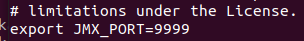
        </p>
    7. **kafka-manager 실행**
        - zookeeper와 kafka는 이미 실행 중이라고 가정
        ```bash
        kafka-manager/bin$ ./kafka-manager
        ```
    8. **카프카 매니저 페이지 접속** (localhost:9000, 기본 포트 9000)
        <p align="center">
            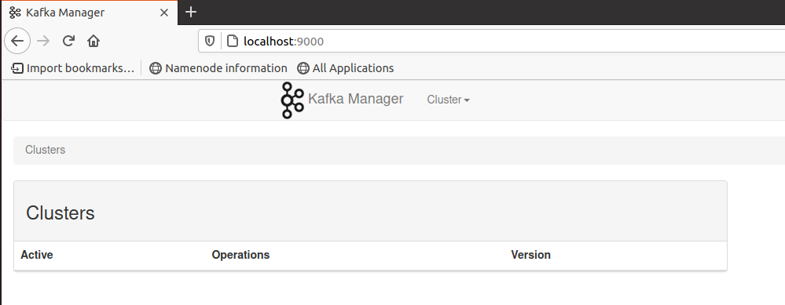
        </p>
    9. **Kafka 연동**
        1. **Cluster 생성**
            - **Cluster Name, Cluster Zookeeper Hosts, Kafka Version 작성**
            - Enable JMX Polling, Poll consumer information, Display Broker and Topic Size 체크
        2. 확인
        <p align="center">
            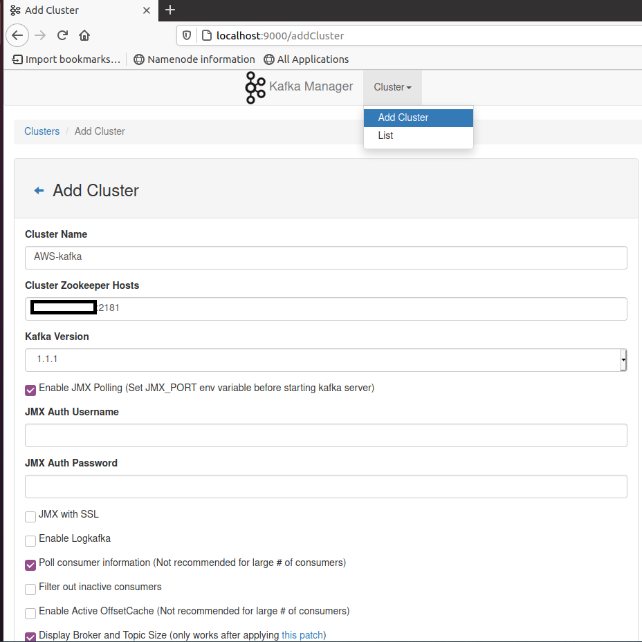
        </p>
        <p align="center">
            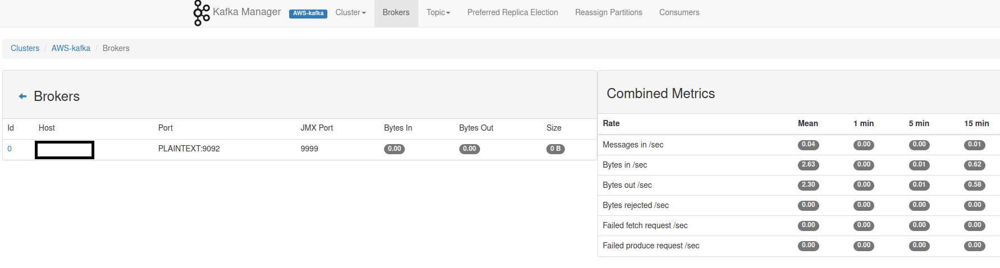
        </p>
        <p align="center">
            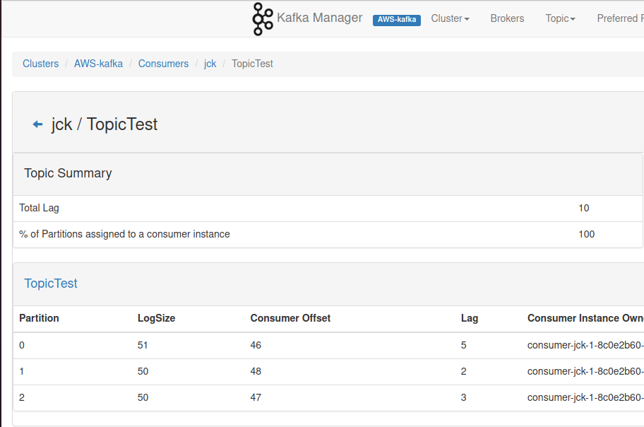
        </p>
2. **Kafka Manager 설치 및 연동 시 발생하는 에러**
    1. **빌드 실패 1** (**sbt-launcher Download failed**)
        - sbt-launch.jar 다운로드 실패 (repo 위치 문제)
            <p align="center">
                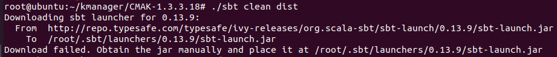
            </p>
        - **해결 방법** : 로그에 나온 To 위치에 **직접 sbt-launch.jar** [다운로드](http://dl.bintray.com/typesafe/ivy-releases/org.scala-sbt/sbt-launch/0.13.9/)
        ```bash
        .sbt/launchers/0.13.9$ wget http://dl.bintray.com/typesafe/ivy-releases/org.scala-sbt/sbt-launch/0.13.9/sbt-launch.jar
        ```
    2. **빌드 실패 2** (**Connection refused**)
        - ./sbt clean dist 명령어 실행 시 Server access Error: Connection refused 발생
        - **해결 방법** : **resolver 추가** 후 다시 실행
            ```bash
            CMAK-1.3.3.23/project# vi plugins.sbt
            
            // The Typesafe repository
            resolvers += "Typesafe repository" at "https://repo.typesafe.com/typesafe/releases/"
            resolvers += "Maven Central Server" at "https://repo1.maven.org/maven2"
            resolvers += "Typesafe Server" at "https://repo.typesafe.com/typesafe/releases"
            ```
    3. **브로커 메트릭 모니터링 실패**
        - 메시지 : ERROR k.m.a.c.BrokerViewCacheActor - Failed to get broker metrics (생략)...
        - **해결 방법** : (카프카 서버에서) **bin/kafka-run-class.sh 설정** 추가
        ```bash
        bin$ vi kafka-run-class.sh
        
        // KAFKA_JMX_OPTS에 -Djava.rmi.server.hostname={AWS IP} 추가
        KAFKA_JMX_OPTS="-Djava.rmi.server.hostname={AWS IP} (생략)"
        ```